# 金花企业（集团）股份有限公司 2022 年年度报告  

# 重要提示  

一、 本公司董事会、监事会及董事、监事、高级管理人员保证年度报告内容的真实性、准确性、完整性，不存在虚假记载、误导性陈述或重大遗漏，并承担个别和连带的法律责任。  

二、 公司全体董事出席董事会会议。  

三、 信永中和会计师事务所（特殊普通合伙）为本公司出具了标准无保留意见的审计报告。  

四、 公司负责人邢雅江、主管会计工作负责人韩卓军及会计机构负责人（会计主管人员）巨亚娟声明：保证年度报告中财务报告的真实、准确、完整。  

五、 董事会决议通过的本报告期利润分配预案或公积金转增股本预案  

经信永中和会计师事务所审计，2022年度母公司实现净利润34,373,694.03元，截止2022年12月31日，母公司期末可供股东分配利润为515,381,407.37元。  

经综合考虑公司2022年度实现利润的规模及构成、所处医药行业情况、公司经营业务发展的需求等因素，以及从股东长远利益及公司可持续发展的需要出发，公司本年度拟不进行利润分配，不派发现金红利，不送红股，亦不以公积金转增股本。  

六、 前瞻性陈述的风险声明  

本报告中所涉及的未来计划、发展战略等前瞻性描述不构成公司对投资者的实质承诺，敬请投资者注意投资风险。   七、 是否存在被控股股东及其他关联方非经营性占用资金情况 否     八、 是否存在违反规定决策程序对外提供担保的情况  

公司原控股股东金花投资控股集团有限公司与西安曙光汽车销售服务有限公司于2018 年10月16 日签订了《借款合同》，公司原实际控制人吴一坚及公司为该合同项下借款提供连带责任保证，曙光汽车向西安市仲裁委员会提起仲裁申请，要求公司向其承担担保责任。经公司调查，时任公司管理层、董事会、股东大会对该事项均不知情，并未履行相应决策程序批准公司为金花投资的上述债务提供担保，公司没有签署《借款合同》或其他担保文件的记录，未发现留存或保管《借款合同》或相关担保文件，也未就该担保事项进行信息披露，《借款合同》签署系原实际控制人个人行为，并未履行上市公司相应审批及披露程序。上述担保事项具体详见公司2023 年2月11 日披露的《关于原实际控制人以公司名义违规担保的公告》（公告编号：临2023-009）。  

九、 是否存在半数以上董事无法保证公司所披露年度报告的真实性、准确性和完整性  

# 十、 重大风险提示  

公司已在本报告中详细描述可能存在的相关风险，敬请查阅第三节管理层讨论与分析-六、关于公司未来发展的讨论与分析之可能面对的风险。  

# 十一、 其他  

□适用 √不适用  

# 目录  

第一节 释义 .................................................................................................................................... 4 第二节 公司简介和主要财务指标................................................................................................. 5 第三节 管理层讨论与分析............................................................................................................. 9 第四节 公司治理........................................................................................................................... 34 第五节 环境与社会责任............................................................................................................... 48 第六节 重要事项........................................................................................................................... 52 第七节 股份变动及股东情况....................................................................................................... 65 第八节 优先股相关情况............................................................................................................... 69 第九节 债券相关情况................................................................................................................... 69 第十节 财务报告........................................................................................................................... 70  

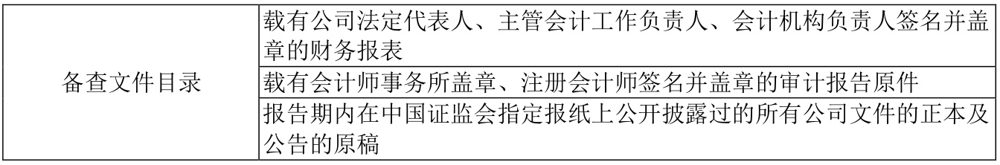  

# 第一节 释义  

# 一、 释义  

在本报告书中，除非文义另有所指，下列词语具有如下含义：  

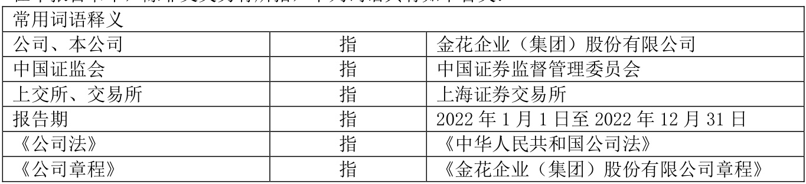  

# 第二节 公司简介和主要财务指标  

# 一、 公司信息  

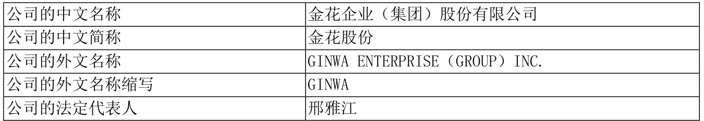  

# 二、 联系人和联系方式  

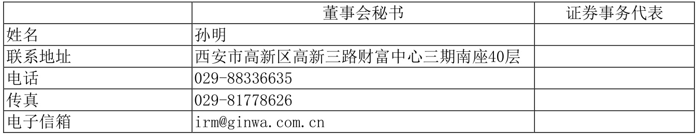  

# 三、 基本情况简介  

四、 信息披露及备置地点 
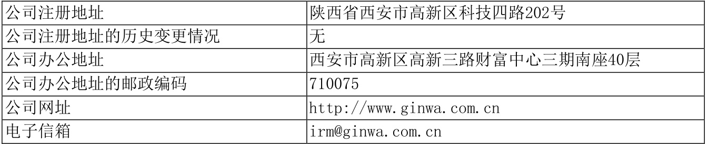  

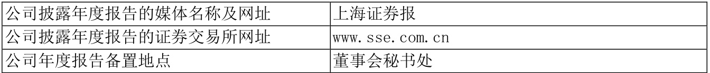  

五、 公司股票简况
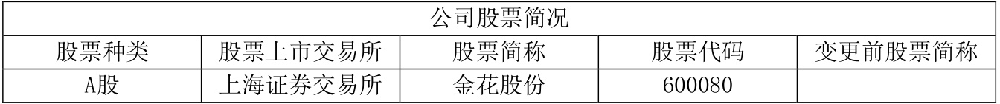  

六、 其他相关资料
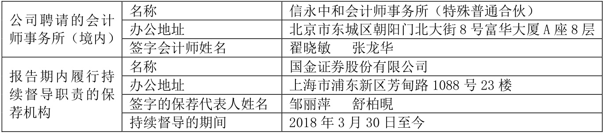  

# 七、 近三年主要会计数据和财务指标  

# (一) 主要会计数据  

单位：元  币种：人民币 
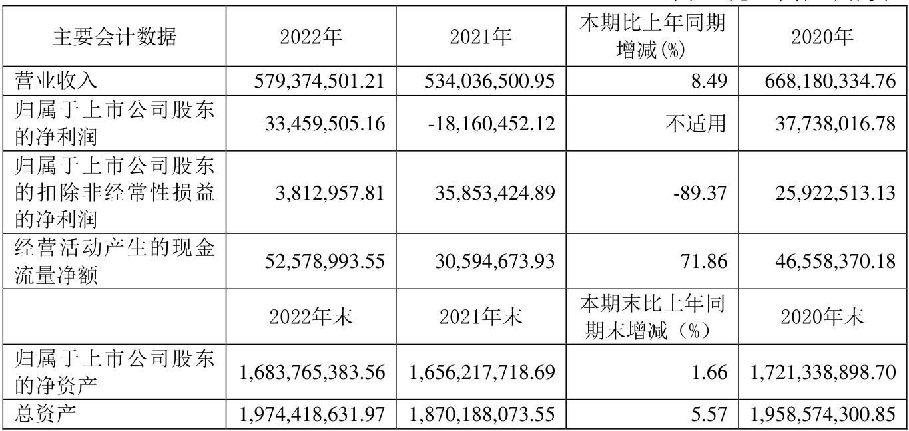  

(二) 主要财务指标 
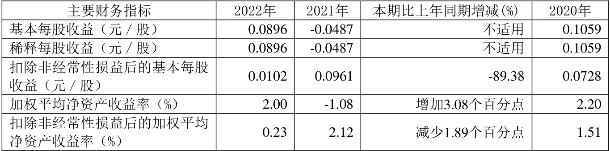  
报告期末公司前三年主要会计数据和财务指标的说明 □适用 √不适用  

八、 境内外会计准则下会计数据差异  

(一) 同时按照国际会计准则与按中国会计准则披露的财务报告中净利润和归属于上市公司股东的净资产差异情况  

□适用 $\surd$不适用  

(二) 同时按照境外会计准则与按中国会计准则披露的财务报告中净利润和归属于上市公司股东的净资产差异情况  

□适用 √不适用  

(三) 境内外会计准则差异的说明：  

□适用 √不适用  

单位：元  币种：人民币 
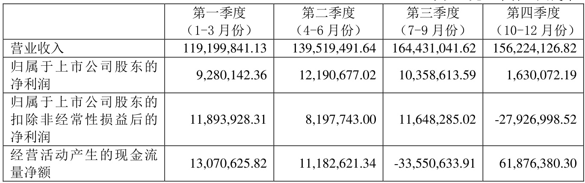  
季度数据与已披露定期报告数据差异说明  

# √适用  □不适用  

分季度归属于上市公司股东净利润波动原因说明：  

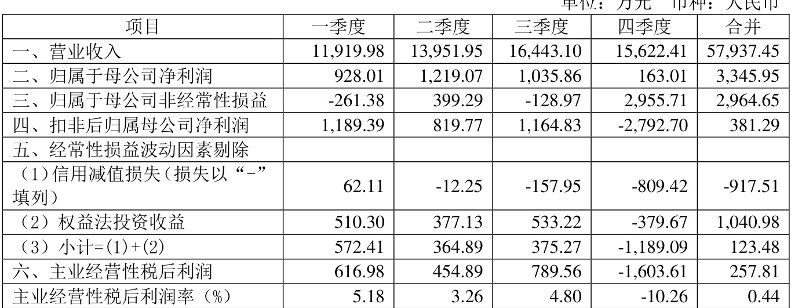  

1、2022 年四季度归属于母公司净利润与前三季度差异较大，主要原因系应收款项计提坏账准备金额较大所致。  

2、2022 年四季度归属于上市公司股东的扣除非经常性损益后的净利润与前三季度差异较大，主要原因系经营性费用增加所致。  

# 十、 非经常性损益项目和金额  

$\surd$适用 □不适用  

单位:元  币种:人民币  

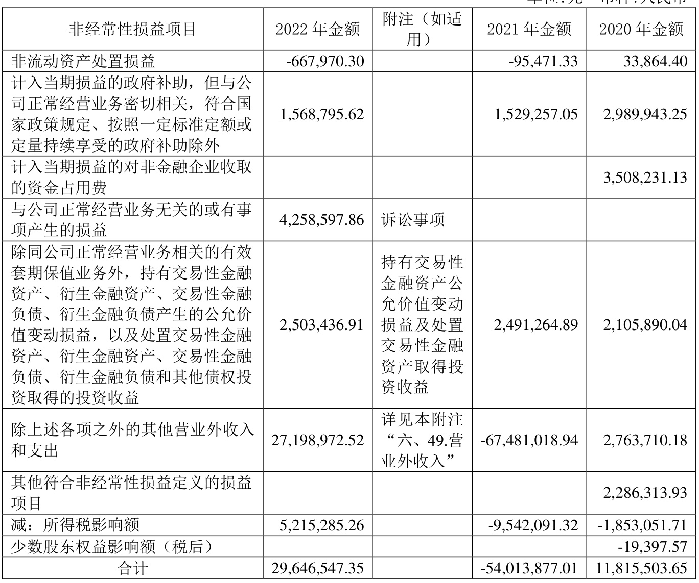  
对公司根据《公开发行证券的公司信息披露解释性公告第1 号——非经常性损益》定义界定的非经常性损益项目，以及把《公开发行证券的公司信息披露解释性公告第1 号——非经常性损益》中列举的非经常性损益项目界定为经常性损益的项目，应说明原因。 □适用 √不适用  

# 十一、 采用公允价值计量的项目  

√适用 □不适用  

单位：元  币种：人民币  

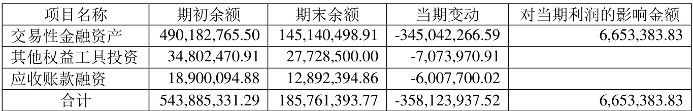  

# 十二、 其他  

□适用 √不适用  

# 第三节 管理层讨论与分析  

# 一、经营情况讨论与分析  

2022 年是全面实施“十四五发展规划”的关键之年，也是全面深化医疗体制改革的重要之年。面对延宕反复的国内形势及医药政策改革带来的行业竞争压力，公司全体员工共同努力，秉承“创新驱动发展”的理念，坚持以合规经营和年度经营目标为指引，稳步推进公司各项经营工作。  

1、产品营销  

报告期内，公司主导产品受医药外部环境影响，公司及时调整营销策略，以坚持合规经营为核心，持续开展循证医学研究，加快学术工具转化，继续巩固线下运营基础的同时，发挥线上运营的优势，完善数字化平台并持续扩大数字化营销网络建设，通过加大线上运营力度，深化数字营销体系，形成强有力的数字化推广工具，进一步夯实学术品牌价值，提升产品同领域竞争差异化优势。同时，公司积极组织并参与学术推广活动，进一步提升行业专家与公司合作的深入与广度，通过开展“肌骨锵锵骨松空中课堂”等线上直播课程、“全国服务商营销沟通会”“精英计划”等学术会议、“超级代表挑战赛”等学术品牌项目，不断优化创新，持续扩大数字化营销建设带来的市场成果。主动落实医学规划方向，重点打造“中青年科研基金项目”，加强体系融合与协作，营造“主动、协作、共赢”的价值理念。  

在普药营销方面，面对激烈的市场竞争环境，在商业流通业务方面，公司积极整合市场资源，优化商业渠道结构，以“稳定核心渠道、维持有效运转、全力保供供应”为目标，在保障传统市场销售业务稳定发展的同时，积极拓展产品新销售渠道，持续推进区域市场开发，优化业务模式；在产品纯销上量方面，设立专职推广岗位，制定专项市场支持方案，执行重点产品市场竞争策略，主动开展促销活动，实现产品市场份额稳定与改善；在新业务开展方面，结合医药行业数字化营销发展趋势，通过多种形式开展精准、高效的线上宣传，以终端客户为核心，推广个性化市场活动，提高产品市场匹配度，增加终端区域覆盖率，努力提升产品市场影响力，为产品后期销售奠定基础。  

2、研发方面  

公司始终坚持以“创新驱动发展”为研发理念，围绕中药大健康产业加快产品研发创新，对已上市核心产品加大研发力度，持续加强与外部研发机构合作与讨论，开展金天格胶囊中保（续保）项目临床研究；获得《一种同时测定人工虎骨粉中胱氨酸和甲硫氨酸含量的方法》的授权专利。结合上市后药品安全性、有效性、质量可控性要求，开展转移因子系列产品质量标准提升研究，提高产品质量稳定性。围绕产品工艺技术研究、质量标准研究等，完成委托药品生产验证，推进药品恢复生产。根据公司战略发展，扩充产品管线，启动新产品开发与布局，通过产学研平台，首次开展与高校研发团队合作，并入选陕西省“科学家+工程师”队伍。成功申报“中小企业技术改造项目”、“陕西省重点研发计划项目”，顺利通过陕西省技术中心复评。  

3、生产运营  

报告期内，公司持续强化质量体系建设，在生产过程中，进一步强化质量管理，通过成立质量专项小组，识别质量风险，进行全面自查自检，对重点环节和岗位双人复核，定期开展验证和 确认，按计划开展物料供应商审计，加大供应商资质审查力度，从源头保障物料供应的质量，同 时不断完善质量管理考核制度和药物警戒体系，逐步推进公司质量管理水平的提升。在安全生产方面，强化安全防控，实行三级安全检查，落实安全生产主体责任，持续加大现场检查力度，及时排除隐患整改，定期开展全员安全生产教育，有效构建安全防控机制，确保安全生产工作全面达标。在生产组织方面，大力推进技术改进革新及工艺优化，解决生产过程中存在的问题，贯彻产销协同，持续完善生产计划管理，通过生产计划合理调整、销售提前预测、实施集约化生产组织措施，确保产品供应平稳有序，保障市场供应。  

# 4、内部控制  

报告期内，公司紧密围绕企业战略目标，持续优化组织架构，搭建和完善一线管理考核制度、薪酬管理体系与劳动风险体系，建立多维度全覆盖的风险管控流程，强化管理执行监督职能，有效提升治理效能。积极拓展招聘渠道，加大人才引进，通过梯队人才培训、中层培养，建立科学的人才培养机制，夯实人才基础，为公司的持续健康发展积蓄力量。在成本控制方面，公司成立监察审计部，通过多维度延伸，构建成本管控体系和监察审计监督机制，加强公司规范运作。  

# 5、转让控股子公司  

公司全资子公司金花国际大酒店有限公司主营业务为酒店经营，非公司医药工业核心业务，且连年亏损，其经营业绩、市场竞争力均比较薄弱，无法与公司主营业务协同发展，亦不符合公司后期发展战略。经公司董事会及股东大会审议，通过了《关于公开拍卖转让全资子公司金花国际大酒店有限公司$100\%$股权的议案》，2022 年12 月15 日该项拍卖已完成。本次交易完成后，公司通过剥离亏损非核心业务，将有利于优化公司资产结构与资源配置，集中资源聚焦医药工业，有效提升主营业务经营业绩，进一步维护公司和全体股东的利益。  

# 二、报告期内公司所处行业情况  

# 1、医药行业情况  

医药行业是我国国民经济的重要组成部分，是关系国计民生、经济发展和国家安全的战略性产业，在惠民生、稳增长方面发挥着积极的作用。随着我国人民生活水平不断提高、人口老龄化加剧、医疗保障制度逐渐完善、居民健康意识逐步增强，带动医药消费市场规模不断扩容，医药制造业整体处于持续发展阶段。  

2022 年，我国医药行业政策加速渗透，行业市场竞争格局不断重塑，多个医药行业规划的出台，提出对药品监管、安全与质量的高要求，医药行业逐步从高速发展向高质量发展转型。随着医疗体制改革的持续深化，三医联动、审评审批制度、一致性评价、集中带量采购、医保支付、准入、合规等政策的改善与推进，医保控费仍是医药行业政策的主旋律。同时，集中带量采购范围进一步扩大，仿制药一致性评价工作全面铺开，政策的推行亦同步倒逼制药行业向创新驱动转型，加快制药企业“由仿入创”步伐，鼓励企业加大研发投入，加速创新药物发展。  

《药品网络销售监督管理办法》的正式施行，医药行业传统格局被打破，互联网医疗与医药新零售发展迅速崛起，网络售药逐步进入规范化、合规化与严监管的新时代，驱动多元化商业模式，为医药企业未来销售与增长带来新的机遇和挑战。据米内网数据统计，截止2022 年上半年，我国网上药店终端药品销售额已超230 亿元，市场潜力十足。  

随着经济发展进入转型升级阶段，人口老龄化趋势愈发明显，慢性病用药需求增大，居民人均收入提高，政府医疗卫生投入加大，逐步带动医药市场规模大幅增长，医药制造企业数量持续增加，集采药品降价、原材料成本上涨等复杂的外部因素影响，医药行业首次出现双下滑。根据国家统计局数据，2022 年，全国规模以上医药制造业实现营业收入29111.4 亿元,同比下降$-1.\,6\%$；实现营业成本16984.6 亿元，同比增长$7,8\%$；实现利润总额4288.7 亿元，同比下降$-31.\,8\%$。全国规模以上工业企业实现营业收入137.91 万亿元，同比增长$5,9\%$。  

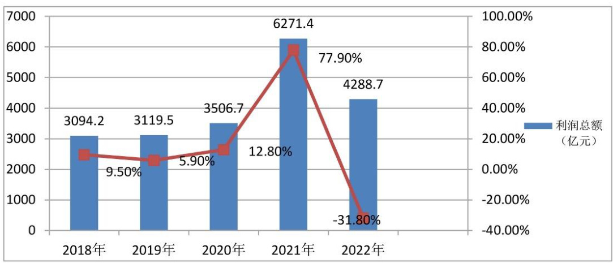  
2018 年—2022 年规模以上医药制造业利润总额 （单位：亿元，$\%$）  

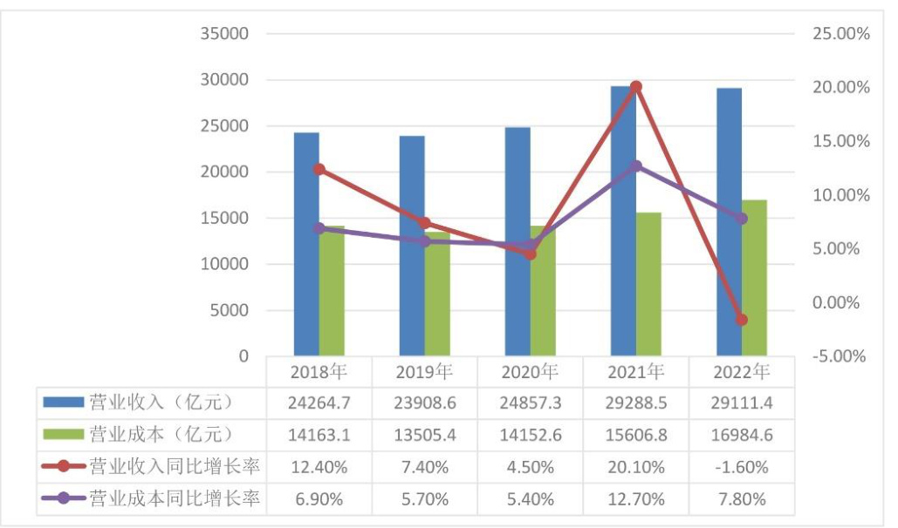  
2018 年-2022 年规模以上医药制造业营业收入与营业成本 （单位：亿元，%）  

# （数据来源：国家统计局）  

2、行业的周期性  

医药行业是支撑发展医疗卫生事业和健康服务业的重要基础，与居民生活息息相关，受宏观经济影响较小，是典型的弱周期行业。随着医药行业政策的相继落地，政策叠加效应显著，居民对医药行业的需求将推动医药行业的持续发展。但受各种疾病季节性高发的影响，具体药品品种需求及销售存在一定的季节性特征。  

# 三、报告期内公司从事的业务情况  

# （一）主要业务  

根据证监会《上市公司行业分类指引》（2012 年修订），公司所处行业为医药制造业。主要业务为药品的研发、生产及销售，产品线涵盖化学药品、中成药、原料药和保健品。剂型包括片剂、胶囊剂、颗粒剂、散剂、合剂、口服溶液剂、糖浆剂、外用溶液剂等一百多个品种、品规。 依据特性和经营模式，产品分为骨科类、免疫类、儿童类和普药类等四个系列。  

公司主导产品金天格胶囊是国家一类新药，经过多年的推广，目前已成为骨科临床中药一线用药；转移因子系列产品为改进人体免疫力的生物药品；儿童系列用药包括小儿止咳糖浆等；普药系列主要包括开塞露、诺氟沙星胶囊、甲芬那酸胶囊等品种，公司主要产品在多年的运营中形成了质量稳定、安全可靠的竞争优势。  

# （二）经营模式  

# （1）采购模式  

公司生产所需物料由物料部统一负责采购。物料部根据生产计划、库存情况及原材料市场情况，制定原材料的采购计划，保证物料及时供应；质量部对供应商的资质、质量体系及生产能力进行审核评估，出具审核意见及合格供应商目录；物料部对合格的供应商通过比价、招标等方式进行物料采购。同时，公司每年对供应商进行现场审计，每季度进行评估、评分。物料部通过对日常市场信息的收集分析，结合合理库存、到货周期、付款周期等因素，降低公司各项采购成本。  

# （2）生产模式  

公司生产模式采用以销定产的模式进行，由公司营销部门提交年度销售预算计划，每月依据市场需求编制次月销售计划提交生产部。生产部根据月度销售计划制定出月度生产计划，再由储运部进行物料需求计划核算，物料部进行物料采购，生产部依据月度生产计划分解出周排产计划并组织生产，各车间负责生产实施。在生产执行过程中，所有在线生产品种严格遵守生产工艺规程，依据规范和岗位操作SOP 开展生产活动，确保规范生产。技术部对生产过程工艺规程执行进  

行全方位的监控和评价。质量部对生产环境、工艺实施过程检测监控，对所有生产物料、生产过程中间产品和产成品按照相应质量标准进行检验，确保生产过程合规，产品质量合格；设备部负责生产设备的安装、调试、保养等工作，确保产品安全生产。  

# （3）销售模式  

公司销售体系设有金天格事业部、招商部、普药部和市场部，分管不同渠道的产品营销业务。主导产品以招商代理模式为主，目前已经建立了覆盖全国的营销网络。公司坚持专业的学术化推广道路，形成了战略规划、品牌建设、媒体宣传、会议推广、市场调研、促销活动以及专家网络建设等多维度的产品营销框架。  

# （三）报告期内业绩驱动因素  

详见本节“五、报告期内主要经营情况”。  

# 四、报告期内核心竞争力分析  

√适用 □不适用  

报告期内，公司核心竞争力未发生重大变化，主要体现在以下方面：  

# 1、产品优势  

经过多年发展，公司已形成了以医药工业为核心的产业基础，产品集中在骨科、免疫、儿科用药等细分领域，公司主导产品金天格胶囊凭借其显著的临床疗效、优良的产品质量和良好的市场服务赢得了广大医生及患者的认可，在骨科中药领域占据领先地位。同时，公司以人工虎骨粉原料药为基础，加大研发投入，积极进行相关研究和系列产品开发，围绕骨科领域核心品种形成公司核心竞争力。  

# 2、营销优势  

在营销方面，公司多年坚持学术推广模式，依靠专业学术推广队伍，积极与权威组织合作，联合领域学术带头人，构建专家网络体系，积极开展多项临床询证医学研究，不断完善和充实临床证据。公司每年开展多次全国级学术会议、省级学术会议，通过学科学术带头人对产品临床应用的认可和解读，向各级医疗机构传递，促进公司产品在领域的应用和发展。营销网络方面，公司组建了精干营销人才队伍，建立了覆盖全国的市场营销网络，专业精干的营销团队及全国市场营销网络优势是公司产品直面行业激烈竞争的重要先决条件，终端布局能够与企业整体战略发展方向取得同步进展。  

# 3、品牌优势  

公司“金花”商标为陕西省、西安市著名商标，“金花”商标被国家工商总局认定为中国驰名商标，转移因子系列产品、金天格胶囊被评为陕西省和西安市名牌产品，借助品牌力量，企业产品在市场中增强了企业的竞争力，树立了企业品牌形象，为产品推广奠定了坚实的品牌基础。  

# 4、生产质量管理优势  

公司高度重视生产质量管理保障体系建设，始终坚持把质量放在第一位，从原材料采购环节开始，严格按照质量标准对供应商进行审核，在整个生产过程中，公司严格执行质量监控及质量检验标准，每一道生产工艺严格监控，保证生产、销售过程的质量可控性。在各级监管部门的检查中均未出现重大质量问题，产品质量稳定，有良好的市场声誉。  

# 五、报告期内主要经营情况  

报告期内，公司实现营业收入57,937.45 万元，较上年同期增长$8,49\%$；其中，医药工业收入56,507.19 万元，较上年同期增长$10,27\%$，主要为报告期内骨科类产品收入较上年同期增长$10,37\%$，免疫类产品较上年同期增长$23.5\%$；金花国际大酒店实现主营业务收入1,404.62 万元，较上年同期减少$35.72\%$。报告期内，公司实现归属母公司所有者的净利润3,345.95 万元，实现扭亏为盈；实现归属于上市公司股东的扣除非经常性损益的净利润381.30 万元。  

# (一) 主营业务分析  

# 1. 利润表及现金流量表相关科目变动分析表  

单位：元  币种：人民币  

  

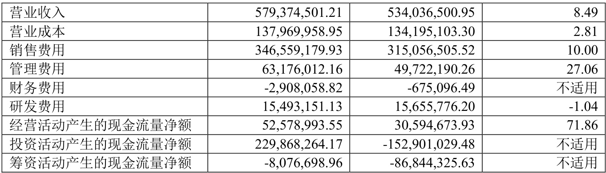  
财务费用变动原因说明：主要为报告期内利息费用减少，同时利息收入增加所致。 经营活动产生的现金流量净额变动原因说明：主要为报告期内销售回款增加所致。 投资活动产生的现金流量净额变动原因说明：主要为报告期内理财产品赎回增加所致。 筹资活动产生的现金流量净额变动原因说明：主要为上年同期归还银行借款所致。  

本期公司业务类型、利润构成或利润来源发生重大变动的详细说明 □适用 √不适用  

# 2. 收入和成本分析  

√适用 □不适用  

报告期内，公司主营业务毛利率为76.19%，较上年同期增长 1.$32\%$。其中医药工业毛利率为$77,35\%$，较上年同期增加$0,16\%$，酒店毛利率为30.26%，较上年同期增长 9.$52\%$。  

# (1). 主营业务分行业、分产品、分地区、分销售模式情况  

单位:元  币种:人民币  

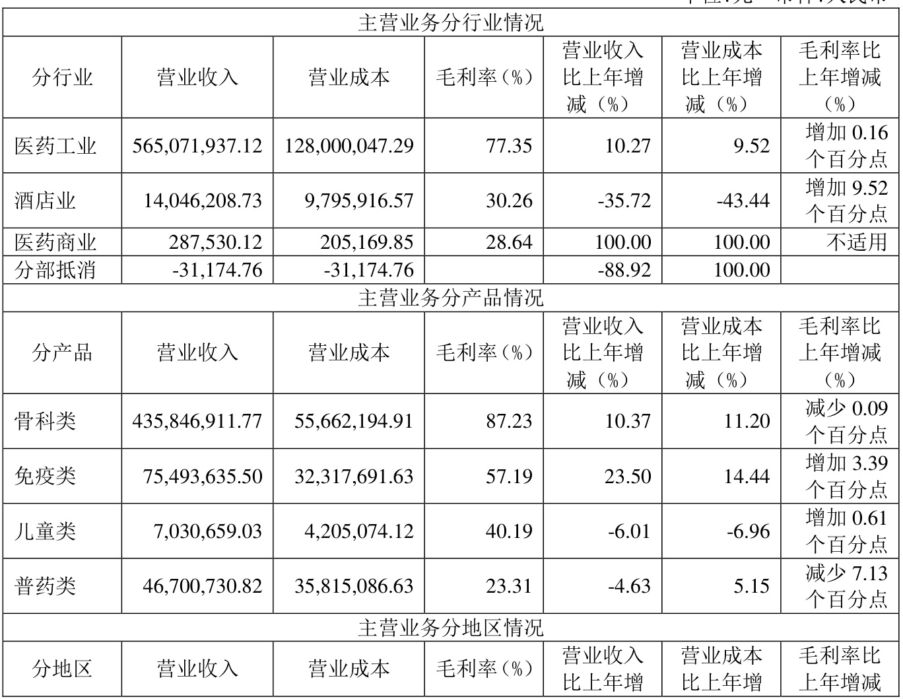  

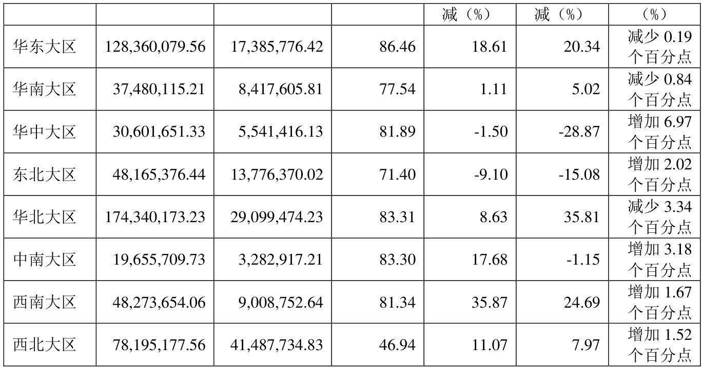  

# (2). 产销量情况分析表  

$\surd$适用 □不适用  
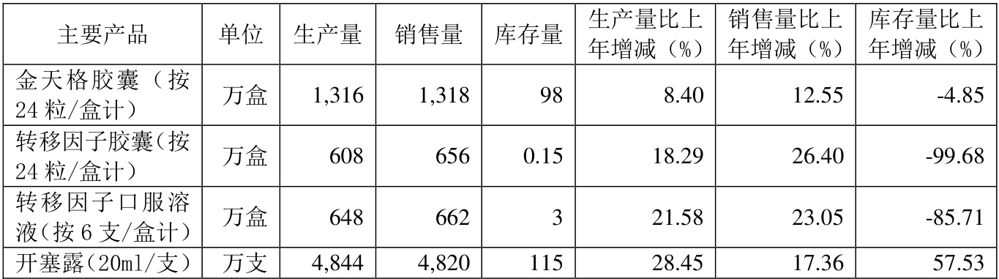  
□适用 $\surd$不适用  

# (4). 成本分析表  

单位：元  

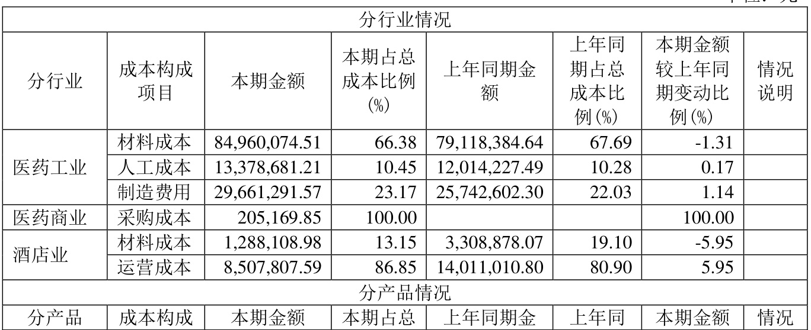  

近三年价格变动趋势具体如下： 
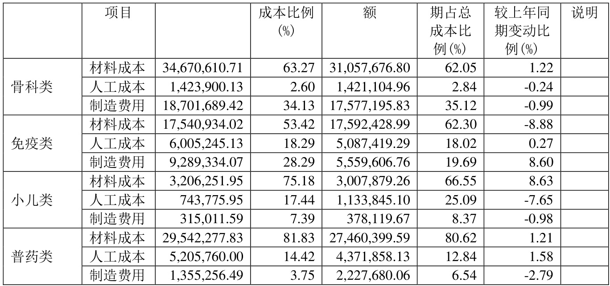  

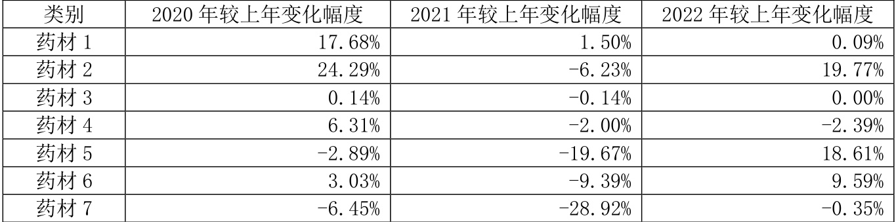  

# 2、采购模式  

首先由质量部门根据所用物料的质量标准对供应商的质量体系及生产能力进行审核与评估，出具审核意见后，选定物料供应厂家，确保物料的质量和稳定性。采购部门根据生产计划制定采购计划，再选定供应厂家进行采购。  

# 3、价格波动对公司产品成本  

近年来，由于市场价格不断变化，导致生产人工虎骨粉的部分原材料价格波动，对人工虎骨粉及其金天格胶囊的成本略有影响。公司将核心产品涉及的主要原材料列为储备资源，一定程度上规避了价格风险。  

近三年药材价格变动对产品单位成本的影响具体如下： 
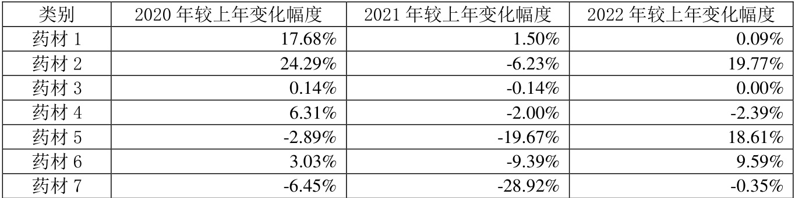  

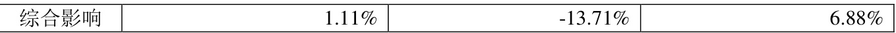  

# (5). 报告期主要子公司股权变动导致合并范围变化  

√适用 □不适用  

公司于2022 年4 月收购西安济世堂医药有限责任公司$100\%$股权；2022 年5 月设立西安金花天格医药有限公司；2022 年8 月设立全资子公司陕西萃秦管理咨询有限责任公司；2022 年8 月设立全资子公司陕西宜甄贸易有限公司；2022 年9 月设立陕西禾润易实业有限公司；2022 年11 月设立全资子公司金花汇康医药（海南）有限公司；2022 年11 月设立全资子公司金花仁宏医药(海南)有限公司，以上公司在报告期内纳入合并报表范围。  

# (6). 公司报告期内业务、产品或服务发生重大变化或调整有关情况  

□适用 √不适用  

# (7). 主要销售客户及主要供应商情况  

# A.公司主要销售客户情况  

√适用 □不适用  

前五名客户销售额7,061.26 万元，占年度销售总额$12,19\%$；其中前五名客户销售额中关联方销售额0 万元，占年度销售总额$0\%$。  

报告期内向单个客户的销售比例超过总额的$50\%$、前5 名客户中存在新增客户的或严重依赖于少数客户的情形  

□适用 √不适用  

# B.公司主要供应商情况  

√适用 □不适用  

前五名供应商采购额2,716.98 万元，占年度采购总额$36.\,69\%$；其中前五名供应商采购额中关联方采购额0 万元，占年度采购总额$0\%$。  

报告期内向单个供应商的采购比例超过总额的$50\%$、前5 名供应商中存在新增供应商的或严重依赖于少数供应商的情形  

□适用 √不适用  

# 3. 费用  

√适用 □不适用  

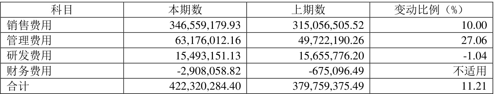  

# 4.   研发投入  

# (1).研发投入情况表  

√适用  □不适用  

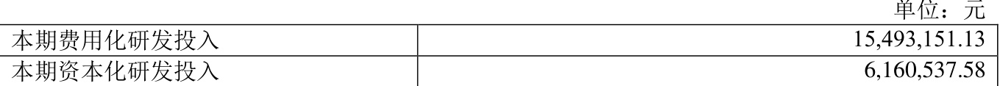  

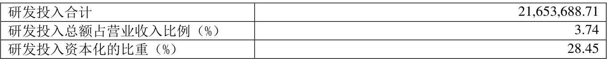  

# (2).研发人员情况表  

√适用 □不适用  

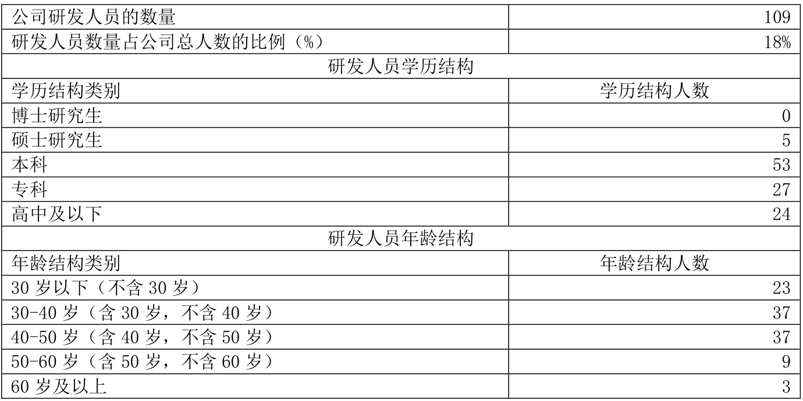  

# (3).情况说明  

√适用 □不适用  

（1）上述研发投入占营业收入比例及研发人员数量占总人数比例以合并报表数据为基数计算；公司研发投入全部发生在母公司，截止报告期末，研发投入占母公司营业收入比例为$3,83\%$，研发人员占母公司比例为$21\%$。  

（2）公司资本化投入确定依据参见本报告第十节财务报告-五、重要会计政策及会计估计-29.无形资产。  

# (4).研发人员构成发生重大变化的原因及对公司未来发展的影响  

□适用 √不适用  

# 5. 现金流  

√适用 □不适用  

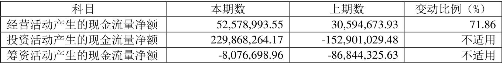  
主要指标变动的说明： （1）经营活动产生的现金流量净额变动主要原因为：主要为报告期内销售回款增加所致； （2）投资活动产生的现金流量净额变动主要原因为：主要为报告期内理财产品赎回增加所致； （3）筹资活动产生的现金流量净额变动主要原因为：主要为上年同期归还银行借款所致。  

# (二) 非主营业务导致利润重大变化的说明  

$\surd$适用 □不适用  

报告期内，公司与西安天磊置业有限公司签订协议购买房产，因西安天磊置业有限公司无法按照协议约定交付认购房屋，西安天磊置业有限公司退还公司支付的房屋认购款项及定金（详见“临2022-070”号公告），该公司双倍返还的定金收入具有特殊性，属于非经常性损益。同时报告期内，公司管理费用较上年同期增加，受上述因素的影响，导致公司本报告期内利润构成发生重大变化。  

# (三) 资产、负债情况分析  

$\surd$适用  □不适用  

1.   资产及负债状况  
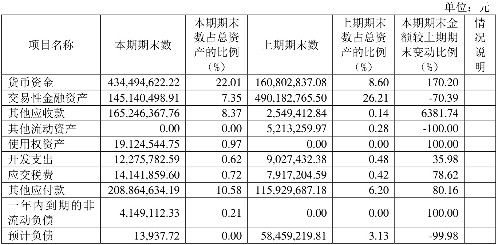  

其他说明  

（1）货币资金：货币资金较上年同期增加，主要为理财产品赎回所致。  

（2）交易性金融资产：交易性金融资产较上年同期减少，主要为理财产品赎回所致。  

（3）其他应收款：其他应收款较上年同期增加，主要为购买房产未如期交付，所支付款项转为其他应收款所致。  

（4）其他流动资产：主要为上年同期预缴所得税，本年抵消所致。 （5）使用权资产：主要为新增公司租赁办公场所及药店经营用房所致。 （6）开发支出：主要为报告期内药品研究项目投入所致。 （7）应交税费：主要为报告期内缴纳的税金增加所致。  

（8）其他应付款：主要为报告期内收到转让全资子公司金花国际大酒店有限公司$100\%$股权部分转让款及预提费用增加所致。  

（9）一年到期流动负债：主要为下年度需支付的租金所致。 （10）预计负债：主要为报告期内完成对上年诉讼事项预计负债的支付所致。  

# 2.   境外资产情况  

□适用 √不适用  

# 3. 截至报告期末主要资产受限情况  

$\surd$适用  □不适用  

2022 年7 月13 日，公司召开第九届董事会第十九次会议，审议通过了《关于向银行申请综合授信的议案》，公司以位于西安市高新区科技四路202 号的办公用房及厂房、位于西安市高新区碑林科技产业园3 号通用厂房为抵押物，获得齐商银行股份有限公司西安分行19000 万元的综合授信。  

# 4. 其他说明  

□适用  $\surd$不适用  

# (四) 行业经营性信息分析  

$\surd$适用  □不适用  

根据证监会《上市公司行业分类指引》（2012 年修订），公司所处行业为医药制药业。  

# 医药制造行业经营性信息分析  

# 1.行业和主要药(产)品基本情况  

# (1).行业基本情况  

√适用 □不适用  一、重要影响医药行业政策情况  

# 1、行业发展规划  

2022 年,在国家医保局、卫健委、国家药监局等相关部委的推进下，“三医”联动改革持续深化，大力推进医药创新、仿制药、中医药产业；促进老龄化慢性病、儿童用药以及罕见病等药品发展；发布了支付方式改革、医保目录、带量采购、重点药品监控、药品管理等一系列政策法规；对分级诊疗体系进行宏观布局，不断促进医药行业高质量、可持续发展。  

（1）2022 年1 月30 日，工信部、国家卫健委、国家医保局、国家药监局等九部门联合印发《“十四五”医药工业发展规划》，全面推进健康中国建设，推动医药行业高质量发展，加快产品创新和产业技术突破、提高产业链现代化水平，健全医药供应保障体系，实现供应链稳定可控，调动企业开展仿制药一致性评价的积极性，打造“原料药$+$制剂”一体化优势。全面形成创新驱动发展的新格局，为全面建成健康中国提供坚实保障。  

（2）2022 年5 月20 日，国务院办公厅印发《“十四五”国民健康规划》，指出重大疾病防治成效显著；重点人群健康服务不断完善；医药卫生体制改革深入推进；健康扶贫任务全面完成；中医药服务体系持续完善。  

（3）2022 年9 月，卫健委发布通知，拟使用财政贴息贷款更新改造医疗设备，并发布配套政策，进一步明确使用财政贴息贷款更新改造医疗设备在医院端落地实施的政策。11 月13 日，中央财政下达2022 年卫生健康领域中央基建投资预算265.21 亿元，推动“十四五”102 项重大工程和《“十四五”优质高效医疗卫生服务体系建设实施方案》等任务落地。推动分级诊疗和公立医院高质量发展，加强互联网医院建设。推动优质医疗资源向市县延伸是今年分级诊疗及医院高质量发展的重要任务。  

# 2、医药改革  

（1）2022 年1 月1 日起，新版国家医保药品目录正式实施。本次调整后，国家医保目录内药品总数达2860 种，其中西药1486 种，中成药1374 种，共计新增74 种药品进入目录，11 种药品被调出目录，新增7 种罕见病用药，为更多患者实现“减负”。  

2022 年6 月13 日，国家医保局发布《2022 年国家基本医疗保险、工伤保险和生育保险药品目录调整工作方案》，支持将罕见病药物、儿童用药、创新药物等药物纳入医保目录，持续落实地方增补目录调出政策，优化药品目录结构、科学规范管理。  

（2）2022 年，国家医保局已开展七批国采，共覆盖294 种药品，集采常态化下，药品降价已成趋势。集采已成为公立医院药品采购的重要模式。  

（3）2022 年4 月15 日，国家医保局发布《关于做好支付方式管理子系统DRG/DIP 功能模块使用衔接工作的通知》，将推进DRG/DIP 支付方式改革向纵深发展，同时进一步倒逼医院精细化管理，合理使用医保资金，推动医疗机构发展转型为更加注重内部成本控制的机构。  

（4）2022 年5 月25 日，国务院办公厅印发《深化医药卫生体制改革2022 年重点工作任务》。全面推进健康中国建设，深入推广三明医改经验，促进优质医疗资源扩容和均衡布局，深化医疗、医保、医药联动改革，持续推动从以治病为中心转变为以人民健康为中心，持续推进解决看病难、看病贵问题。  

# 3、行业监管  

（1）2022 年2 月，国家药监局就《药审中心加快创新药上市申请审评工作程序（试行）（征求意见稿）》公开征求意见（以下简称《征求意见稿》）为代表，旨在鼓励研究和创新制药，加快创新药品审评速度。截至2022 年11 月末，我国已有131 个药品品种（以受理号计）被纳入突破性治疗药物名单，相较2021 年末新增40 个药品品种，突破性治疗药物的审评加速有利于提高药企研发效率和转换率，加快具备较高临床价值的重磅创新药上市速度，体现了CDE 在审批端对于突破性治疗药物研发的大力支持。  

（2）2022 年3 月，国家药监局、农业农村部、国家林草局、国家中医药管理局联合发布《中药材生产质量管理规范》的公告，加强对中药材生产企业生产过程的细化管理和对关键环节重点管理，是中药材规范化生产和管理的基本要求。  

（3）2022 年4 月，国家药监局发布《药物警戒检查指导原则》，要求药品监管部门开展药物警戒检查工作，突出风险管理、强化风险控制。  

（4）2022 年10 月26 日，国家药监局发布新修订的《药品召回管理办法》，自11 月1 日起施行，国家药监局又拿出一个针对药品召回的全新管理办法，体现了药监局对药品管理理念、手段、方法的提高。  

# 二、公司所处医药制造业细分行业的基本发展状况、市场竞争情况  

公司所处行业为医药制造业，按照类别为中成药生产，根据主导产品治疗划分属于骨科领域。  

# （1）中药行业  

中医药是我国重要的卫生资源、经济资源和生态资源，是文化传承的载体，以其独特优势，在守护健康中发挥了重要作用。近年来，中药标准体系建设及监管工作逐步完善，中药审评审批制度改革加速，2021 年12 个中药新药上市，2022 年7 款中药新药获批。  

国家高度重视中医药事业的创新与发展，党的二十大报告明确提出“促进中医药传承创新发展，推进健康中国建设”。随着国家对中医药行业发展的加速推进与大力扶持，各项政策的出台，都为中医药行业高质量发展起到了积极的作用，为中医药传承创新指明了方向。近年来，《中华人民共和国中医药法》的颁布实施；《“十四五”中医药发展规划》的正式印发，提出“十四五”中医药发展目标，完善中医药高质量发展政策和体系；《中共中央、国务院关于促进中医药传承创新发展的意见》、《关于加强新时代中医药人才工作的意见》、《国家“十四五”期间人才发展规划》及2023 年2 月国家药监局《中药注册管理专门规定》等文件的发布，要求着力改善中医药发展条件，提升中医药防病治病能力与科研水平，培养造就中医药专业团队，鼓励运用传统中药研究方法和现代科学技术研究开发中药，形成结合中医药临床治疗特点的中药疗效评价指标，从研发创新、行业标准化、医疗、医保、医药端推动中医药振兴发展，不断释放中医药创新潜力，明确中医药发展的指导思想与重点举措，为全面推进健康中国建设、保障人民健康提供有力支撑。政策的发布将为中医药的创新发展和影响力提升带来机遇。  

据国家统计局数据。2021 年全年中国中成药累计产量达到了231.8 万吨，累计增长$6,5\%$，截止2022 年2 月中国中成药产品为26.4 万吨；累计方面，2022 年1-12 月中国中成药累计产量达到了227.7 万吨，累计下降了$3,4\%$。  

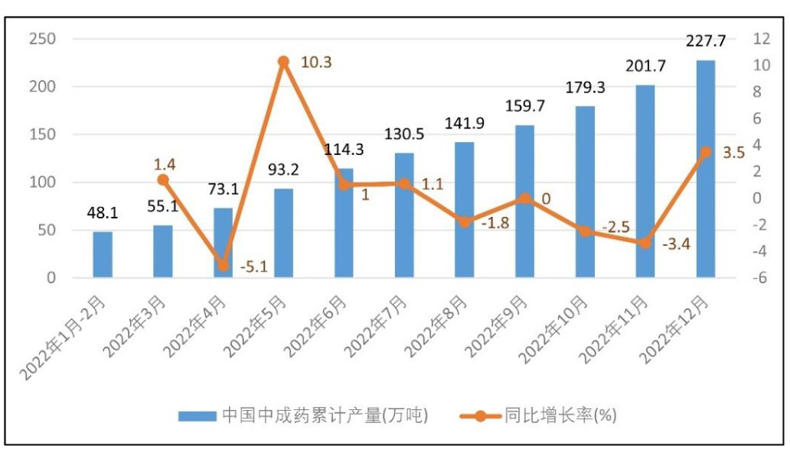  
2022 年1-12 月中国中成药月度产量及增长情况 （单位：万吨，%）  

# （2）骨科领域  

随着国家人口老龄化持续增长，慢性非传染性疾病已成为严重影响居民健康的公共问题。骨质疏松症作为慢性病之一，有着发病率高、医疗费用高、疗程长、生存质量低等特点，社会关注度仍旧不足。2022 年10 月，国家卫健委发布《2021 年度国家老龄事业发展公报》显示，截至2021年末，全国60 岁及以上老年人26736 万，占比$18,9\%$，其中65 岁以上人群骨质疏松症患病率达到$32.\,0\%$，骨质疏松症患病率明显增加。2018 年中国骨质疏松流行病学调查也显示，50 岁以上女性人群骨质疏松症患病率达$32.1\%$，65 岁以上女性人群骨质疏松症患病率达$51.\,6\%$，我国中老年女性骨质疏松问题尤为严重。  

随着人们健康意识的逐渐提高，包括骨质疏松在内的多种慢性病逐渐得到重视。因骨质疏松症带来的临床治疗压力以及用药需求逐年增大，医生对于骨质疏松的认知需求也有所上升。据米内网数据显示，2017 至2021 年，全国医院渠道抗骨质疏松药物市场规模分别为98.2 亿元、103亿元、104.4 亿元、101.9 元和115.8 亿元，呈逐年上升趋势。  

# （3）公司的市场地位和竞争优势  

公司主导产品金天格胶囊经过多年的临床验证和循证证据积累，目前已成为中成药骨质疏松领域临床用药一线品牌，市场份额持续保持市场领先。据米内网数据显示，在2021 年1-2 季度重点城市公立医院中成药骨质疏松类用药产品份额占比中，金天格胶囊以$35.\;31\%$的市场份额保持市场领先。  

公司持续开展专业化学术推广工作，形成了战略规划、品牌建设、循证研究、市场调研和媒体宣传等多维度的市场营销框架。金天格胶囊先后被国家卫健委、国家中医药管理局、中华医学会、中国医师协会、中国中药协会、中国中西医结合学会等权威机构颁布的临床指南及共识收录。近年来，公司持续加强研发投入，积极开展药物作用机制、药理药效以及临床疗效、安全性、药物经济学等多个高标准的研究项目。各项循证研究涵盖骨质疏松、骨关节炎、类风湿性关节炎等疾病领域，为产品后期的品牌学术推广奠定了坚实的基础，为公司品牌战略发展提供了有力的保障。  

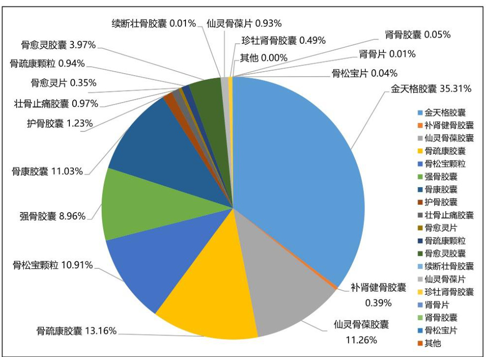  
(数据来源：南方医药经济研究所 米内网)  

据米内网数据统计，在2017 年至2022 年1-2 季度重点城市公立医院中成药骨质疏松类用药产品份额占比中，金天格胶囊市场占有率持续领先。  

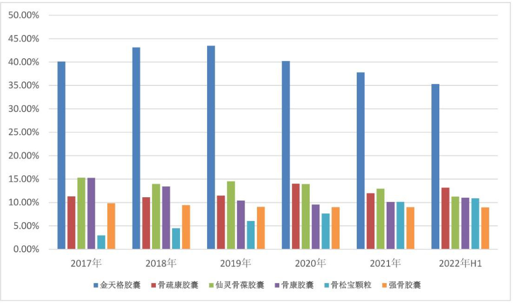  
(数据来源：南方医药经济研究所 米内网)  

# (2).主要药（产）品基本情况  

$\surd$适用 □不适用  按细分行业、治疗领域划分的主要药（产）品基本情况  

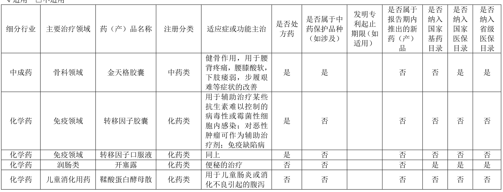  
□适用  √不适用  

# 报告期内主要药品在药品集中招标采购中的中标情况  

√适用  □不适用  

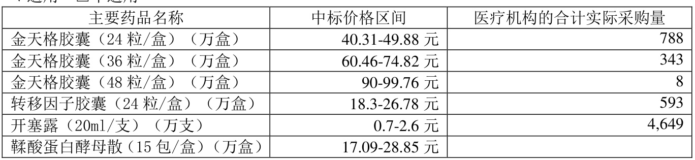  
情况说明 □适用  √不适用  

# 按治疗领域或主要药（产）品等分类划分的经营数据情况  

√适用  □不适用  

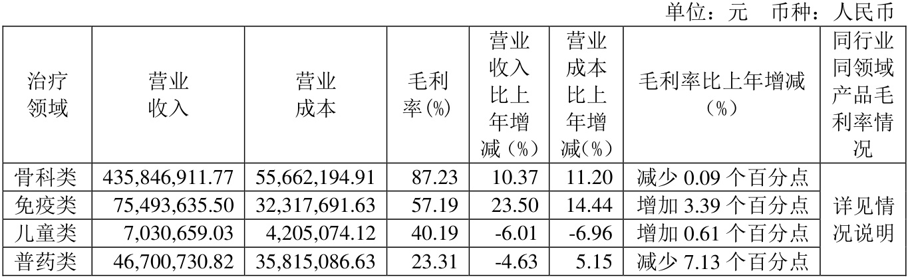  
情况说明 √适用  □不适用  同行业可比公司毛利率情况  

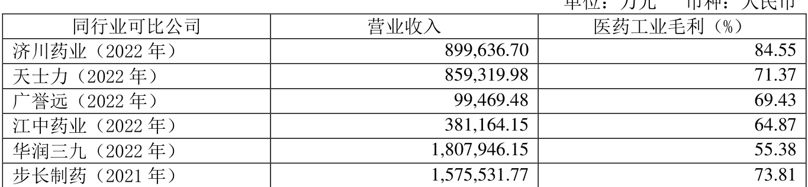  
报告期内，公司医药工业毛利率为$77,35\%$，公司主导产品领域为骨科医药，该系列产品为国家一类新药，市场盈利能力强；2022 年该类产品营业收入占公司医药工业营业收入的$77.13\%$。因此使得公司整体工业毛利率较高，与同行业企业相比处于中等偏上水平。  

# 2.公司药（产）品研发情况  

# (1). 研发总体情况  

√适用  □不适用  

目前，公司研发项目主要集中在两个方面：第一围绕已上市核心产品进行二次开发，包括工艺改进、成分研究、质量标准提高和适应症拓展；第二围绕核心产品进行系列新产品的开发研究，主要为开发保健食品；在研发模式上，一方面通过加强自身研发队伍的建设，进行自主研发；另一方面，继续加强和外部研发机构的联系和合作，借助外部研发机构的技术力量，继续委托研发，积极推进研发项目，提升公司核心竞争力。  

# (2).主要研发项目基本情况  

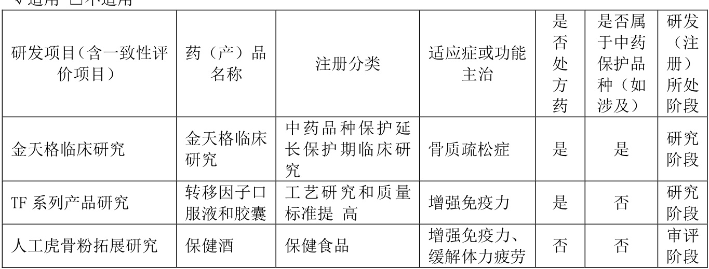  
□适用  $\surd$不适用  

# (4).报告期内主要研发项目取消或药（产）品未获得审批情况  

□适用  $\surd$不适用  

# (5). 研发会计政策  

$\surd$适用 □不适用  参见本报告第十节财务报告-五、重要会计政策及会计估计-29.无形资产。  

# (6). 研发投入情况  

同行业比较情况 √适用  □不适用  

单位：万元  币种：人民币 
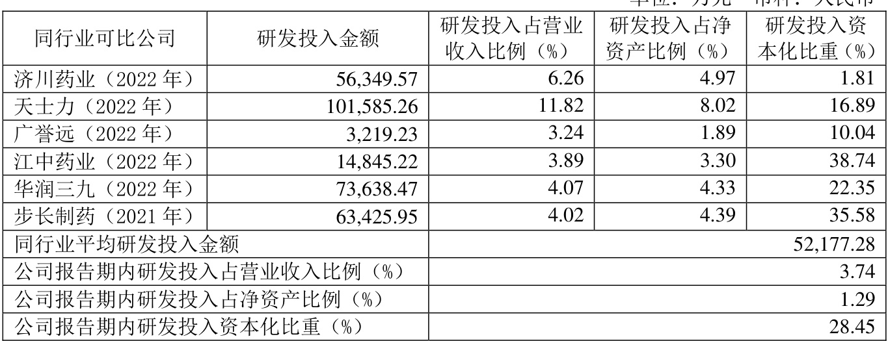  
研发投入发生重大变化以及研发投入比重、资本化比重合理性的说明 $\surd$适用  □不适用  

报告期内，公司研发投入2,165.37万元，占本期营业收入$3.\;74\%$，占母公司营业收入的$3,83\%$。与同行业研发投入占营业收入比例平均值相比，研发投入比重相当，处于中等水平，后期公司将围绕战略规划及年度经营计划，整合资源优势，高效统筹生产经营和研发创新，持续加大研发投入，聚焦主业与医药大健康产业，推动公司业务高质量发展。  

# 主要研发项目投入情况  

单位：万元  币种：人民币 
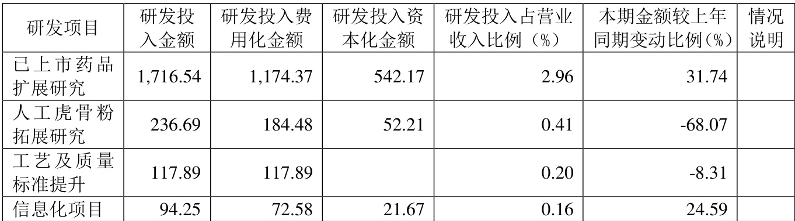  
公司研发的会计政策：参见本报告第十节财务报告-五、重要会计政策及会计估计$-29$、无形资产。  

# 3.公司药（产）品销售情况  

# (1).主要销售模式分析  

$\surd$适用  □不适用  

公司销售体系设有金天格事业部、招商部、普药部和市场部，负责不同渠道的产品营销业务。公司坚持专业的学术化推广道路，形成了战略规划、品牌建设、媒体宣传、会议推广、市场调研、促销活动以及专家网络建设等多维度的产品营销框架，随着营销活动的持续深入，营销工作不断取得新的进展。  

# (2). 销售费用情况分析  

销售费用具体构成 √适用  □不适用  

单位：元  币种：人民币 
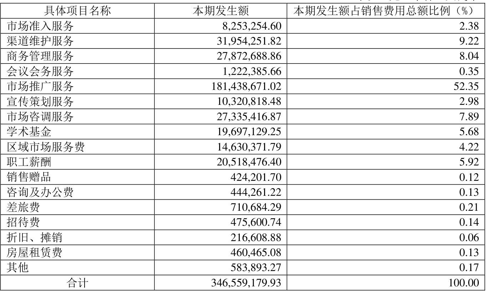  

同行业比较情况  

单位：万元  币种：人民币 
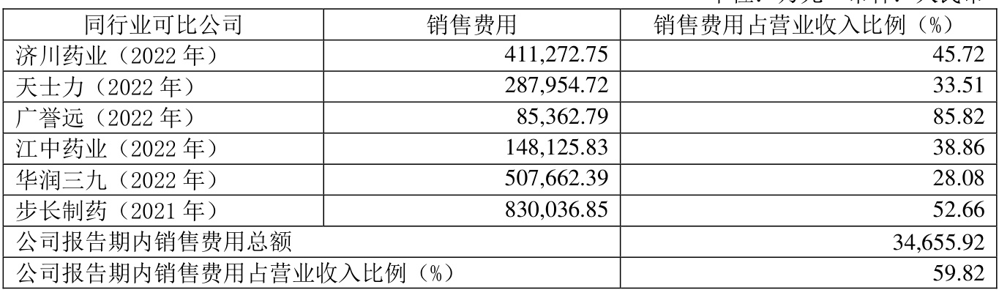  
销售费用发生重大变化以及销售费用合理性的说明  

√适用  □不适用  

2022 年度，公司销售费用34,655.92 万元，销售费用占营业收入比例为$59,82\%$。报告期内公司主导产品销售收入占公司整体医药工业营业收入的比例为77.$13\%$。  

单位：万元  币种：人民币
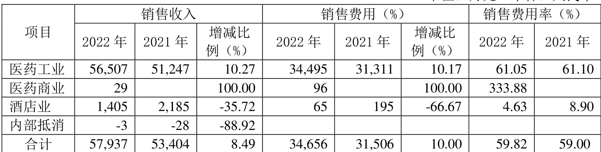  
报告期公司医药工业营业收入较上年增加$10,27\%$，销售费用较上年增加$10.17\%$报告期公司医药商业营业收入较上年增加$100\%$，销售费用较上年增加$100\%$。 报告期公司酒店业营业收入较上年减少$35.72\%$，销售费用较上年减少$66.\;67\%$。  

# 公司采取的销售费用控制措施  

公司对销售费用管理实行严格控制，遵循预算管理制度，要求客户按月制定区域营销推广活动方案，确定当期活动预算金额，销售部门监督活动实施情况，财务部门根据区域实际推广工作成效，核实费用限额，对经审批的年度预算范围内的市场推广活动产生的费用按照公司规定的流程予以核销，费用控制措施有效，费用开支情况可控。  

# 4.其他说明  

□适用  $\surd$不适用  

# (五) 投资状况分析  

# 对外股权投资总体分析  

适用 □不适用  参见本报告“第三节管理层讨论与分析-五、（七）主要控股参股公司分析”相关内容。  

# 1. 重大的股权投资  

$\surd$适用  □不适用  

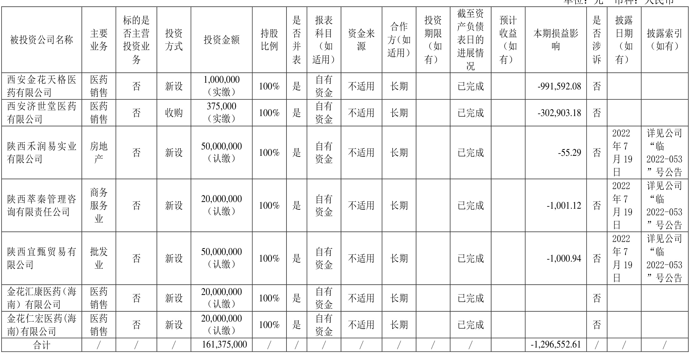  

# 2. 重大的非股权投资  

$\surd$适用  □不适用  

1、公司于2022 年2 月28 日与重庆万达城投资有限公司签订协议，以自有资金购买重庆市沙坪坝区西永组团L 标准分区L70/04（部分）号宗地上开发建设重庆融创山城印象-文华旅游体验区项目商品房，面积42500 平方米，合同总价款17000 万元，该房产拟用于公司西南营销中心办公用房。截至本报告期末，重庆万达城投资有限公司未按合同约定如期交付房产。截止本报告披露日，公司收到重庆万达城投资有限公司退回的购房款17400 万元。  

2、经公司2022 年3 月31 日召开的第九届董事会第十七次会议审议通过，公司与西安天磊置业有限公司签订协议，以自有资金购买其在西安市长安区韦曲街办徐家寨社区DK2 号宗地上开发建设的融创南长安街壹号项目商品房商住房产，面积24500 平方米，合同总价款9800 万元，该房产拟用于公司常宁新区新产品研发与展销中心办公场所。（详见“临2022-031”号公告）  

因西安天磊置业有限公司经营变更，已明确无法按照原协议约定的时间向公司交付认购房屋。西安天磊置业有限公司同意按照双方协议约定，退还公司支付房屋认购预付款项及公司支付的定金，并按照合同约定承担违约责任。经双方协商签订原用房认购事项解除协议，2022 年11 月30 日，公司收到上述全部房屋认购款项8500 万元、应归还定金及应双倍返还的定金2590 万元等合计11090 万元的应归还款项，原用房认购协议书约定用房认购事项终止。（详见“临2022-070”号公告）  

# 3.   以公允价值计量的金融资产  

$\surd$适用  □不适用  

单位：元  币种：人民币
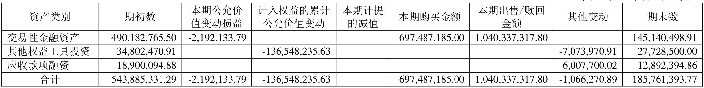  

证券投资情况  √适用 □不适用  

单位：元  币种：人民币
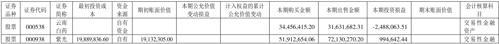  

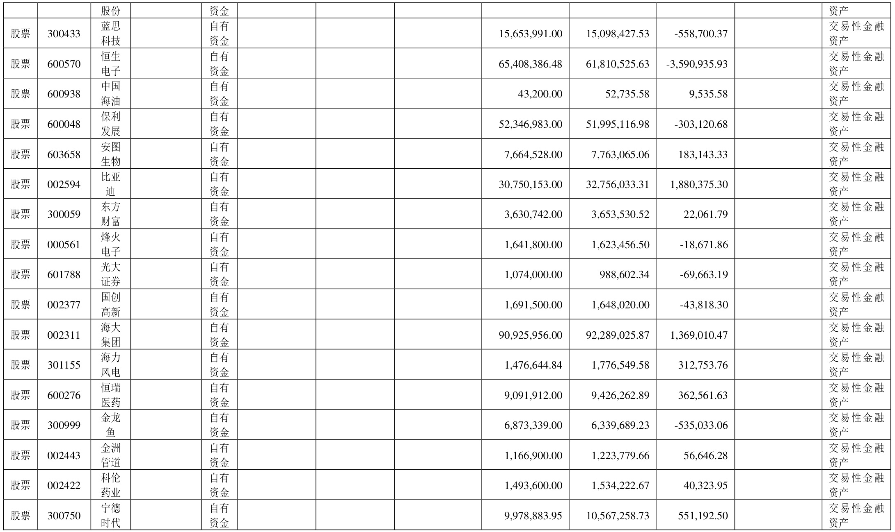  

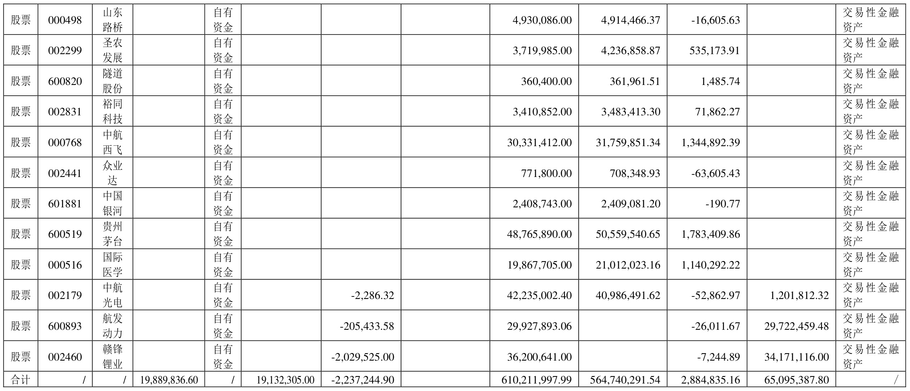  
私募基金投资情况 □适用 √不适用  

衍生品投资情况  □适用 √不适用  

# 4.   报告期内重大资产重组整合的具体进展情况  

□适用 √不适用  

# (六) 重大资产和股权出售  

$\surd$适用  □不适用  

经公司2022 年3 月10 日、2022 年3 月28 日召开的第九届董事会第十六次会议、2022 年第二次临时股东大会审议通过了《关于公开拍卖转让全资子公司金花国际大酒店有限公司$100\%$股权的议案》，公司以评估值36,893.88 万元为底价，采用公开拍卖方式转让全资子公司金花国际大酒店有限公司$100\%$股权（详见公司“临2022-024、临2022-027”号公告）。  

2022 年12 月15 日上述拍卖完成，西部投资集团有限公司以36900 万元举牌，成为金花国际大酒店有限公司$100\%$股权的受让方，公司与西部投资集团有限公司签署《股权转让协议》，约定对拍卖完成时间与评估基准日期间金花国际大酒店产生亏损金额2,447.37 万元在拍卖成交价格中予以扣减，实际应付股权转让价款金额为34,452.63 万元（详见公司“临2022-073、临2022-075”号公告）。  

截止本公告披露日，上述交易尚未完成交割。  

# (七) 主要控股参股公司分析  

$\surd$适用  □不适用  

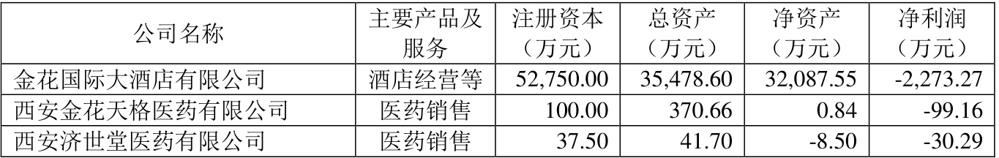  

# (八) 公司控制的结构化主体情况  

□适用  √不适用  

# 六、公司关于公司未来发展的讨论与分析(一)行业格局和趋势  

$\surd$适用  □不适用  

随着我国经济发展进入转型升级阶段，医药行业也逐步向新的发展阶段迈进，《深化医药卫生体制改革2022 年重点工作任务》的印发，国家持续出台的政策与举措，都为医药行业发展指明了方向，为深化医药体制改革构建了路线。药品集中带量采购、降价控费、医保目录调整与支付改革、仿制药一致性评价等政策的完善，加剧医药行业变革的同时，加大了企业研发力度与创新转型，加强了医药监管制度，为医药行业迎来巨大的发展机遇和挑战。  

人口老龄化的加剧、居民健康意识的提升和人们生活水平的提高，拉动我国对慢性病药物的需求增长，发挥我国对中医药传承创新的促进，凸显中医药在疾病预防、治疗中的独特优势，推动中医药长远健康发展，为医疗健康产业提供广阔的市场空间。  

# (二)公司发展战略  

$\surd$适用  □不适用  

公司聚焦制药主业，通过产品升级创新、技术创新、市场创新、服务创新和结构优化，在细分市场做精做强，加大产品研发投入，启动以品种为核心的企业并购重组，延伸公司的产品线，强化在骨科领域的优势，通过在该领域的资源共享，渠道整合，形成协同增效，提升公司品牌的影响力，使得公司在这一细分领域里做大做强，全力打造制药主业核心竞争能力，同时围绕医药大健康领域适度多元化，推动公司持续健康发展。  

# (三)经营计划  

√适用  □不适用  

2023 年，公司将围绕战略规划及年度经营计划，整合资源优势，优化产业布局，以深耕主打产品为核心，高效统筹生产经营和研发创新，聚焦主业与医药大健康产业，持续推动公司业务高质量发展。公司2023 年度重点经营工作如下：  

1、在主导产品营销方面，不断完善销售体系建设，持续加大市场拓展，优化产业布局及产品规划，统筹线上线下渠道联动，完善数字营销体系，持续开展循证研究，有序推进在产产品准入与复产产品上市，落实医学研究方向，提高现有产品市场份额，加大技术研发创新，提升学术品牌价值。在普药产品销售方面，以直营业务渠道集中化为目标，持续推进销售渠道建设，加强与核心渠道的合作力度，优化合作业务模式，提升产品市场覆盖率，制定产品市场竞争方案，有效执行重点产品市场竞争策略，提升核心产品市场竞争力，通过完善销售制度、工作质量评价及考 评体系，树立市场形象，优化市场推广职能，加强执行落实力度，提升市场支持，强化资信管理与风险控制。  

2、在研发方面，公司持续加快技术创新，积极开展新产品研发，扩充产品管线，建立与市场相适应的技术创新体系。提高质量管理意识，细化研究管理要求，完成实验室规划管理升级，全面开展质量标准、工艺优化、工艺研究及产品质量风险评价，提升现有品种质量。加强行业政策与专业技术的学习，提高研发团队专业水平。持续探索外部研发机构合作机会，建立长期良好的协作关系，积极推进各项研发项目，提升公司核心竞争力。  

3、在生产方面，根据年度生产计划，做好生产组织统筹，合理排产，充分挖掘产能潜能，有效降低采购成本，保障市场供应。持续技术革新、工艺改进工作，按照计划完成设备设施的更新。以合规经营为理念，严格执行各项规范，促进质量体系建设，结合公司质量改进、中药委托生产等重点工作，加强生产及质量人员培训，持续开展自检自查工作，强化全员合规生产意识，提升质量管理的创新力和前瞻性。  

4、在管理方面，公司将持续夯实内部管理，加强预算管理与财务监督，进一步提升财务管理水平和风险防范能力。优化激励与约束制度，加大人才引进力度，推进科学人才培养机制，制定和完善绩效管理体系，严格按照目标完成情况落实绩效考核，规范公司运作，开展各项文化活动，营造良好的团队氛围，以人才驱动业务发展。  

5、全力推进酒店子公司的处置进度，尽快完成交割手续；按照计划加快推进募投项目新工厂搬迁扩建的施工进度。  

# (四)可能面对的风险  

√适用  □不适用  

1、行业政策风险：医药行业具有较强的政策导向性，受国家和行业政策影响较大。近年来，我国医药行业监管日趋严格，在药品集中采购常态化、DRG/DIP 支付方式改革、医保目录调整、仿制药一致性评价等政策调控下以及药品质量安全制度细化下，医药行业开始向高质量创新转型，行业优胜劣汰洗牌加速，公司将面临行业政策带来的压力与挑战。  

应对措施：面对行业政策风险，公司将积极应对政策变化，加强对行业信息的研究与分析，及时调整经营策略，加快推进落实战略规划，坚持创新引领，不断优化产品结构，持续提升管理能力，确保公司长期可持续发展；  

2、成本及价格风险：随着国家医疗体系改革的不断推进，基药、医保目录的持续扩容，医保控费力度继续加大。近年来，受全球政治局势、安全环保监管等影响，药品原材料价格上涨，人工成本增加，一定程度影响了公司盈利水平。同时在集采常态化的背景下，药品价格将继续下调，公司将面临生产运营成本增加、销售价格下降等风险。  

应对措施：面对成本及价格风险，公司将加强市场价格监控及分析，合理安排库存与采购周期，提前布局，优化资源配置，有效控制采购成本。  

3、新品研发风险：研发创新是医药行业可持续发展的核心驱动力。药品研发存在周期长、投资大、风险高等特征，易受政策、技术、财务、环境、市场等多方面因素影响，导致研发成果存在不确定性。同时，随着医药创新改革政策的不断推进，新药研发推陈出新的速度不断加快，市场竞争力加剧了产品存在被取代的风险。  

应对措施：面对新品研发风险，公司将持续优化研发创新机制，加强研发团队建设，建立高效的研发管理体系，加快现有产品项目进度，加大研发创新投入，依托现有资源，稳步推进新产品研发，提升公司新产品核心竞争力。  

4、质量安全风险：药品质量责任重大，直接关系到民众的身体健康和生命安全。新《药品管理办法》、《药物警戒检查指导原则》、《药品监管网络安全与信息化建设“十四五”规划》等政策的相继发布，国家对药品质量监管日趋严格。在药品生产过程中，原材料采购、生产、运输和使用等多个环节都可能受到产品质量影响，对公司的经营和业绩将会产生巨大的风险。  

应对措施：公司秉承“质量第一”的管理理念，从药品原材料供应、生产质量管理、药品流通等多个环节严格把控，持续强化质量体系建设，通过成立质量专项小组，识别质量风险，开展技术创新、工艺优化和质量改进专项活动，确保药品质量稳定可控、安全有效。  

# (五)其他  

□适用  √不适用  

七、公司因不适用准则规定或国家秘密、商业秘密等特殊原因，未按准则披露的情况和原因说明 

□适用  √不适用  

# 第四节 公司治理  

# 一、 公司治理相关情况说明  

$\surd$适用  □不适用  

公司按照《公司法》、《证券法》、《上市公司治理准则》及中国证监会等监管机构和上海证券交易所的相关规定和规范性文件的要求，建立了较为完善的公司治理结构及公司治理制度,公司权力机构、决策机构、监督机构及经营管理层之间权责明确，运作规范，公司治理与《公司法》和中国证监会相关规定的要求不存在差异。  

1、股东与股东大会  

公司按照中国证监会发布的《上市公司股东大会规则》的要求，在公司章程中对股东大会的召集、召开程序做出明确规定。公司历次股东大会的召集、召开、表决程序均符合规定，并聘请律师对股东大会出具法律意见。保障股东，特别是中小股东的话语、表决权，确保全体股东能够 充分行使自己的权利。  

2、控股股东与上市公司的关系  

公司与控股股东在经营、管理方面没有交叉，同时公司针对控股股东对公司可能施加的影响，将相关法规文件传达至股东，提示股东按照规章执行，因此控股股东主要通过董事会、股东大会参与公司重大经营决策和管理，不存在直接控制公司、干涉公司正常经营的情况。从人员、资产、财务、机构和业务方面与控股股东做到了相互独立。  

# 3、董事与董事会  

公司严格按照《公司法》、《公司章程》的规定提名和选举董事，董事会的人数和人员构成均符合法律、法规的要求，董事会下设战略、提名、审计、薪酬与考核委员会，制定了专门委员会工作细则，按照国家法律法规和公司相关规则运作。各位董事都能够勤勉尽责，以认真负责的态度出席董事会和股东大会，确保董事会的高效运作和科学决策。  

# 4、监事和监事会  

公司监事会的人员产生和构成符合国家法律法规和公司章程的规定，监事能够认真履行自己的职责，能够本着对股东负责的精神，对公司财务以及对公司董事、公司经理和其他高级管理人员履行职责的合法、合规性进行监督，维护公司和全体股东的利益。  

5、信息披露和公司透明度  

公司指定董事会秘书负责信息披露工作，严格按照监管部门的要求和公司章程、公司信息披露管理制度、公司重大信息内部报告制度、对外信息报送和使用管理办法、内幕信息知情人登记制度及年报信息披露重大差错责任追究制度执行，同时组织学习，强化有关人员的信息披露意识，避免信息披露违规事件的发生。  

6、投资者关系管理  

公司投资者管理由证券部负责，通过电话、传真、电子邮件和上海证券交易所E 互动等方式与投资者保持联系，专人负责接待投资者电话、来信、来访，以即时解答、信件复函等方式进行答复，在不违规的前提下，最大程度的满足投资者的信息需求。  

7、内幕信息知情人登记备案情况  

报告期内，公司严格执行公司《内幕信息知情人登记制度》，在公司披露定期报告及发生重大事项时，编制内幕信息知情人登记表，记录事项的参与人员，确保信息披露的公平、公正、公开。  

公司治理与法律、行政法规和中国证监会关于上市公司治理的规定是否存在重大差异；如有重大差异，应当说明原因  

□适用 √不适用  

# 二、 公司控股股东、实际控制人在保证公司资产、人员、财务、机构、业务等方面独立性的具体措施，以及影响公司独立性而采取的解决方案、工作进度及后续工作计划  

□适用  √不适用  

控股股东、实际控制人及其控制的其他单位从事与公司相同或者相近业务的情况，以及同业竞争或者同业竞争情况发生较大变化对公司的影响、已采取的解决措施、解决进展以及后续解决计划  

□适用  √不适用  

三、 股东大会情况简介
  
表决权恢复的优先股股东请求召开临时股东大会 □适用 √不适用  

股东大会情况说明 □适用 √不适用  

# 四、 董事、监事和高级管理人员的情况  

# (一)  现任及报告期内离任董事、监事和高级管理人员持股变动及报酬情况  

$\surd$适用 □不适用  

  

  

  

  

其它情况说明  

$\surd$适用 □不适用  

1、公司原独立董事张小燕女士、郭凌女士分别于2021 年11 月、2022 年2 月辞去独立董事职务。经公司第九届董事会第十三次会议、2022 年第一次临时股东大会审议通过，补选羿克先生、赵舸女士为公司第九届董事会独立董事；补选邢博越先生、汪星先生为公司第九届董事会董事。  

2、2022 年第一次临时股东大会审议通过了《关于股东提议更换监事及补选监事的议案》，免去李鹏先生第九届监事会监事职务，提名马斌为公司第九届监事会监事。经第九届监事会第十一次会议审议通过，选举马斌先生为监事会主席；原职工代表监事张云波女士于2022 年2 月辞去第九届职工代表监事职务，经公司职工代表大会选举，补选了石智华先生为公司第九届监事会职工代表监事。  

3、经公司第九届董事会第十三次会议审议通过，聘请邢博越先生、宋燕萍女士、陈雪妍女士为副总经理，孙明先生为董事会秘书，巨亚娟女士为财务总监。  

4、2022 年2 月21 日，张朝阳先生辞去董事长职务，经公司第九届董事会第十四次会议审议通过，选举邢雅江先生为公司董事长、张朝阳先生为公司副董事长。  

# (二) 现任及报告期内离任董事、监事和高级管理人员的任职情况  

# 1. 在股东单位任职情况  

√适用 □不适用  
  

# 2. 在其他单位任职情况  

√适用 □不适用  
  

# (三) 董事、监事、高级管理人员报酬情况  

√适用 □不适用  

  

  

# (四) 公司董事、监事、高级管理人员变动情况  

$\surd$适用 □不适用  
  

# (五) 近三年受证券监管机构处罚的情况说明  

$\surd$适用 □不适用  

2021 年10 月21 日，公司收到中国证券监督管理委员会陕西监管局《行政监管措施决定书》（陕证监措施字[2021]30 号），对公司现任实际控制人、董事、副总经理邢博越采取出具警示函的监管措施。（详见公司“临2021-060”号公告）  

2022 年9 月30 日，公司收到上海证券交易所《纪律处分决定书》（【2022】123 号），上海证券交易所对公司现任实际控制人、董事、副总经理邢博越予以公开谴责的纪律处分。  

# (六) 其他  

□适用  √不适用  

五、 报告期内召开的董事会有关情况
  

(一) 董事参加董事会和股东大会的情况
  

  

  
连续两次未亲自出席董事会会议的说明 □适用 √不适用  

  

# (二) 董事对公司有关事项提出异议的情况  

$\surd$适用 □不适用  

  

# (三) 其他  

□适用  $\surd$不适用  

# 七、 董事会下设专门委员会情况  

$\surd$适用 □不适用  

  
2022 年3 月4 日，经公司第九届董事会第十五次会议审议通过《关于补选及调整董事会专门委员会委员的议案》。（详见公司“临2022-021”号公告）  

(2).报告期内审计委员会召开5 次会议
  

(3).报告期内提名委员会召开1 次会议
  

(4).报告期内薪酬与考核委员会委员会召开1 次会议
  

  

(5).存在异议事项的具体情况 □适用  √不适用  

# 八、 监事会发现公司存在风险的说明  

□适用 √不适用  监事会对报告期内的监督事项无异议。  

# 九、 报告期末母公司和主要子公司的员工情况  

( 一 )   员工情况 
  

  

# (二) 薪酬政策  

$\surd$适用  □不适用  

1.员工薪酬的决策程序：员工工资根据公司工资管理制度发放。  

2.员工薪酬确定依据：《金花企业（集团》股份有限公司工资管理制度》。  

3.员工薪酬实际支付情况：已按照《金花企业（集团》股份有限公司工资管理制度》规定的薪酬标准及条款予以支付。  

# ( 三 )   培训计划  

√适用  □不适用  

为了进一步深化公司管理效能、质量管理体系及精益管理体系，有效提高管理层综合管理能力、创建强大的质量管理体系及质量意识、建设高效优质的人才梯队建设以及有效提升员工良好的工作技能和安全保障技能，以培训促发展，打造强有力的学习型成长团队，提升公司培训工作的有效性及连续性，从而为公司快速发展提供强大助推力，结合年度培训需求调研，特制定2022年培训计划。  

一、总体目标  

1.通过中层人才梯队建设培训等，促进公司中层管理团队壮大，有效提升中层管理者管理意识及管理工具使用能力。  

2.通过外部咨询交流学习项目，从战略发展、领导变革、组织创新、资本增长、产业发展等维度充分发挥公司高层管理者的中坚力量。  

3.通过操规培训、现场练兵、技能竞赛等形式开展操作作业规范，形成规范化、标准化的操作行为及习惯。  

4.通过管理规程、质量管理体系等文件的定期复盘式培训，加强全员质量管理意识，互相监督，时长自检。  

5.通过安全演习，安全技能培训，安全知识科普等方式，安全知识实时讲，确保员工具备强大的安全意识和科学的安全保障技能。  

6.加强公司专业技术人员的培训，提高技术理论水平和专业技能，增加技术创新、改造能力。  

7.加强行业法律法规的培训及科普，打好员工规范执业的基础，确保员工了解或具备充分的行业法律法规知识积累。  

8.加强公司员工的职业资格、职业化培训，确保员工的职业资格与岗位匹配，实现技能与综合素质同步替升。  

# 二、基本原则  

1.对于操作岗位员工的培训应关注岗位操作技能提升，并加强科学操作相关课程的学习。  

2.树立部门标兵，鼓励员工向各自部门的标兵学习，促进本部门的学习、交流合作氛围，改进自身不足，提升管理和业务水平。  

3.在关注外在管理思想引进的同时重视企业自身培训能力提升，继续促进兼职培训师队伍课件开发能力、课程传授能力提升，加大培训师队伍学习与建设投入。  

4.培训形式以课堂讲授为主，结合视频教学、现场演练、技能竞赛等形式，以实际案例分析等方式促进知识吸收程度的加强。  

5.针对不同层级开发培训课件，形成培训课程体系，为各层级能力提升和人才建设提供保障。 三、基本要求  

1.坚持自主培训为主，外委培训为辅的原则。持续开展培训讲师专业辅导活动，鼓励管理层、技术骨干授课比例不低于$70\%$，培训时长不低于14 小时/人/年。  

2.建立以部门为单位的培训负责制。部门自行整合培训资源，制作培训教材，因需施教。  

3.各部门编制完成本部门的培训教材，教材以培训“基本功”为主，即明确实际操作的基本动作、基本技能和基础理论，内容包括：  

$\oslash$1 各岗位工作职责、范围；  

$\oslash$2 各岗位所使用机器、设备、系统、仪器仪表、工具器皿等的操作原理； $\textcircled{3}$3 各岗位工作标准、质量标准、工艺流程、操作规范及依据制度； $\textcircled{\scriptsize{4}}$4 各岗位自检、维修及保养方法，如何发现故障以及排除技巧；  

# $\odot$5 各岗位事故急救措施；  

$\mathfrak{C}$6 各岗位其他应知、应会内容。  

1.教材可根据需要制作成手册（行政人事部负责公司公共类型知识、管理知识、企业文化、行政人事制度规范等内容）、PPT 电子版、影音资料等多种形式。  

2.教材经审核后，统一交行政人事部备案存档，用于部门新入职员工岗位技能培训和部门日常培训学习所用。  

3.持续培训积分原则，各岗位层级对应考核积分详见下表： 
  

培训积分条件、方法及管理细则详见《培训积分管理办法》。  

4.培训工作由人力资源部全面管理，确保培训计划开课率达$90\%$以上，全员覆盖率达$100\%$四、培训内容  

# （一）岗前培训  

1.由人力资源部统一管理新员工入职培训工作，培训内容包括：公司简介、企业文化、产品介绍、GMP 认证知识、药物警戒管理知识、人事和财务管理制度、员工行为规范、OA/钉钉办公系统使用等。各部门在此基础上还应根据不同岗位建立适应部门需求的新员工培训体系，合理安排部门内部的新员工岗前培训。  

2.注重专业知识、岗位操作技能培训授课后培训效果评估与培训成绩考核。  

3.重视岗前培训课件标准化工作，规范企业岗前培训形式，引入影像存档等高效培训方式。  

（二）岗中培训  

1.高层领导：通过参加企业家高端论坛、峰会、到成功企业参观学习等方式提升先进管理理念，提高综合管理效能。  

2.中、基层管理人员：增强管理实务方面培训。包括成本管理、高效能团队建设、高水准问题分析与解决、领导艺术、创新与激励、沟通与执行等。主要采取外请讲师到公司集中授课、外派参与管理培训、沙盘模拟及案例分析形式。  

3.转岗培训：以“师傅带徒弟”形式进行一对一培训，培训内容、步骤及评估标准同“新员工岗位技能培训”，最低不少于20 个工作日。  

4.专业技术人员培训：加强公司人才梯队建设及人员外出培训管理，培训后务必将所学内容在公司内进行翻讲传授、推广分享，由行政人事部负责培训协议签订、翻讲推广跟踪等工作。  

5.建立生产部三级培训学习体系  

一级培训是由生产部经理对车间主任、主管进行培训，主要内容包括：GMP 规范、法律法规、质量规范、团队建设、沟通管理、创新开拓等，每季度至少进行一次，每次不少于一小时；  

二级培训是由车间主任或主管对主管或班组长、技术员进行培训，主要内容包括：技术创新、GMP 规范、质量规范、设备管理、5S 管理等，每月至少进行一次，每次不少于一小时；  

三级培训是由主管或班组长或技术员对本车间员工进行培训，主要内容包括岗位职责、岗位操规、安全操规、工作流程和工艺技能等专业知识及作业指导书等，每月至少进行两次，每次不少于两小时。  

6.“技术骨干”围绕各自工作领域每年至少开发一节课程，并在公司范围内进行授课不少于两次，每次不少于两小时。  

7.专业知识培训：坚持医药卫生类人才、财务专业人员继续教育，加强执业资格证书获取学习。  

8.开阔眼界，拓展思路，掌握信息，汲取经验。组织中层干部到上下游企业和关联企业学习参观，了解生产经营情况，借鉴成功经验。  

9.企业文化：开展“金花人”讲“金花故事”，由“金花故事”当事人或参与人讲述能够代表金花精神的金花故事，目标涵盖公司全体员工，对公司企业文化进行再回顾，提高团队的凝聚力。  

10.继续加强法律法规学习，尤其是企业负责人，质量授权人，各管理人员对于《药品管理法》《质量管理法》《劳动法》等培训。  

# 五、培训考核与评估  

1.建立员工培训记录，将员工培训积分、培训考试结果等纳入档案管理，由人力资源部统一登记管理，以部门为单位每月定期将统计结果发送给各部门经理，以便员工掌握自己的培训情况。  

2.员工培训积分与年度考核挂钩，对于年度累计积分低于合格积分标准的员工一律按权重比例扣减年终考核成绩。  

3.考核评估分两个方面：一是受训人员对讲师（包括组织者、授课人）的考核和评估，二是对受训人员的考核和评估，新员工入职培训、基础理论、专业技能等培训增加笔试考核，由讲师负责提供考试试题，评估后统一报人力资源部汇总，笔试得分低于60 分者。  

4.凡签到不听课者、考试不及格者、无故迟到、早退者均不计培训积分。  

# (四) 劳务外包情况  

□适用 √不适用  

# 十、 利润分配或资本公积金转增预案 (一) 现金分红政策的制定、执行或调整情况  

$\surd$适用  □不适用  

公司章程中对现金分红政策及相关决策程序进行了明确的规定，报告期内，公司未对现金分红政策进行调整。经公司董事会及股东大会审议通过，鉴于2021 年度归属于上市公司股东的净利润为负，2021 年度不进行利润分配，报告期内，公司未实施利润分配。  

# (二) 现金分红政策的专项说明  

$\surd$适用 □不适用  
  

(三) 报告期内盈利且母公司可供股东分配利润为正，但未提出现金利润分配方案预案的，公司应当详细披露原因以及未分配利润的用途和使用计划 
  

  

# (四) 本报告期利润分配及资本公积金转增股本情况  

□适用 √不适用  

十一、 公司股权激励计划、员工持股计划或其他员工激励措施的情况及其影响  

(一) 相关激励事项已在临时公告披露且后续实施无进展或变化的  

□适用 √不适用  

(二)  

股权激励情况  □适用 √不适用  

其他说明 □适用  √不适用  

员工持股计划情况  

$\surd$适用  □不适用  

2022 年11 月19 日，公司披露了《关于第一期员工持股计划出售完毕暨终止的公告》，公司第一期员工持股计划所持公司股票1,289,559 股已全部出售完毕。（详见公司“临2022-065”号公告）。  

其他激励措施 

□适用 √不适用  

# (三) 董事、高级管理人员报告期内被授予的股权激励情况  

□适用 √不适用  

# (四) 报告期内对高级管理人员的考评机制，以及激励机制的建立、实施情况  

$\surd$适用  □不适用  

公司对管理人员的考评和激励实行管理目标责任制，在年初制定年度目标责任书，明确各子公司、分支机构、管理部门的工作职责、经营目标，定期进行考核。在下一年度初，对上一年度工作进行总结，考评指标按照年初与各业务部门签订的目标责任书进行综合绩效评估，以评估结果作为对管理人员激励的依据。  

# 十二、 报告期内的内部控制制度建设及实施情况  

√适用 □不适用  

公司严格遵守《中华人民共和国审计法》《企业内部控制评价指引》《企业内部控制审计指引》《上市公司治理准则》等有关法律和规范，不断建立健全公司内部控制体系，提升公司的内控管理水平。  

公司根据现行法律法规，建立了完善的内部控制制度。按照国家内控标准建立的《内部控制手册》《内部控制评价手册》及公司治理等相关制度。公司通过制度化、流程化、信息化建设，实现生产、销售、储运、财务、行政、人事等各个环节无纸化办公，确保公司经营及生产活动的高效、平稳运行。  

报告期内，公司对《公司章程》、《独立董事工作制度》、《关联方资金往来和对外担保管理办法》进行了修订。  

报告期内部控制存在重大缺陷情况的说明 

□适用 √不适用  

# 十三、 报告期内对子公司的管理控制情况  

$\surd$适用 □不适用  

公司根据《公司法》《公司章程》等相关法律法规的规定，对子公司实施管理控制。按照相关法律法规，指导子公司健全治理结构，完善企业制度，修订完善公司章程等相关制度，明确规定子公司规范运作、财务管理、经营决策管理、重大事项及信息披露、审计监督等各项制度，以及公司对子公司的指导、管理及监督，督促子公司对关联交易等事项事前向公司报告工作。  

# 十四、 内部控制审计报告的相关情况说明  

√适用  □不适用  

公司聘请信永中和会计师事务所(特殊普通合伙)对公司出具了带强调事项段的无保留意见内部控制审计报告（XYZH/2023XAAA5B0269）。信永中和会计师事务所(特殊普通合伙)出具的内部控制审计报告与董事会的自我评价报告意见一致。具体内容详见公司于上海证券交易所网站  

（www.sse.com.cn）披露的相关公告。  

是否披露内部控制审计报告：是 内部控制审计报告意见类型：带强调事项段的无保留意见  

十五、 上市公司治理专项行动自查问题整改情况 不适用  

十六、 其他 

□适用  √不适用  

# 第五节 环境与社会责任  

# 一、环境信息情况  

  

# (一) 属于环境保护部门公布的重点排污单位的公司及其主要子公司的环保情况说明  

□适用 √不适用  

# (二) 重点排污单位之外的公司环保情况说明  

$\surd$适用 □不适用  

# 1. 因环境问题受到行政处罚的情况  

□适用 √不适用  

# 2. 参照重点排污单位披露其他环境信息  

$\surd$适用 □不适用  1、报告期内，公司未发生重大环境问题，没有因环境污染问题受到环境保护行政主管部门  

处罚。  

2、执行的污染物排放标准：  

报告期内，公司燃烧废气排放执行氮氧化物排放浓度符合《锅炉大气污染物排放标准》（DB61/1226-2018）表3 燃气锅炉大气污染物排放浓度限值的要求。  

（1）有组织废气:DA001 粉碎后室排气筒出口、DA002 制粒排气筒出口、DA003 沸腾干燥1 排 气筒出口、 DA004 沸腾干燥2 排气筒出口、 DA005 沸腾干燥3 排气筒出口、 DA006 粉碎排气筒出口、 DA007 包衣后室净化设备出口、DA008 压片净化设备出口、DA009 填充车间净化设备出口、DA010提取车间废气净化设备出口的颗粒物的排放放浓度均满足《制药工业大气污染物排放标准》 (GB37823-2019)表1 中标准限值要求，DA010 提取车间废气净化设备出口的臭气浓度值满足《恶臭污染物排放标准》(GB 14554-1993)表2 中标准值限值要求，DA011 锅炉排气筒出口、DA012 锅炉排气筒出口中的颗粒物、二氧化硫、氮等氧化物排放浓度均满足《锅炉大气污染物排放标准》

(DB61/1226-2018)表3 中标准限值要求；废水排放执行《黄河流域（陕西段）污水综合排放标准》

（DB61/224-2011）二级标准和《污水综合排放标准》（GB 8978-1996）表4 三级标准。  

（2）无组织废气:金花企业(集团)股份有限公司西安金花制药厂厂界无组织废气中氨、硫化氢、臭气浓度的浓度满足《恶臭污染物排放标准》(GB 14554-1993)表I 中标准限值要求，非甲烷总烃的排放浓度满足《大气污染物综合排放标准》(GB 16297-1996)表2 中标准限值要求；  

(3)废水:DW001 污水排放口中pH 值、悬浮物、化学需氧量、五日生化需氧量、石油类、动植 物油类的浓度均满足《污水综合排放标准》(GB 8978-1996)表4 中三级标准的限值要求，总磷、氨氮、总氮的浓度满足《污水排入城镇下水道水质标准》(GB/T31962-2015)表1 中B 级标准限值要求。  

3、噪声排放执行《工业企业厂界环境噪声排放标准》（GB12348-2008）2 类、4 类区标准。  

4、建设项目环境影响评价及其他环境保护行政许可情况：公司现有建设项目环境影响评价均已通过环保竣工验收。  

5、企业环保设施的建设和运行情况：  

报告期内，公司环保设施由专人维护，定期检查，运行状况良好，各类污染物均能达标排放。公司建有污水处理站，采用“厌氧+好氧”相结合的接触氧化法工艺处理污水，处理能力为10m3/h（240m3/d），废水处理达标后排入污水处理厂。  

燃烧废气由天然气锅炉（WNS6-1.25-Q）产生，报告期内锅炉已完成低氮改造，改造后锅炉燃烧废气氮氧化物排放浓度不高于$80\mathrm{{mg/m3}}$，并采用余热回收技术，烟气经过热交换常温排放，换热产生的热水供锅炉补水使用。  

含尘废气由产尘工序产生，产尘工序生产设备均配备了除尘机，功能间排风全部配套专用除尘设备，进行高空排放，经除尘设备处理后的含尘废气浓度符合《大气污染物综合排放标准》（GB 16297-1996）二级标准。  

含异味废气集中收集后经喷淋洗涤塔+UV 光氧催化$\cdot^{+}$活性炭吸附处理后，高空排放，经处理后的含异味废气排放符合《恶臭污染物排放标准》（GB 14554-1993）表1 排放量限值要求。  

6、主要污染物的排放及控制情况：  

根据第三方检测机构出具的环境监测报告，公司生产排放的主要污染物及核算的排放数据（2022 年1—12 月）如下：  

废水：出水口排放污水PH 值为6.8；CODcr 浓度为119mg/L，排放量约为0.07 吨；氨氮浓度为22.3mg/L，排放量约为0.13 吨；石油类浓度约为0.19mg/L，排放量约为0.01 吨。氨氮、化学 需氧量、石油类检测结果均符合《黄河流域（陕西段）污水综合排放标准》（DB61/224-2011）第二类污染物最高允许排放浓度二级标准，PH 检测结果符合《污水综合排放标准》（GB 8978-1996）第二类污染物最高排放浓度三级标准要求。  

燃烧废气：天然气锅炉经低氮改造后，氮氧化物排放浓度为$50\mathrm{{mg/m3}}$，氮氧化物排放浓度符合《锅炉大气污染物排放标准》（DB61/1226-2018）表3 燃气锅炉大气污染物排放浓度限值80mg/m3的要求。  

危险废物：2022 年1—12 月公司危险废物转移量约为23.86 吨，危险废物定期交由陕西新天地固体废物综合处置有限公司处置。公司按照危险废物管理规定对危险废物分类收集、专库储存，已建立完善的危险废物储存、转运、处置台账和周检查管理制度。  

7、环境自行监测方案：  

公司每年定期委托具有检测资质的第三方检测机构对厂区内环境质量进行监测，明确污染物监测类别、监测项目、监测频次，监测内容包括废水（化学需氧量、石油类、悬浮物、生化需氧量、氨氮、PH 值）、废气（颗粒物、臭气、无组织废气）、噪音，监测完成后，由第三方检测机构出具环境监测报告。报告期内已完成废水、废气、噪声各项目监测，各类污染物均达标排放。公司通过监测结果及时了解并控制污染物排放情况，通过不断改进现有环保运行设施，确保污染物达标排放。  

8、突发环境事件应急预案：  

公司已编制《金花企业（集团）股份有限公司西安金花制药厂突发环境事件应急预案》，并已完成专家评审在西安市生态环境局高新分局备案，公司将根据预案定期组织相关部门进行演练。  

# 3. 未披露其他环境信息的原因  

□适用 √不适用  

# (三) 有利于保护生态、防治污染、履行环境责任的相关信息  

√适用 □不适用  

报告期内，公司主动履行环境保护社会责任，在合规运营的前提下，持续提升环保管理水平，主动细化环境保护治理要求，优化过程控制环节，全面完成日常环保管理，环境监测，固废管理、环境应急演练，重污染天气的应急响应、环境报表等工作，制定并签订目标责任书，落实公用系统节能方案，通过设备设施改造、加大重点岗位巡检、节能意识的宣贯等措施推动节能减排，切实履行企业社会责任。  

(四) 在报告期内为减少其碳排放所采取的措施及效果 
  

具体说明  

√适用 □不适用  

2022 年“双碳”目标依然是我国经济社会发展，全面绿色低碳转型的主旋律。党的二十大报告提出积极稳妥推进碳达峰碳中和，围绕深入推进“双碳”目标，完善“双碳”政策体系，加快能源结构调整，促进发展方式绿色转型，是贯彻落实新发展理念、推动高质量发展的关键环节。公司将积极相应低碳号召，坚持低碳环保的生产经营理念，持续有效实施以下减少碳排放措施：  

一是积极倡导低碳工作、低碳生活。公司建立办公设备、耗材用品、空调、纸张使用、节电节水等员工日常行为规范；积极倡导健康出行理念，组织公益捐步等多项健民活动；生产车间、办公区域的工作照明全部采用LED 节能灯具和声、光、感应控制措施。  

二是减少垃圾产量，实行垃圾分类。对公司相关板块进行节能改造，提高资源使用率，加强资源回收，节约成本，减少污染。  

三是加强资源的回收再利用。公司对工艺用水回收再利用；采用节能器对锅炉烟气排放热量进行余热回收利用；对所有生产车间蒸汽加热工艺设备产生的冷凝水的余热和水资源进行回收再利用；同时积极实施各项节能减排设备改造优化项目，全面提高生产管理的精细化水平。  

四是公司设备设施购置选型、技术改造，充分采用降耗节能方案，减少碳排放。公司制药工艺设备、包装生产线，采用先进适用、节能可靠的电气自动化控制技术和联动线流水作业生产方式，提高生产效率，杜绝次品、废品产生，减少储存搬运浪费，有效降低物料损耗和资源浪费；公司燃气蒸汽锅炉、员工餐厅全部采用清洁能源天然气作为燃料，有效降低碳排放的同时，减少大气污染和对周边环境的影响。  

五是加强低碳宣传，广泛传播“碳中和”理念。公司要求员工从“我”做起，争当低碳达人，弘扬以低碳环保为荣的企业新风尚。  

# 二、社会责任工作情况  

# (一) 是否单独披露社会责任报告、可持续发展报告或ESG 报告  

□适用 √不适用  

# (二) 社会责任工作具体情况  

$\surd$适用 □不适用  

  

具体说明  

√适用  □不适用  

近年来，公司以“可持续发展”为责任理念，积极投身社会公益活动，参与多种形式的公益慈善事业。作为医药制造企业，公司始终坚持依法经营、诚实守信，切实提升产品质量和服务水平，积极回报投资者。  

1、关爱员工：公司严格遵守《劳动法》及《劳动合同法》等相关法律法规，切实维护员工的合法权益，逐步完善各项人力资源管理制度和绩效考核体系，为员工提供薪酬福利保障。关注员工健康，组织员工健康体检；重视员工成长规划，开展员工岗位培训与专业技能培训；搭建职业晋升平台，开展丰富的业余生活，以多种形式关怀员工，对困难员工提供关爱和帮助；以孝道文化为企业文化内核之一，为员工父母发放生日福利，进一步体现对员工及员工家庭的关爱，提升员工凝聚力，努力构建良好的工作氛围。  

2、提升品质：公司坚持依法经营，以诚信为基础，建立长期稳定的合作关系，提供专业化服务需求；严格按照药品质量管理体系，全程监控各环节药品质量，实行全员质量责任制，不断提高全员的职业技能素质。  

3、注重环保：公司非常重视生产对环境的影响，坚持贯彻落实环保相关法规政策，不断完善环保管理体制，持续对环保设施进行技术改进，实施从生产源头控制，减少“三废”排放，实现公司经济效益、社会效益、环境效益的协调发展。  

4、投资者利益：公司严格按照《公司法》、《上海证券交易所股票上市规则》等法律法规的要求，不断健全、完善公司法人治理结构和内部控制制度，提升法人治理水平，保障投资者的知情权和收益权。报告期内，公司通过股东大会、上市公司“e 互动”、投资者来电、投资者邮箱等方式，进行互动交流，积极建立公开、公正、透明的投资者关系。  

5、投身公益：公司积极投身于多种形式的公益慈善事业，组成志愿者队伍，发扬志愿精神，2022 年11 月，公司捐赠10 万余支转移因子口服液，以实际行动践行企业社会责任。  

# 三、巩固拓展脱贫攻坚成果、乡村振兴等工作具体情况  

□适用 √不适用  具体说明 □适用 √不适用  

# 第六节 重要事项  

# 一、承诺事项履行情况  

(一) 公司实际控制人、股东、关联方、收购人以及公司等承诺相关方在报告期内或持续到报告期内的承诺事项  

$\surd$适用 □不适用  

  

  

备注1：通过集中竞价交易方式减持的，在任意连续90 个自然日内减持的股份总数不超过公司股份总数的$1\%$，减持期间为自贵公司公告披露之日起15 个交易日后的六个月内；通过大宗交易方式减持的，在任意连续90 个自然日内减持的股份总数不超过公司股份总数的$2\%$，减持期间为自贵公司公告披露之日起3 个交易日后的六个月内。  

备注2：公司于2022 年12 月15 日采用公开拍卖方式转让全资子公司金花国际大酒店有限公司$100\%$股权，西部投资集团有限公司举牌，成为金花国际大酒店有限公司$100\%$股权的受让方（详见“临2022-073、临2022-075”号公告），鉴于金花国际大酒店拍卖结果构成关联交易，为最大程度的维护公司利益，西部投资集团有限公司声明并承诺如下：1、西部投资参与本次拍卖，其目的是为了维护金花股份核心利益，减少金花大酒店每年给金花股份造成的折旧和经营亏损合计约2500 万元；2、待房地产市场回暖，旅游市场获得恢复及酒店经营好转后半年内，西部投资将再次以公开拍卖的形式对金花大酒店进行转让，届时如再次公开拍卖的转让价款与西部投资竞拍取得酒店公司实际支付股权价款之间产生溢价，西部投资集团有限公司承诺将该溢价部分全部无偿赠与公司。  

(二) 公司资产或项目存在盈利预测，且报告期仍处在盈利预测期间，公司就资产或项目是否达到原盈利预测及其原因作出说明  

□已达到 □未达到 √不适用  

( 三 )   业绩承诺的完成情况及其对商誉减值测试的影响  

 □适用 $\surd$不适用  

  二、报告期内控股股东及其他关联方非经营性占用资金情况  

□适用 √不适用  

# 三、违规担保情况  

$\surd$适用 □不适用  

  

# 四、公司董事会对会计师事务所“非标准意见审计报告”的说明  

□适用 √不适用  

五、公司对会计政策、会计估计变更或重大会计差错更正原因和影响的分析说明  

（一）公司对会计政策、会计估计变更原因及影响的分析说明  

□适用  √不适用  

（二）公司对重大会计差错更正原因及影响的分析说明 

□适用  √不适用  

（三）与前任会计师事务所进行的沟通情况  

□适用  √不适用  

（四）其他说明  

□适用  √不适用  

# 六、聘任、解聘会计师事务所情况  

单位：万元  币种：人民币  

  

  

聘任、解聘会计师事务所的情况说明  

$\surd$适用 □不适用  

经公司第九届董事会第十八次会议及2021 年年度股东大会审议通过，公司聘请信永中和会计师事务所（特殊普通合伙）为公司2022 年度财务及内部控制审计机构（具体详见“临2022-033号、临2022-038 号、临2022-045”号公告）。  

审计期间改聘会计师事务所的情况说明 □适用  √不适用  

七、面临退市风险的情况 

(一)导致退市风险警示的原因  

□适用  √不适用  

(二)公司拟采取的应对措施 

□适用 √不适用  

# (三)面临终止上市的情况和原因  

□适用  √不适用  

# 八、破产重整相关事项  

□适用 √不适用  

九、重大诉讼、仲裁事项  

$\surd$本年度公司有重大诉讼、仲裁事项 □本年度公司无重大诉讼、仲裁事项  

# (一) 诉讼、仲裁事项已在临时公告披露且无后续进展的  

$\surd$适用 □不适用  
  

# (二) 、仲裁情况  

□适用 √不适用  

(三) 其他说明 

□适用  √不适用  

十、上市公司及其董事、监事、高级管理人员、控股股东、实际控制人涉嫌违法违规、受到处罚及整改情况  

$\surd$适用 □不适用  2022 年9 月30 日，公司收到上海证券交易所《纪律处分决定书》（【2022】123 号），上海证券交易所对公司现任实际控制人、董事、副总经理邢博越及其一致行动人予以纪律处分。  

# 十一、报告期内公司及其控股股东、实际控制人诚信状况的说明  

□适用  √不适用  

# 十二、重大关联交易  

( 一 ) 与日常经营相关的关联交易   1、 已在临时公告披露且后续实施无进展或变化的事项 □适用 $\surd$不适用  

2、 已在临时公告披露，但有后续实施的进展或变化的事项 □适用  $\surd$不适用  

# 3、   临时公告未披露的事项  

$\surd$适用 □不适用  

单位:元  币种:人民币 
  

# (二)资产或股权收购、出售发生的关联交易  

# 1、 已在临时公告披露且后续实施无进展或变化的事项  

$\surd$适用 □不适用  

  

# 2、 已在临时公告披露，但有后续实施的进展或变化的事项  

□适用  √不适用  

# 3、   临时公告未披露的事项  

□适用 √不适用  

# 4、 涉及业绩约定的，应当披露报告期内的业绩实现情况  

□适用  √不适用  

# (三)共同对外投资的重大关联交易  

# 1、 已在临时公告披露且后续实施无进展或变化的事项  

□适用 √不适用  

# 2、 已在临时公告披露，但有后续实施的进展或变化的事项 □适用  √不适用  

3、   临时公告未披露的事项  

□适用 √不适用  

(四)关联债权债务往来 1、 已在临时公告披露且后续实施无进展或变化的事项 □适用 √不适用  

2、 已在临时公告披露，但有后续实施的进展或变化的事项 □适用  √不适用  

3、   临时公告未披露的事项  □适用 √不适用  

(五)公司与存在关联关系的财务公司、公司控股财务公司与关联方之间的金融业务 □适用 √不适用  

(六)其他 □适用  √不适用  

十三、重大合同及其履行情况  

(一)   托管、承包、租赁事项  

1、 托管情况 □适用 √不适用  

2、 承包情况 □适用 √不适用  

# 3、   租赁情况  

$\surd$适用 □不适用  

单位:元  币种:人民币 
  

  

# (二)   担保情况  

□适用 √不适用  

# (三) 委托他人进行现金资产管理的情况  

1.   委托理财情况 

 (1)   委托理财总体情况  

$\surd$适用  □不适用  

单位：万元  币种：人民币 
  

# 其他情况  

□适用  √不适用  

# (2)   单项委托理财情况  

$\surd$适用  □不适用  

  

  

  

  

  
其他情况 □适用  √不适用  

(3)   委托理财减值准备  

 □适用  √不适用  

2.   委托贷款情况 

 (1)   委托贷款总体情况  

 □适用  √不适用  其他情况 

□适用  √不适用  

(2)   单项委托贷款情况  

 □适用  √不适用  其他情况 

□适用  √不适用  

(3)   委托贷款减值准备  

 □适用  √不适用  

3. 其他情况 

□适用  √不适用  

(四) 其他重大合同 

□适用  √不适用  

十四、其他对投资者作出价值判断和投资决策有重大影响的重大事项的说明 □适用 √不适用  

# 第七节 股份变动及股东情况  

一、 股本变动情况  

(一) 股份变动情况表 1、 股份变动情况表 报告期内，公司股份总数及股本结构未发生变化。  

2、 股份变动情况说明 □适用  √不适用  3、 股份变动对最近一年和最近一期每股收益、每股净资产等财务指标的影响（如有） □适用  $\surd$不适用  4、 公司认为必要或证券监管机构要求披露的其他内容 □适用  √不适用  

# (二) 限售股份变动情况  

□适用 √不适用  

# 二、  证券发行与上市情况  

# (一)截至报告期内证券发行情况  

□适用 √不适用  截至报告期内证券发行情况的说明（存续期内利率不同的债券，请分别说明）： □适用  √不适用  

# (二)公司股份总数及股东结构变动及公司资产和负债结构的变动情况  

□适用  √不适用  

# (三) 现存的内部职工股情况  

□适用 √不适用  

# 三、 股东和实际控制人情况  

# (一) 股东总数  

  

# (二) 截至报告期末前十名股东、前十名流通股东（或无限售条件股东）持股情况表  

单位:股  

  

  
前十名有限售条件股东持股数量及限售条件 □适用 √不适用  

# (三) 战略投资者或一般法人因配售新股成为前10 名股东  

□适用 √不适用  

# 四、 控股股东及实际控制人情况  

( 一 )   控股股东情况  

1 法人 

□适用 √不适用  

# 2 自然人  

$\surd$适用 □不适用  

  

# 3 公司不存在控股股东情况的特别说明  

□适用  √不适用  

# 4 报告期内控股股东变更情况的说明  

$\surd$适用  □不适用  2022 年1 月15 日，公司原控股股东金花投资控股集团有限公司（以下简称“金花投资”）持有的公司无限售流通股份66,897,654 股（占公司总股本的$17,92\%$，占其持有公司股份总数的$93.\,63\%$）被司法拍卖，2022 年1 月26 日完成划转过户（详见公告“临2022-003、临2022-005、临2022-007”号），权益变动后，金花投资持有公司4,550,000 股（占公司总股本的$1,22\%$）。  

2022 年3 月23 日，邢博越及其一致行动人持有公司无限售流通股份94,608,154 股（占公司总股本的$25,35\%$），其中，邢博越持有64,566,652 股（占公司总股本的$17,30\%$），杜玲持有10,974,247 股（占公司总股本的$2,94\%$），杨蓓持有10,545,559 股（占公司总股本的$2,83\%$），钟春华持有8,521,696 股（占公司总股本的$2,28\%$）。公司董事会认定邢博越及其一致行动人杜玲、杨蓓、钟春华成为公司控股股东，邢博越为公司实际控制人。（详见公告“临2022-026、临2022-028”号）  

# 5 公司与控股股东之间的产权及控制关系的方框图  

$\surd$适用  □不适用  

  

# (二) 实际控制人情况  

1 法人 

□适用 √不适用  

# 2 自然人  

√适用 □不适用  
  

# 3 公司不存在实际控制人情况的特别说明  

□适用  √不适用  

# 4 报告期内公司控制权发生变更的情况说明  

$\surd$适用  □不适用  

详见本报告“第七节股份变动及股东情况-四、控股股东及实际控制人情况-（一）控股股东情况-4、报告期内控股股东变更情况的说明”相关内容。  

# 5 公司与实际控制人之间的产权及控制关系的方框图  

$\surd$适用  □不适用  

  

# 6 实际控制人通过信托或其他资产管理方式控制公司  

□适用  $\surd$不适用  

# (三) 控股股东及实际控制人其他情况介绍  

$\surd$适用  □不适用  详见本报告“第七节股份变动及股东情况-四、控股股东及实际控制人情况-（一）控股股东情况-4、报告期内控股股东变更情况的说明”相关内容。  

# 五、 公司控股股东或第一大股东及其一致行动人累计质押股份数量占其所持公司股份数量比例达到 $\bf{80\%}$以上  

□适用 √不适用  

六、 其他持股在百分之十以上的法人股东  

□适用 $\surd$不适用  

七、 股份限制减持情况说明□适用 √不适用  

八、 股份回购在报告期的具体实施情况  

□适用 √不适用  

# 第八节 优先股相关情况  

□适用 √不适用  

# 第九节 债券相关情况  

# 一、企业债券、公司债券和非金融企业债务融资工具  

□适用 √不适用  

# 二、可转换公司债券情况  

□适用 √不适用  

# 第十节 财务报告  

# 一、 审计报告  

$\surd$适用 □不适用  

# 审计报告  

XYZH/2023XAAA5B0268  

# 金花企业（集团）股份有限公司全体股东：  

# 一、审计意见  

我们审计了金花企业（集团）股份有限公司（以下简称金花股份公司）财务报表，包括2022年12 月31 日的合并及母公司资产负债表，2022 年度的合并及母公司利润表、合并及母公司现金流量表、合并及母公司股东权益变动表，以及相关财务报表附注。  

我们认为，后附的财务报表在所有重大方面按照企业会计准则的规定编制，公允反映了金花股份公司2022 年12 月31 日的合并及母公司财务状况以及2022 年度的合并及母公司经营成果和现金流量。  

# 二、形成审计意见的基础  

我们按照中国注册会计师审计准则的规定执行了审计工作。审计报告的“注册会计师对财务报表审计的责任”部分进一步阐述了我们在这些准则下的责任。按照中国注册会计师职业道德守则，我们独立于金花股份公司，并履行了职业道德方面的其他责任。我们相信，我们获取的审计证据是充分、适当的，为发表审计意见提供了基础。  

# 三、关键审计事项  

关键审计事项是我们根据职业判断，认为对本期财务报表审计最为重要的事项。这些事项的应对以对财务报表整体进行审计并形成审计意见为背景，我们不对这些事项单独发表意见。  

  

  

# 四、其他信息  

金花股份公司管理层(以下简称管理层)对其他信息负责。其他信息包括金花股份公司2022年度报告中涵盖的信息，但不包括财务报表和我们的审计报告。  

我们对财务报表发表的审计意见不涵盖其他信息，我们也不对其他信息发表任何形式的鉴证结论。  

结合我们对财务报表的审计，我们的责任是阅读其他信息，在此过程中，考虑其他信息是否与财务报表或我们在审计过程中了解到的情况存在重大不一致或者似乎存在重大错报。  

基于我们已执行的工作，如果我们确定其他信息存在重大错报，我们应当报告该事实。在这方面，我们无任何事项需要报告。  

# 五、管理层和治理层对财务报表的责任  

管理层负责按照企业会计准则的规定编制财务报表，使其实现公允反映，并设计、执行和维护必要的内部控制，以使财务报表不存在由于舞弊或错误导致的重大错报。  

在编制财务报表时，管理层负责评估金花股份公司的持续经营能力，披露与持续经营相关的事项（如适用），并运用持续经营假设，除非管理层计划清算金花股份公司、终止运营或别无其他现实的选择。  

治理层负责监督金花股份公司的财务报告过程。  

# 六、注册会计师对财务报表审计的责任  

我们的目标是对财务报表整体是否不存在由于舞弊或错误导致的重大错报获取合理保证，并出具包含审计意见的审计报告。合理保证是高水平的保证，但并不能保证按照审计准则执行的审计在某一重大错报存在时总能发现。错报可能由于舞弊或错误导致，如果合理预期错报单独或汇总起来可能影响财务报表使用者依据财务报表作出的经济决策，则通常认为错报是重大的。  

在按照审计准则执行审计工作的过程中，我们运用职业判断，并保持职业怀疑。同时，我们也执行以下工作：  

（1）识别和评估由于舞弊或错误导致的财务报表重大错报风险，设计和实施审计程序以应对这些风险，并获取充分、适当的审计证据，作为发表审计意见的基础。由于舞弊可能涉及串通、伪造、故意遗漏、虚假陈述或凌驾于内部控制之上，未能发现由于舞弊导致的重大错报的风险高于未能发现由于错误导致的重大错报的风险。  

（2）了解与审计相关的内部控制，以设计恰当的审计程序。 （3）评价管理层选用会计政策的恰当性和作出会计估计及相关披露的合理性。  

（4）对管理层使用持续经营假设的恰当性得出结论。同时，根据获取的审计证据，就可能导致对金花股份公司持续经营能力产生重大疑虑的事项或情况是否存在重大不确定性得出结论。如果我们得出结论认为存在重大不确定性，审计准则要求我们在审计报告中提请报表使用者注意财务报表中的相关披露；如果披露不充分，我们应当发表非无保留意见。我们的结论基于截至审计报告日可获得的信息。然而，未来的事项或情况可能导致金花股份公司不能持续经营。  

（5）评价财务报表的总体列报、结构和内容，并评价财务报表是否公允反映相关交易和事项。  

（6）就金花股份公司中实体或业务活动的财务信息获取充分、适当的审计证据，以对财务报表发表审计意见。我们负责指导、监督和执行集团审计，并对审计意见承担全部责任。  

我们与治理层就计划的审计范围、时间安排和重大审计发现等事项进行沟通，包括沟通我们在审计中识别出的值得关注的内部控制缺陷。  

我们还就已遵守与独立性相关的职业道德要求向治理层提供声明，并与治理层沟通可能被合理认为影响我们独立性的所有关系和其他事项，以及相关的防范措施（如适用）。  

从与治理层沟通过的事项中，我们确定哪些事项对本期财务报表审计最为重要，因而构成关键审计事项。我们在审计报告中描述这些事项，除非法律法规禁止公开披露这些事项，或在极少数情形下，如果合理预期在审计报告中沟通某事项造成的负面后果超过在公众利益方面产生的益处，我们确定不应在审计报告中沟通该事项。  

信永中和会计师事务所(特殊普通合伙) 中国 北京  

中国注册会计师：        （项目合伙人）  

中国注册会计师：  

二○二三年四月二十六日  

# 二、 财务报表  

# 合并资产负债表  

2022 年12 月31 日  

编制单位: 金花企业（集团）股份有限公司  

单位:元  币种:人民币  

  

  

  

公司负责人：邢雅江 主管会计工作负责人：韩卓军 会计机构负责人：巨亚娟  

# 母公司资产负债表  

2022 年12 月31 日 编制单位:金花企业（集团）股份有限公司  

单位:元  币种:人民币 
  

  

  
公司负责人：邢雅江 主管会计工作负责人：韩卓军 会计机构负责人：巨亚娟  

# 合并利润表  

# 2022 年1—12 月  

  

  

  

本期发生同一控制下企业合并的，被合并方在合并前实现的净利润为：0 元, 上期被合并方实现的净利润为： 0 元。  

公司负责人：邢雅江 主管会计工作负责人：韩卓军 会计机构负责人：巨亚娟  

# 母公司利润表  

2022 年1—12 月  

单位:元  币种:人民币
  

  
公司负责人：邢雅江 主管会计工作负责人：韩卓军 会计机构负责人：巨亚娟  

# 合并现金流量表  

2022 年1—12 月  

单位：元  币种：人民币 
  

  

  
公司负责人：邢雅江 主管会计工作负责人：韩卓军 会计机构负责人：巨亚娟  

# 母公司现金流量表  

2022 年1—12 月  

单位:元  币种:人民币 
  

  
公司负责人：邢雅江 主管会计工作负责人：韩卓军 会计机构负责人：巨亚娟  

# 合并所有者权益变动表  

2022 年1—12 月  

单位:元  币种:人民币  

  

  

  

  

  

  

  
公司负责人：邢雅江 主管会计工作负责人：韩卓军 会计机构负责人：巨亚娟  

# 母公司所有者权益变动表  

2022 年1—12 月  

单位:元  币种:人民币 
  

  

  

  
公司负责人：邢雅江 主管会计工作负责人：韩卓军 会计机构负责人：巨亚娟  

# 三、 公司基本情况  

# 1. 公司概况  

$\surd$适用  □不适用  

金花企业（集团）股份有限公司（以下简称本公司，在包含子公司时统称本集团）是经陕西省人民政府办公厅陕改办函（1996）23 号《关于同意设立金花企业股份有限公司的批复》批准，于1996 年2 月以发起方式设立的股份公司。1997 年4 月24 日经中国证券监督管理委员会证监发字[1997]178、179 号文批准向社会公众公开发行股票，并于同年6 月12 日在上海证券交易所正式挂牌交易，股票代码“600080”。本公司原股本204,800,000.00 元，于2000 年8 月实施配股，配股后的总股本为230,835,200.00 元，其中流通股99,840,000.00 元。本公司于2006 年6 月12日进行股权分置改革，非流通股股东为其持有的非流通股份获得上市流通权向流通股股东执行对价安排，以本公司流通股本99,840,000.00 股为基数，以资本公积金向方案实施日登记在册的全体流通股股东转增股本，流通股每10 股获得7.458 股的转增股份，转增后的总股本为305,295,872.00 元。2018 年3 月28 日，本公司非公开发行人民币普通股（A 股）67,974,413.00  

股，每股面值人民币1 元，每股发行价格为人民币9.38 元。本次非公开发行后，本公司总股本变更为373,270,285.00 股，注册资本变更为373,270,285.00 元。  

注册地址：陕西省西安市科技四路202 号。法定代表人：邢雅江。本公司所属行业：医药制造业。经营范围主要为：骨科中成药、免疫类药品等产品的生产及销售。主要产品为金天格胶囊，金花牌转移因子胶囊、转移因子口服液等。本公司子公司主要从事酒店经营及医药商业。  

# 2.   合并财务报表范围  

$\surd$适用  □不适用  

本公司合并财务报表的合并范围以控制为基础确定，包括本公司及全部子公司的财务报表。子公司，是指被本公司控制的企业或主体。截至2022 年12 月31 日，本公司纳入合并财务报表范围的子公司共7 户，较上年增加5 户。  

详见本附注“七、合并范围的变化”及本附注“八、在其他主体中的权益”相关内容。  

# 四、 财务报表的编制基础  

# 1.   编制基础  

本公司财务报表以持续经营为编制基础，根据实际发生的交易和事项，按照财政部颁布的《企业会计准则》及相关规定，并基于本附注“四、重要会计政策及会计估计”所述会计政策和会计 估计编制。  

# 2.   持续经营  

√适用  □不适用  

本集团对自报告期末起12 个月的持续经营能力进行了评价，未发现对持续经营能力产生重大怀疑的事项或情况。因此，本财务报表系在持续经营假设的基础上编制。  

# 五、 重要会计政策及会计估计  

具体会计政策和会计估计提示：  

$\surd$适用 □不适用  

本集团根据实际生产经营特点制定的具体会计政策和会计估计包括营业周期、应收款项坏账准备的确认和计量、发出存货计量、固定资产分类及折旧方法、无形资产摊销、研发费用资本化条件、收入确认和计量等。  

# 1. 遵循企业会计准则的声明  

本公司编制的财务报表符合企业会计准则的要求，真实、完整地反映了本公司及本集团的财务状况、经营成果和现金流量等有关信息。  

# 2. 会计期间  

本集团的会计期间为公历1 月1 日至12 月31 日。  

# 3. 营业周期  

$\surd$适用  □不适用  本集团以一年（12 个月）作为正常营业周期。  

# 4.   记账本位币  

本集团以人民币为记账本位币。  

# 5. 同一控制下和非同一控制下企业合并的会计处理方法  

$\surd$适用  □不适用  

本集团作为合并方，在同一控制下企业合并中取得的资产和负债，在合并日按被合并方在最终控制方合并报表中的账面价值计量。取得的净资产账面价值与支付的合并对价账面价值的差额，调整资本公积；资本公积不足冲减的，调整留存收益。  

在非同一控制下企业合并中取得的被购买方可辨认资产、负债及或有负债在收购日以公允价值计量。合并成本为本集团在购买日为取得对被购买方的控制权而支付的现金或非现金资产、发 行或承担的负债、发行的权益性证券等的公允价值以及在企业合并中发生的各项直接相关费用之和（通过多次交易分步实现的企业合并，其合并成本为每一单项交易的成本之和）。合并成本大于合并中取得的被购买方可辨认净资产公允价值份额的差额，确认为商誉；合并成本小于合并中取得的被购买方可辨认净资产公允价值份额的，首先对合并中取得的各项可辨认资产、负债及或有负债的公允价值、以及合并对价的非现金资产或发行的权益性证券等的公允价值进行复核，经复核后，合并成本仍小于合并中取得的被购买方可辨认净资产公允价值份额的，将其差额计入合并当期营业外收入。  

# 6. 合并财务报表的编制方法  

√适用  □不适用  

本集团将所有控制的子公司纳入合并财务报表范围。  

在编制合并财务报表时，子公司与本公司采用的会计政策或会计期间不一致的，按照本公司的会计政策或会计期间对子公司财务报表进行必要的调整。  

合并范围内的所有重大内部交易、往来余额及未实现利润在合并报表编制时予以抵销。子公司的所有者权益中不属于母公司的份额以及当期净损益、其他综合收益及综合收益总额中属于少数股东权益的份额，分别在合并财务报表“少数股东权益、少数股东损益、归属于少数股东的其他综合收益及归属于少数股东的综合收益总额”项目列示。  

对于同一控制下企业合并取得的子公司，其经营成果和现金流量自合并当期期初纳入合并财务报表。编制比较合并财务报表时，对上年财务报表的相关项目进行调整，视同合并后形成的报告主体自最终控制方开始控制时点起一直存在。  

通过多次交易分步取得同一控制下被投资单位的股权，最终形成企业合并的，应在取得控制权的报告期，补充披露在合并财务报表中的处理方法。例如：通过多次交易分步取得同一控制下被投资单位的股权，最终形成企业合并，编制合并报表时，视同在最终控制方开始控制时即以目前的状态存在进行调整，在编制比较报表时，以不早于本集团和被合并方同处于最终控制方的控制之下的时点为限，将被合并方的有关资产、负债并入本集团合并财务报表的比较报表中，并将合并而增加的净资产在比较报表中调整所有者权益项下的相关项目。为避免对被合并方净资产的价值进行重复计算，本集团在达到合并之前持有的长期股权投资，在取得原股权之日与本集团和被合并方处于同一方最终控制之日孰晚日起至合并日之间已确认有关损益、其他综合收益和其他净资产变动，应分别冲减比较报表期间的期初留存收益和当期损益。  

对于非同一控制下企业合并取得子公司，经营成果和现金流量自本集团取得控制权之日起纳入合并财务报表。在编制合并财务报表时，以购买日确定的各项可辨认资产、负债及或有负债的公允价值为基础对子公司的财务报表进行调整。  

通过多次交易分步取得非同一控制下被投资单位的股权，最终形成企业合并的，应在取得控制权的报告期，补充披露在合并财务报表中的处理方法。例如：通过多次交易分步取得非同一控制下被投资单位的股权，最终形成企业合并，编制合并报表时，对于购买日之前持有的被购买方的股权，按照该股权在购买日的公允价值进行重新计量，公允价值与其账面价值的差额计入当期投资收益；与其相关的购买日之前持有的被购买方的股权涉及权益法核算下的其他综合收益以及除净损益、其他综合收益和利润分配外的其他所有者权益变动，在购买日所属当期转为投资损益，由于被投资方重新计量设定受益计划净负债或净资产变动而产生的其他综合收益除外。  

本集团在不丧失控制权的情况下部分处置对子公司的长期股权投资，在合并财务报表中，处置价款与处置长期股权投资相对应享有子公司自购买日或合并日开始持续计算的净资产份额之间的差额，调整资本溢价或股本溢价，资本公积不足冲减的，调整留存收益。  

本集团因处置部分股权投资等原因丧失了对被投资方的控制权的，在编制合并财务报表时，对于剩余股权，按照其在丧失控制权日的公允价值进行重新计量。处置股权取得的对价与剩余股权公允价值之和，减去按原持股比例计算应享有原有子公司自购买日或合并日开始持续计算的净资产的份额之间的差额，计入丧失控制权当期的投资损益，同时冲减商誉。与原有子公司股权投资相关的其他综合收益等，在丧失控制权时转为当期投资损益。  

本集团通过多次交易分步处置对子公司股权投资直至丧失控制权的，如果处置对子公司股权投资直至丧失控制权的各项交易属于一揽子交易的，应当将各项交易作为一项处置子公司并丧失控制权的交易进行会计处理；但是，在丧失控制权之前每一次处置价款与处置投资对应的享有该子公司净资产份额的差额，在合并财务报表中确认为其他综合收益，在丧失控制权时一并转入丧失控制权当期的投资损益。  

# 7. 合营安排分类及共同经营会计处理方法  

□适用  √不适用  

# 8. 现金及现金等价物的确定标准  

本集团现金流量表之现金指库存现金以及可以随时用于支付的存款。现金流量表之现金等价物指持有期限不超过3 个月、流动性强、易于转换为已知金额现金且价值变动风险很小的投资。  

# 9.   外币业务和外币报表折算  

□适用  √不适用  

# 10. 金融工具  

$\surd$适用  □不适用  本集团成为金融工具合同的一方时确认一项金融资产或金融负债。  

# （1）金融资产  

1）金融资产分类、确认依据和计量方法  

本集团根据管理金融资产的业务模式和金融资产的合同现金流特征，将金融资产分类为以摊余成本计量的金融资产、以公允价值计量且其变动计入其他综合收益的金融资产、以公允价值计量且其变动计入当期损益的金融资产。  

本集团将同时符合下列条件的金融资产分类为以摊余成本计量的金融资产：$\textcircled{1}$管理该金融资产的业务模式是以收取合同现金流量为目标。$\circledcirc$该金融资产的合同条款规定，在特定日期产生的现金流量，仅为对本金和以未偿付本金金额为基础的利息的支付。此类金融资产按照公允价值进 行初始计量，相关交易费用计入初始确认金额；以摊余成本进行后续计量。除被指定为被套期项目的，按照实际利率法摊销初始金额与到期金额之间的差额，其摊销、减值、汇兑损益以及终止确认时产生的利得或损失，计入当期损益。  

本集团将同时符合下列条件的金融资产分类为以公允价值计量且其变动计入其他综合收益的金融资产：$\textcircled{1}$管理该金融资产的业务模式既以收取合同现金流量为目标又以出售该金融资产为目标。$\circledcirc$该金融资产的合同条款规定，在特定日期产生的现金流量，仅为对本金和以未偿付本金金额为基础的利息的支付。此类金融资产按照公允价值进行初始计量，相关交易费用计入初始确认 金额。除被指定为被套期项目的，此类金融资产，除信用减值损失或利得、汇兑损益和按照实际利率法计算的该金融资产利息之外，所产生的其他利得或损失，均计入其他综合收益；金融资产终止确认时，之前计入其他综合收益的累计利得或损失应当从其他综合收益中转出，计入当期损益。  

本集团按照实际利率法确认利息收入。利息收入根据金融资产账面余额乘以实际利率计算确定，但下列情况除外：$\textcircled{1}$对于购入或源生的已发生信用减值的金融资产，自初始确认起，按照该金融资产的摊余成本和经信用调整的实际利率计算确定其利息收入。$\circledcirc$对于购入或源生的未发生信用减值、但在后续期间成为已发生信用减值的金融资产，在后续期间，按照该金融资产的摊余成本和实际利率计算确定其利息收入。  

本集团将非交易性权益工具投资指定为以公允价值计量且其变动计入其他综合收益的金融资产。该指定一经作出，不得撤销。本集团指定的以公允价值计量且其变动计入其他综合收益的非交易性权益工具投资，按照公允价值进行初始计量，相关交易费用计入初始确认金额；除了获得股利（属于投资成本收回部分的除外）计入当期损益外，其他相关的利得和损失（包括汇兑损益）均计入其他综合收益，且后续不得转入当期损益。当其终止确认时，之前计入其他综合收益的累计利得或损失从其他综合收益中转出，计入留存收益。  

除上述分类为以摊余成本计量的金融资产和分类为以公允价值计量且其变动计入其他综合收 益的金融资产之外的金融资产，本集团将其分类为以公允价值计量且其变动计入当期损益的金融 资产。此类金融资产按照公允价值进行初始计量，相关交易费用直接计入当期损益。此类金融资 产的利得或损失，计入当期损益。  

本集团在非同一控制下的企业合并中确认的或有对价构成金融资产的，该金融资产分类为以公允价值计量且其变动计入当期损益的金融资产。  

本集团在改变管理金融资产的业务模式时，对所有受影响的相关金融资产进行重分类。  

2）金融资产转移的确认依据和计量方法  

本集团将满足下列条件之一的金融资产予以终止确认：$\textcircled{1}$收取该金融资产现金流量的合同权利终止；$\circledcirc$金融资产发生转移，本集团转移了金融资产所有权上几乎所有风险和报酬；$\textcircled{3}$金融资产发生转移，本集团既没有转移也没有保留金融资产所有权上几乎所有风险和报酬，且未保留对该金融资产控制的。  

金融资产整体转移满足终止确认条件的，将所转移金融资产的账面价值，与因转移而收到的对价及原直接计入其他综合收益的公允价值变动累计额中对应终止确认部分的金额（涉及转移的金融资产的合同条款规定，在特定日期产生的现金流量，仅为对本金和以未偿付本金金额为基础的利息的支付）之和的差额计入当期损益。  

金融资产部分转移满足终止确认条件的，将所转移金融资产整体的账面价值，在终止确认部分和未终止确认部分之间，按照各自的相对公允价值进行分摊，并将因转移而收到的对价及应分摊至终止确认部分的原计入其他综合收益的公允价值变动累计额中对应终止确认部分的金额（涉及转移的金融资产的合同条款规定，在特定日期产生的现金流量，仅为对本金和以未偿付本金金额为基础的利息的支付）之和，与分摊的前述金融资产整体账面价值的差额计入当期损益。  

# （2）金融负债  

1）金融负债分类、确认依据和计量方法  

本集团的金融负债于初始确认时分类为以公允价值计量且其变动计入当期损益的金融负债和其他金融负债。  

以公允价值计量且其变动计入当期损益的金融负债，包括交易性金融负债和初始确认时指定为以公允价值计量且其变动计入当期损益的金融负债，（相关分类依据参照金融资产分类依据进 行披露）。按照公允价值进行后续计量，公允价值变动形成的利得或损失以及与该金融负债相关的股利和利息支出计入当期损益。  

其他金融负债，（根据实际情况进行披露具体金融负债内容）。采用实际利率法，按照摊余成本进行后续计量。除下列各项外，本集团将金融负债分类为以摊余成本计量的金融负债：$\textcircled{1}$以公允价值计量且其变动计入当期损益的金融负债，包括交易性金融负债（含属于金融负债的衍生工具）和指定为以公允价值计量且其变动计入当期损益的金融负债。$\circledcirc$不符合终止确认条件的金融资产转移或继续涉入被转移金融资产所形成的金融负债。$\textcircled{3}$不属于以上$\textcircled{1}$或$\circledast$情形的财务担保合同，以及不属于以上$\textcircled{1}$情形的以低于市场利率贷款的贷款承诺。  

本集团将在非同一控制下的企业合并中作为购买方确认的或有对价形成金融负债的，按照以公允价值计量且其变动计入当期损益进行会计处理。  

# 2）金融负债终止确认条件  

当金融负债的现时义务全部或部分已经解除时，终止确认该金融负债或义务已解除的部分。本集团与债权人之间签订协议，以承担新金融负债方式替换现存金融负债，且新金融负债与现存金融负债的合同条款实质上不同的，终止确认现存金融负债，并同时确认新金融负债。本集团对现存金融负债全部或部分的合同条款作出实质性修改的，终止确认现存金融负债或其一部分，同时将修改条款后的金融负债确认为一项新金融负债。终止确认部分的账面价值与支付的对价之间的差额，计入当期损益。  

# （3）金融资产和金融负债的公允价值确定方法  

本集团以主要市场的价格计量金融资产和金融负债的公允价值，不存在主要市场的，以最有利市场的价格计量金融资产和金融负债的公允价值，并且采用当时适用并且有足够可利用数据和其他信息支持的估值技术。公允价值计量所使用的输入值分为三个层次，即第一层次输入值是计量日能够取得的相同资产或负债在活跃市场上未经调整的报价；第二层次输入值是除第一层次输入值外相关资产或负债直接或间接可观察的输入值；第三层次输入值是相关资产或负债的不可观察输入值。本集团优先使用第一层次输入值，最后再使用第三层次输入值。公允价值计量结果所属的层次，由对公允价值计量整体而言具有重大意义的输入值所属的最低层次决定。  

本集团对权益工具的投资以公允价值计量。但在有限情况下，如果用以确定公允价值的近期信息不足，或者公允价值的可能估计金额分布范围很广，而成本代表了该范围内对公允价值的最佳估计的，该成本可代表其在该分布范围内对公允价值的恰当估计。  

# （4）金融资产和金融负债的抵销  

本集团的金融资产和金融负债在资产负债表内分别列示，不相互抵销。但同时满足下列条件时，以相互抵销后的净额在资产负债表内列示：（1）本集团具有抵销已确认金额的法定权利，且该种法定权利是当前可执行的；（2）本集团计划以净额结算，或同时变现该金融资产和清偿该金融负债。  

# （5）金融负债与权益工具的区分及相关处理方法  

本集团按照以下原则区分金融负债与权益工具：（1）如果本集团不能无条件地避免以交付现金或其他金融资产来履行一项合同义务，则该合同义务符合金融负债的定义。有些金融工具虽然没有明确地包含交付现金或其他金融资产义务的条款和条件，但有可能通过其他条款和条件间接地形成合同义务。（2）如果一项金融工具须用或可用本集团自身权益工具进行结算，需要考虑用于结算该工具的本集团自身权益工具，是作为现金或其他金融资产的替代品，还是为了使该工具持有方享有在发行方扣除所有负债后的资产中的剩余权益。如果是前者，该工具是发行方的金融负债；如果是后者，该工具是发行方的权益工具。在某些情况下，一项金融工具合同规定本集团须用或可用自身权益工具结算该金融工具，其中合同权利或合同义务的金额等于可获取或需交付的自身权益工具的数量乘以其结算时的公允价值，则无论该合同权利或义务的金额是固定的，还是完全或部分地基于除本集团自身权益工具的市场价格以外的变量（例如利率、某种商品的价格或某项金融工具的价格）的变动而变动，该合同分类为金融负债。  

本集团在合并报表中对金融工具进行分类时，考虑了集团成员和金融工具持有方之间达成的所有条款和条件。如果集团作为一个整体由于该工具而承担了交付现金、其他金融资产或者以其他导致该工具成为金融负债的方式进行结算的义务，则该工具应当分类为金融负债。  

金融工具或其组成部分属于金融负债的，相关利息、股利（或股息）、利得或损失，以及赎回或再融资产生的利得或损失等，本集团计入当期损益。  

金融工具或其组成部分属于权益工具的，其发行（含再融资）、回购、出售或注销时，本集团作为权益的变动处理，不确认权益工具的公允价值变动。  

# 11.   应收票据  应收票据的预期信用损失的确定方法及会计处理方法  

√适用 □不适用  

对于应收票据，无论是否存在重大融资成分，本集团均按照整个存续期的预期信用损失计量损失准备。  

信用风险自初始确认后是否显著增加的判断。本集团通过比较金融工具在初始确认时所确定的预计存续期内的违约概率和该工具在资产负债表日所确定的预计存续期内的违约概率，来判定金融工具信用风险是否显著增加。但是，如果本集团确定金融工具在资产负债表日只具有较低的信用风险的，可以假设该金融工具的信用风险自初始确认后并未显著增加。在确定信用风险自初始确认后是否显著增加时，本集团考虑无须付出不必要的额外成本或努力即可获得的合理且有依据的信息，包括前瞻性信息。  

以组合为基础的评估。对于应收票据，本集团在单项工具层面可以合理成本获得关于信用风险显著增加的充分证据时，以单项工具为基础评估信用风险，考虑评估信用风险是否显著增加并确定单项工具的预期信用损失率。本集团在单项工具层面无法以合理成本获得关于信用风险显著增加的充分证据，而在组合的基础上评估信用风险是否显著增加可行时，本集团按照信用风险特征对应收票据进行分组并以组合为基础考虑评估信用风险是否显著增加，在组合基础上计算预期信用损失，确定组合的依据如下：  

  

于本财务报告的资产负债表日，本集团认为所持有的银行承兑汇票不存在重大的信用风险，不会因银行违约而产生重大损失。  

本集团在资产负债表日计算应收票据预期信用损失，如果该预期信用损失大于当前应收票据减值准备的账面金额，本集团将其差额确认为应收票据减值损失，借记“信用减值损失”，贷记“坏账准备”。相反，本集团将差额确认为减值利得，做相反的会计记录。  

本集团实际发生信用损失，认定相关应收票据无法收回，经批准予以核销的，根据批准的核销金额，借记“坏账准备”，贷记“应收票据”。若核销金额大于已计提的损失准备，按其差额借记“信用减值损失”  

本集团在日常资金管理中将部分银行承兑汇票背书或贴现，既以收取合同现金流量又以出售金融资产为目标，因此，本集团将该等应收票据重分类为以公允价值计量且其变动计入其他综合收益的金融资产类别，列报为应收款项融资。参考历史信用损失经验，结合当前状况以及对未来经济状况的预测，分类为应收款项融资的银行承兑汇票具有较低的信用风险，不计提坏账准备。  

# 12.   应收账款  

# 应收账款的预期信用损失的确定方法及会计处理方法  

√适用 □不适用  

本集团对于《企业会计准则第14 号-收入准则》规范的交易形成且不含重大融资成分的应收款项，始终按照相当于整个存续期内预期信用损失的金额计量其损失准备。  

信用风险自初始确认后是否显著增加的判断。本集团通过比较金融工具在初始确认时所确定的预计存续期内的违约概率和该工具在资产负债表日所确定的预计存续期内的违约概率，来判定金融工具信用风险是否显著增加。但是，如果本集团确定金融工具在资产负债表日只具有较低的信用风险的，可以假设该金融工具的信用风险自初始确认后并未显著增加。通常情况下，如果逾  

期超过30 日，则表明金融工具的信用风险已经显著增加。除非本集团在无须付出不必要的额外成本或努力的情况下即可获得合理且有依据的信息，证明即使逾期超过30 日，信用风险自初始确认后仍未显著增加。在确定信用风险自初始确认后是否显著增加时，本集团考虑无须付出不必要的额外成本或努力即可获得的合理且有依据的信息，包括前瞻性信息。  

以组合为基础的评估。对于应收账款，本集团在单项工具层面可以合理成本获得关于信用风险显著增加的充分证据时，以单项工具为基础评估信用风险，考虑评估信用风险是否显著增加并确定单项工具的预期信用损失率。当单项应收账款无法以合理成本评估预期信用损失的信息时，本集团依据信用风险特征将应收账款分为若干组合，在组合基础上计算预期信用损失，确定组合的依据如下：  

  

除了单项确定预期信用损失率的应收账款外，本集团采用以账龄特征为基础的预期信用损失 模型，对应收账款进行分组并以组合为基础考虑评估信用风险是否显著增加并确定预期信用损失率。  

预期信用损失计量。预期信用损失，是指以发生违约的风险为权重的金融工具信用损失的加权平均值。信用损失，是指本集团按照原实际利率折现的、根据合同应收的所有合同现金流量与预期收取的所有现金流量之间的差额，即全部现金短缺的现值。  

本集团在资产负债表日计算应收账款预期信用损失，如果该预期信用损失大于当前应收账款减值准备的账面金额，本集团将其差额确认为应收账款减值损失，借记“信用减值损失”，贷记“坏账准备”。相反，本集团将差额确认为减值利得，做相反的会计记录。  

本集团实际发生信用损失，认定相关应收账款无法收回，经批准予以核销的，根据批准的核销金额，借记“坏账准备”，贷记“应收账款”。若核销金额大于已计提的损失准备，按其差额借记“信用减值损失”。  

本集团参考历史信用损失经验，结合当前状况以及对未来经济状况的预测，通过违约风险敞口和整个存续期预期信用损失率，并考虑本年的前瞻性信息，对纳入账龄组合的应收账款计量预期信用损失的会计估计政策为：  

  

# 13.   应收款项融资  

√适用 □不适用  

本集团根据日常资金管理的需要，将部分银行承兑汇票进行贴现和背书，考虑贴现和背书的频繁程度、金额以及管理情况，此类金融资产的业务模式既以收取合同现金流量为目标又以获取融资为目标，将应收票据列示为应收款项融资。  

# 14. 其他应收款 其他应收款预期信用损失的确定方法及会计处理方法  

$\surd$适用 □不适用  

本集团按照下列情形计量其他应收款损失准备：$\textcircled{1}$信用风险自初始确认后未显著增加的金融资产， 本集团按照未来12 个月的预期信用损失的金额计量损失准备； $\circledcirc$ 信用风险自初始确认后已 显著增加的金融资产，本集团按照相当于该金融工具整个存续期内预期信用损失的金额计量损失 准备； $\textcircled{3}$ 购买或源生已发生信用减值的金融资产，本集团按照相当于整个存续期内预期信用损失 的金额计量损失准备。  

以组合为基础的评估。对于其他应收款，本集团在单项工具层面可以合理成本获得关于信用风险显著增加的充分证据时，以单项工具为基础评估信用风险，考虑评估信用风险是否显著增加并确定单项工具的预期信用损失率。当单项其他应收款无法以合理成本评估预期信用损失的信息时，本集团依据信用风险特征将其他应收款分为若干组合，在组合基础上计算预期信用损失，确定组合的依据如下：  

  

预期信用损失计量。预期信用损失，是指以发生违约的风险为权重的金融工具信用损失的加权平均值。  

本集团参考历史信用损失经验，结合当前状况以及对未来经济状况的预测，通过违约风险敞口和未来12 个月内或整个存续期预期信用损失率，并考虑本年的前瞻性信息，对纳入账龄组合的其他应收款计量预期信用损失的会计估计政策为：  

  

本集团在资产负债表日计算其他应收款预期信用损失，如果该预期信用损失大于当前其他应收款减值准备的账面金额，本集团将其差额确认为其他应收款减值损失，借记“信用减值损失”，贷记“坏账准备”。相反，本集团将差额确认为减值利得，做相反的会计记录。  

本集团实际发生信用损失，认定相关其他应收款无法收回，经批准予以核销的，根据批准的核销金额，借记“坏账准备”，贷记“其他应收款”。若核销金额大于已计提的损失准备，按其差额借记“信用减值损失”。  

本集团根据以前年度的实际信用损失，并考虑本年的前瞻性信息，计量预期信用损失的会计估计政策为：本集团参考历史信用损失经验，结合当前状况以及对未来经济状况的预测，通过违约风险敞口和未来12 个月内或整个存续期预期信用损失率，计算预期信用损失。  

# 15.   存货  

$\surd$适用  □不适用  

本集团存货主要包括原材料、在产品及自制半成品、包装物、库存商品、发出商品等。  

存货实行永续盘存制，存货在取得时按实际成本计价；领用或发出存货，采用加权平均法确定其实际成本。低值易耗品和包装物采用一次转销法进行摊销。  

库存商品、在产品和用于出售的材料等直接用于出售的商品存货，其可变现净值按该存货的估计售价减去估计的销售费用和相关税费后的金额确定；用于生产而持有的材料存货，其可变现净值按所生产的产成品的估计售价减去至完工时估计将要发生的成本、估计的销售费用和相关税费后的金额确定。  

# 16.   合同资产  

# (1).合同资产的确认方法及标准  

√适用 □不适用  

合同资产，是指本集团已向客户转让商品而有权收取对价的权利，且该权利取决于时间流逝之外的其他因素。如本集团向客户销售两项可明确区分的商品，因已交付其中一项商品而有权收取款项，但收取该款项还取决于交付另一项商品的，本集团将该收款权利作为合同资产。  

# (2).合同资产预期信用损失的确定方法及会计处理方法  

$\surd$适用 □不适用  

合同资产的预期信用损失的确定方法，参照上述12.应收账款相关内容描述。  

会计处理方法，本集团在资产负债表日计算合同资产预期信用损失，如果该预期信用损失大于当前合同资产减值准备的账面金额，本集团将其差额确认为减值损失，借记“资产减值损失”，贷记“合同资产减值准备”。相反，本集团将差额确认为减值利得，做相反的会计记录。  

本集团实际发生信用损失，认定相关合同资产无法收回，经批准予以核销的，根据批准的核销金额，借记“合同资产减值准备”，贷记“合同资产”。若核销金额大于已计提的损失准备，按其差额借记“资产减值损失”。  

# 17.   持有待售资产  

□适用  √不适用  

18.   债权投资  

 (1).债权投资预期信用损失的确定方法及会计处理方法  

□适用 √不适用  

19. 其他债权投资 

(1).其他债权投资预期信用损失的确定方法及会计处理方法  

□适用 √不适用  

20.   长期应收款  

 (1).长期应收款预期信用损失的确定方法及会计处理方法  

□适用 √不适用  

# 21.   长期股权投资  

适用  □不适用  本集团长期股权投资主要是对子公司的投资、对联营企业的投资和对合营企业的投资。  

本集团对共同控制的判断依据是所有参与方或参与方组合集体控制该安排，并且该安排相关活动的政策必须经过这些集体控制该安排的参与方一致同意。  

本集团直接或通过子公司间接拥有被投资单位$20\%$以上但低于$50\,\%$的表决权时，通常认为对被投资单位具有重大影响。持有被投资单位$20\%$以下表决权的，还需要综合考虑在被投资单位的董事会或类似权力机构中派有代表、或参与被投资单位财务和经营政策制定过程、或与被投资单位之间发生重要交易、或向被投资单位派出管理人员、或向被投资单位提供关键技术资料等事实和情况判断对被投资单位具有重大影响。  

对被投资单位形成控制的，为本集团的子公司。通过同一控制下的企业合并取得的长期股权投资，在合并日按照取得被合并方在最终控制方合并报表中净资产的账面价值的份额作为长期股权投资的初始投资成本。被合并方在合并日的净资产账面价值为负数的，长期股权投资成本按零确定。  

通过多次交易分步取得同一控制下被投资单位的股权，最终形成企业合并的，应在取得控制权的报告期，补充披露在母公司财务报表中的长期股权投资的处理方法。例如：通过多次交易分步取得同一控制下被投资单位的股权，最终形成企业合并，属于一揽子交易的，本集团将各项交易作为一项取得控制权的交易进行会计处理。不属于一揽子交易的，在合并日，根据合并后享有被合并方净资产在最终控制方合并财务报表中的账面价值的份额作为长期股权投资的的初始投资成本。初始投资成本与达到合并前的长期股权投资账面价值加上合并日进一步取得股份新支付对价的账面价值之和的差额，调整资本公积，资本公积不足冲减的，冲减留存收益。  

通过非同一控制下的企业合并取得的长期股权投资，以合并成本作为初始投资成本。  

通过多次交易分步取得非同一控制下被投资单位的股权，最终形成企业合并的，应在取得控制权的报告期，补充披露在母公司财务报表中的长期股权投资成本处理方法。例如：通过多次交易分步取得非同一控制下被投资单位的股权，最终形成企业合并，属于一揽子交易的，本集团将各项交易作为一项取得控制权的交易进行会计处理。不属于一揽子交易的，按照原持有的股权投资账面价值加上新增投资成本之和，作为改按成本法核算的初始投资成本。购买日之前持有的股权采用权益法核算的，原权益法核算的相关其他综合收益暂不做调整，在处置该项投资时采用与被投资单位直接处置相关资产或负债相同的基础进行会计处理。购买日之前持有的股权如果是指定为以公允价值计量且其变动计入其他综合收益的金融资产，该股权原计入其他综合收益的累计利得或损失应当从其他综合收益中转出，计入留存收益；如果是以公允价值计量且其变动计入当期损益的金融资产，该股权原计入公允价值变动损益的利得或损失无需转入投资收益。/购买日之前持有的股权为其他权益工具投资的，该权益工具投资在购买日之前累计在其他综合收益的公允价值变动转入留存收益。  

除上述通过企业合并取得的长期股权投资外，以支付现金取得的长期股权投资，按照实际支付的购买价款作为投资成本；以发行权益性证券取得的长期股权投资，按照发行权益性证券的公允价值作为投资成本；投资者投入的长期股权投资，按照投资合同或协议约定的价值作为投资成本；[公司如有以债务重组、非货币性资产交换等方式取得的长期股权投资，应根据相关企业会计准则的规定并结合公司的实际情况披露确定投资成本的方法。  

本集团对子公司投资采用成本法核算，对合营企业及联营企业投资采用权益法核算。  

后续计量采用成本法核算的长期股权投资，在追加投资时，按照追加投资支付的成本额公允价值及发生的相关交易费用增加长期股权投资成本的账面价值。被投资单位宣告分派的现金股利或利润，按照应享有的金额确认为当期投资收益。  

后续计量采用权益法核算的长期股权投资，随着被他投资单位所有者权益的变动相应调整增加或减少长期股权投资的账面价值。其中在确认应享有被投资单位净损益的份额时，以取得投资时被投资单位各项可辨认资产等的公允价值为基础，按照本集团的会计政策及会计期间，并抵销与联营企业及合营企业之间发生的内部交易损益按照持股比例计算归属于投资企业的部分，对被投资单位的净利润进行调整后确认。  

处置长期股权投资，其账面价值与实际取得价款的差额，计入当期投资收益。采用权益法核算的长期股权投资，原权益法核算的相关其他综合收益应当在终止采用权益法核算时采用与被投资单位直接处置相关资产或负债相同的基础进行会计处理，因被投资方除净损益、其他综合收益和利润分配以外的其他所有者权益变动而确认的所有者权益，应当在终止采用权益法核算时全部转入当期投资收益。  

因处置部分股权投资等原因丧失了对被投资单位的共同控制或重大影响的，处置后的剩余股权改按金融工具确认和计量准则的有关规定核算，剩余股权在丧失共同控制或重大影响之日的公允价值与账面价值之间的差额计入当期损益。原股权投资因采用权益法核算而确认的其他综合收益，在终止采用权益法核算时采用与被投资单位直接处置相关资产或负债相同的基础处理并按比例结转，因被投资方除净损益、其他综合收益和利润分配以外的其他所有者权益变动而确认的所有者权益，应当按比例转入当期投资收益。  

因处置部分长期股权投资丧失了对被投资单位控制的，处置后的剩余股权能够对被投资单位实施共同控制或施加重大影响的，改按权益法核算，处置股权账面价值和处置对价的差额计入投资收益，并对该剩余股权视同自取得时即采用权益法核算进行调整；处置后的剩余股权不能对被投资单位实施共同控制或施加重大影响的，改按金融工具确认和计量准则的有关规定进行会计处理，处置股权账面价值和处置对价的差额计入投资收益，剩余股权在丧失控制之日的公允价值与账面价值间的差额计入当期损益。  

本集团对于分步处置股权至丧失控股权的各项交易不属于一揽子交易的，对每一项交易分别进行会计处理。属于“一揽子交易”的，将各项交易作为一项处置子公司并丧失控制权的交易进行会计处理，但是，在丧失控制权之前每一次交易处置价款与所处置的股权对应的长期股权投资账面价值之间的差额，确认为其他综合收益，到丧失控制权时再一并转入丧失控制权的当期损益。  

# 22.   投资性房地产  

# (1).如果采用成本计量模式的：  

折旧或摊销方法  

本集团投资性房地产包括房屋建筑物。采用成本模式计量。  

本集团投资性房地产采用直线法计提折旧或摊销。各类投资性房地产的预计使用寿命、净残值率及年折旧(摊销)率如下：  

  

# 23.   固定资产  

# (1).确认条件  

$\surd$适用 □不适用  

本集团固定资产是指同时具有以下特征，即为生产商品、提供劳务、出租或经营管理而持有的，使用年限超过一年的有形资产。  

固定资产在与其有关的经济利益很可能流入本集团、且其成本能够可靠计量时予以确认。本集团固定资产包括房屋及建筑物、机器设备、运输设备、其他设备等。  

除已提足折旧仍继续使用的固定资产和单独计价入账的土地外，本集团对所有固定资产计提折旧。计提折旧时采用平均年限法。  

# (2).折旧方法  

$\surd$适用 □不适用  

  

本集团于每年年度终了，对固定资产的预计使用寿命、预计净残值和折旧方法进行复核，如发生改变，则作为会计估计变更处理。  

# (3).融资租入固定资产的认定依据、计价和折旧方法  

□适用  √不适用  

# 24. 在建工程  

$\surd$适用  □不适用  

在建工程在达到预定可使用状态之日起，根据工程预算、造价或工程实际成本等，按估计的价值结转固定资产，次月起开始计提折旧，待办理了竣工决算手续后再对固定资产原值差异进行 调整。  

# 25. 借款费用  

√适用  □不适用  

发生的可直接归属于需要经过1 年以上的购建或者生产活动才能达到预定可使用或者可销售状态的固定资产、投资性房地产和存货等的借款费用，在资产支出已经发生、借款费用已经发生、为使资产达到预定可使用或可销售状态所必要的购建或生产活动已经开始时，开始资本化；当购建或生产符合资本化条件的资产达到预定可使用或可销售状态时，停止资本化，其后发生的借款费用计入当期损益。如果符合资本化条件的资产在购建或者生产过程中发生非正常中断、且中断时间连续超过3 个月，暂停借款费用的资本化，直至资产的购建或生产活动重新开始。  

专门借款当期实际发生的利息费用，扣除尚未动用的借款资金存入银行取得的利息收入或进行暂时性投资取得的投资收益后的金额予以资本化；一般借款根据累计资产支出超过专门借款部分的资产支出加权平均数乘以所占用一般借款的资本化率，确定资本化金额。资本化率根据一般借款加权平均利率计算确定。  

26. 生物资产 

□适用  √不适用  

27.   油气资产  

 □适用  √不适用  

# 28. 使用权资产  

$\surd$适用 □不适用  

使用权资产，是指本集团作为承租人可在租赁期内使用租赁资产的权利。  

（1）初始计量  

在租赁期开始日，本集团按照成本对使用权资产进行初始计量。该成本包括下列四项：$\textcircled{1}$租赁负债的初始计量金额；$\circledcirc$在租赁期开始日或之前支付的租赁付款额，存在租赁激励的，扣除已享受的租赁激励相关金额；$\textcircled{3}$发生的初始直接费用，即为达成租赁所发生的增量成本；$\textcircled{4}$为拆卸及移除租赁资产、复原租赁资产所在场地或将租赁资产恢复至租赁条款约定状态预计将发生的成本，属于为生产存货而发生的除外。  

# （2）后续计量  

在租赁期开始日后，本集团采用成本模式对使用权资产进行后续计量，即以成本减累计折旧及累计减值损失计量使用权资产，本集团按照租赁准则有关规定重新计量租赁负债的，相应调整使用权资产的账面价值。  

使用权资产的折旧  

自租赁期开始日起，本集团对使用权资产计提折旧。使用权资产通常自租赁期开始的当月计提折旧。计提的折旧金额根据使用权资产的用途，计入相关资产的成本或者当期损益。  

本集团在确定使用权资产的折旧方法时，根据与使用权资产有关的经济利益的预期消耗方式做出决定，以直线法对使用权资产计提折旧。  

本集团在确定使用权资产的折旧年限时，遵循以下原则：能够合理确定租赁期届满时取得租赁资产所有权的，在租赁资产剩余使用寿命内计提折旧；无法合理确定租赁期届满时能够取得租赁资产所有权的，在租赁期与租赁资产剩余使用寿命两者孰短的期间内计提折旧。  

使用权资产的减值  

如果使用权资产发生减值，本集团按照扣除减值损失之后的使用权资产的账面价值，进行后续折旧。  

# 29.   无形资产  

# (1).计价方法、使用寿命、减值测试  

$\surd$适用 □不适用  

本集团无形资产包括土地使用权、专利技术、非专利技术等，按取得时的实际成本计量，其中，购入的无形资产，按实际支付的价款和相关的其他支出作为实际成本；投资者投入的无形资产，按投资合同或协议约定的价值确定实际成本，但合同或协议约定价值不公允的，按公允价值确定实际成本。  

土地使用权从出让起始日起，按其出让年限平均摊销；知识产权类无形资产按预计使用年限、合同规定的受益年限和法律规定的有效年限三者中最短者分期平均摊销。摊销金额按其受益对象计入相关资产成本和当期损益。对使用寿命有限的无形资产的预计使用寿命及摊销方法于每年年度终了进行复核，如发生改变，则作为会计估计变更处理。  

其中，知识产权类无形资产项目的使用寿命及摊销方法如下： 
  

# (2).内部研究开发支出会计政策  

$\surd$适用 □不适用  

本集团内部研究开发项目的支出分为研究阶段支出与开发阶段支出。  

研究阶段的支出，于发生时计入当期损益。  

开发阶段的支出同时满足下列条件的，确认为无形资产，不能满足下述条件的开发阶段的支出计入当期损益：  

（1）完成该无形资产以使其能够使用或出售在技术上具有可行性； （2）具有完成该无形资产并使用或出售的意图；  

（3）无形资产产生经济利益的方式，包括能够证明运用该无形资产生产的产品存在市场或无形资产自身存在市场，无形资产将在内部使用的，能够证明其有用性；  

（4）有足够的技术、财务资源和其他资源支持，以完成该无形资产的开发，并有能力使用或出售该无形资产；  

（5）归属于该无形资产开发阶段的支出能够可靠地计量。 本集团根据医药行业研发特点，制定了开发阶段的支出确认为无形资产具体确认标准： （1）新药、仿制药、出口药品等研发项目  

新药研发项目一般分为四个阶段，即临床前研究、临床批文申报、临床研究、新药证书及生产批文申报；根据《中华人民共和国药品管理法》，新药一般在完成III 期临床试验后经国家药品监督管理局批准，发给新药证书。生产新药或者已有国家标准的药品，须取得药品批准文号。公司该类项目以取得国家食品药品监督管理局新药证书或药品批准文号等为研究成果，确认无形资产。  

（2）已上市品种补充申报立项项目  

根据《药品注册管理办法》及《中药品种保护条例》，已上市品种的补充申请，是指新药申请、仿制药申请或者进口药品申请经批准后，改变、增加或者取消原批准事项或者内容的注册申请。该类项目一般以取得国家食品药品监督管理局修订后新药证书或者批准文号等为研究成果，确认无形资产。  

（3）已上市品种拓展研究立项项目  

指除《国家药品注册管理办法》规定需要按照新药申请、仿制药申请、出口申请、补充申请流程向国家食品药品监督管理局申请取得批复外的研究项目。该类项目一般以取得相关权威部门出具的临床试验报告或者试验报告等为研究成果，确认无形资产。  

无法区分研究阶段支出和开发阶段支出的，将发生的研发支出全部计入当期损益。  

# 30.   长期资产减值  

√适用  □不适用  

本集团于每一资产负债表日对长期股权投资、采用成本模式计量的投资性房地产、固定资产、在建工程、使用寿命有限的无形资产等项目进行检查，当存在减值迹象时，本集团进行减值测试。对商誉和使用寿命不确定的无形资产，无论是否存在减值迹象，每年末均进行减值测试。  

减值测试结果表明资产的可收回金额低于其账面价值的，按其差额计提减值准备并计入减值损失。可收回金额为资产的公允价值减去处置费用后的净额与资产预计未来现金流量的现值两者之间的较高者。资产的公允价值根据公平交易中销售协议价格确定；不存在销售协议但存在资产活跃市场的，公允价值按照该资产的买方出价确定；不存在销售协议和资产活跃市场的，则以可获取的最佳信息为基础估计资产的公允价值。处置费用包括与资产处置有关的法律费用、相关税费、搬运费以及为使资产达到可销售状态所发生的直接费用。资产预计未来现金流量的现值，按照资产在持续使用过程中和最终处置时所产生的预计未来现金流量，选择恰当的折现率对其进行折现后的金额加以确定。资产减值准备按单项资产为基础计算并确认，如果难以对单项资产的可收回金额进行估计的，以该资产所属的资产组确定资产组的可收回金额。资产组是能够独立产生现金流入的最小资产组合。  

减值测试后，若该资产的账面价值超过其可收回金额，其差额确认为减值损失，上述资产的减值损失一经确认，在以后会计期间不予转回。  

# 31. 长期待摊费用  

$\surd$适用  □不适用  

长期待摊费用为已经发生但应由报告期和以后各期负担的分摊期限在一年以上的各项费用。本公司的长期待摊费用主要包括改造装修费。长期待摊费用在预计受益期间按直线法摊销。  

# 32.   合同负债  

# (1).合同负债的确认方法  

$\surd$适用 □不适用  

合同负债反映本集团已收或应收客户对价而应向客户转让商品的义务。本集团在向客户转让商品之前，客户已经支付了合同对价或本集团已经取得了无条件收取合同对价权利的，在客户实际支付款项与到期应支付款项孰早时点，按照已收或应收的金额确认合同负债。  

# 33.   职工薪酬  

# (1).短期薪酬的会计处理方法  

√适用  □不适用  

短期薪酬主要包括职工工资、奖金、津贴和补贴、职工福利费、医疗保险费、生育保险费、工伤保险费、住房公积金、工会经费和职工教育经费、非货币性福利等，在职工提供服务的会计期间，将实际发生的短期薪酬确认为负债，并按照受益对象计入当期损益或相关资产成本。  

# (2).离职后福利的会计处理方法  

√适用  □不适用  

离职后福利主要包括基本养老保险费、失业保险等，按照公司承担的风险和义务，分类为设定提存计划、设定受益计划。对于设定提存计划在根据在资产负债表日为换取职工在会计期间提供的服务而向单独主体缴存的提存金确认为负债，并按照受益对象计入当期损益或相关资产成本。  

# (3).辞退福利的会计处理方法  

□适用  √不适用  

# (4).其他长期职工福利的会计处理方法  

√适用  □不适用  

本公司向职工提供的其他长期职工福利，符合设定提存计划的，按照设定提存计划进行会计处理，除此之外按照设定受益计划进行会计处理。  

# 34.   租赁负债  

$\surd$适用 □不适用  

（1）初始计量 本集团按照租赁期开始日尚未支付的租赁付款额的现值对租赁负债进行初始计量。  

1）租赁付款额  

租赁付款额，是指本集团向出租人支付的与在租赁期内使用租赁资产的权利相关的款项，包括：$\textcircled{1}$固定付款额及实质固定付款额，存在租赁激励的，扣除租赁激励相关金额；$\circledcirc$取决于指数或比率的可变租赁付款额，该款额在初始计量时根据租赁期开始日的指数或比率确定；$\textcircled{3}$本集团合理确定将行使购买选择权时，购买选择权的行权价格；$\textcircled{4}$租赁期反映出本集团将行使终止租赁选择权时，行使终止租赁选择权需支付的款项⑤根据本集团提供的担保余值预计应支付的款项。  

# 2）折现率  

在计算租赁付款额的现值时，本集团采用租赁内含利率作为折现率，该利率是指使出租人的租赁收款额的现值与未担保余值的现值之和等于租赁资产公允价值与出租人的初始直接费用之和的利率。本集团因无法确定租赁内含利率的，采用增量借款利率作为折现率。该增量借款利率，是指本集团在类似经济环境下为获得与使用权资产价值接近的资产，在类似期间以类似抵押条件借入资金须支付的利率。该利率与下列事项相关：$\textcircled{1}$本集团自身情况，即集团的偿债能力和信用状况；$\circledcirc$“借款”的期限，即租赁期；$\textcircled{3}$“借入”资金的金额，即租赁负债的金额；$\textcircled{4}$“抵押条件”，即标的资产的性质和质量；$\textcircled{5}$经济环境，包括承租人所处的司法管辖区、计价货币、合同签订时间等。本集团以银行贷款利率为基础，考虑上述因素进行调整而得出该增量借款利率。  

（2）后续计量  

在租赁期开始日后，本集团按以下原则对租赁负债进行后续计量①确认租赁负债的利息时，增加租赁负债的账面金额；$\circledcirc$支付租赁付款额时，减少租赁负债的账面金额；$\textcircled{3}$因重估或租赁变更等原因导致租赁付款额发生变动时，重新计量租赁负债的账面价值。  

本集团按照固定的周期性利率计算租赁负债在租赁期内各期间的利息费用，并计入当期损益，但应当资本化的除外。周期性利率是指本集团对租赁负债进行初始计量时所采用的折现率，或者因租赁付款额发生变动或因租赁变更而需按照修订后的折现率对租赁负债进行重新计量时，本集团所采用的修订后的折现率。  

# （3）重新计量  

在租赁期开始日后，发生下列情形时，本集团按照变动后租赁付款额的现值重新计量租赁负债，并相应调整使用权资产的账面价值。使用权资产的账面价值已调减至零，但租赁负债仍需进一步调减的，本集团将剩余金额计入当期损益。$\textcircled{1}$实质固定付款额发生变动（该情形下，采用原折现率折现）；$\circledcirc$保余值预计的应付金额发生变动（该情形下，采用原折现率折现）；$\textcircled{3}$用于确定租赁付款额的指数或比率发生变动（该情形下，采用修订后的折现率折现）；$\textcircled{4}$购买选择权的评估结果发生变化（该情形下，采用修订后的折现率折现）；$\textcircled{5}$续租选择权或终止租赁选择权的评估结果或实际行使情况发生变化（该情形下，采用修订后的折现率折现）。  

# 35.   预计负债  

$\surd$适用  □不适用  

当与或有事项相关的义务同时符合以下条件，确认为预计负债：（1）该义务是本公司承担的现时义务；（2）履行该义务很可能导致经济利益流出；（3）该义务的金额能够可靠地计量。  

在资产负债表日，考虑与或有事项有关的风险、不确定性和货币时间价值等因素，按照履行相关现时义务所需支出的最佳估计数对预计负债进行计量。  

如果清偿预计负债所需支出全部或部分预期由第三方补偿的，补偿金额在基本确定能够收到时，作为资产单独确认，且确认的补偿金额不超过预计负债的账面价值。  

（1）亏损合同  

亏损合同是履行合同义务不可避免会发生的成本超过预期经济利益的合同。待执行合同变成亏损合同，且该亏损合同产生的义务满足上述预计负债的确认条件的，将合同预计损失超过合同标的资产已确认的减值损失（如有）的部分，确认为预计负债。  

（2）重组义务  

对于有详细、正式并且已经对外公告的重组计划，在满足前述预计负债的确认条件的情况下，按照与重组有关的直接支出确定预计负债金额。  

# 36.   股份支付  

$\surd$适用  □不适用  

用以换取职工提供服务的以权益结算的股份支付，以授予职工权益工具在授予日的公允价值计量。该公允价值的金额在完成等待期内的服务或达到规定业绩条件才可行权的情况下，在等待期内以对可行权权益工具数量的最佳估计为基础，按直线法计算计入相关成本或费用，相应增加资本公积。  

以现金结算的股份支付，按照本集团承担的以股份或其他权益工具为基础确定的负债的公允价值计量。如授予后立即可行权，在授予日以承担负债的公允价值计入相关成本或费用，相应增加负债；如需完成等待期内的服务或达到规定业绩条件以后才可行权，在等待期的每个资产负债表日，以对可行权情况的最佳估计为基础，按照本集团承担负债的公允价值金额，将当期取得的服务计入成本或费用，相应调整负债。  

在相关负债结算前的每个资产负债表日以及结算日，对负债的公允价值重新计量，其变动计入当期损益。  

本集团在等待期内取消所授予权益工具的（因未满足可行权条件而被取消的除外），作为加速行权处理，即视同剩余等待期内的股权支付计划已经全部满足可行权条件，在取消所授予权益工具的当期确认剩余等待期内的所有费用。  

# 37. 优先股、永续债等其他金融工具  

□适用  √不适用  

# 38. 收入 (1).收入确认和计量所采用的会计政策  

$\surd$适用 □不适用  

本集团的营业收入主要包括商品销售收入、服务收入等，收入确认原则如下：  

本集团在履行了合同中的履约义务，即在客户取得相关商品或服务的控制权时，确认收入。  

合同中包含两项或多项履约义务的，本集团在合同开始时，按照各单项履约义务所承诺商品或服务的单独售价的相对比例，将交易价格分摊至各单项履约义务，按照分摊至各单项履约义务的交易价格计量收入。  

交易价格是本集团因向客户转让商品或服务而预期有权收取的对价金额，不包括代第三方收取的款项。本集团确认的交易价格不超过在相关不确定性消除时累计已确认收入极可能不会发生重大转回的金额。预期将退还给客户的款项作为负债不计入交易价格。合同中存在重大融资成分的，本集团按照假定客户在取得商品或服务控制权时即以现金支付的应付金额确定交易价格。该交易价格与合同对价之间的差额，在合同期间内采用实际利率法摊销。合同开始日，本集团预计客户取得商品或服务控制权与客户支付价款间隔不超过一年的，不考虑合同中存在的重大融资成分。  

满足下列条件之一时，本集团属于在某一时段内履行履约义务；否则，属于在某一时点履行履约义务：  

（1）客户在本集团履约的同时即取得并消耗本集团履约所带来的经济利益。 （2）客户能够控制本集团履约过程中在建的商品。  

（3）在本集团履约过程中所产出的商品具有不可替代用途，且本集团在整个合同期间内有权就累计至今已完成的履约部分收取款项。  

对于在某一时段内履行的履约义务，本集团在该段时间内按照履约进度确认收入。履约进度不能合理确定时，本集团已经发生的成本预计能够得到补偿的，按照已经发生的成本金额确认收入，直到履约进度能够合理确定为止。  

对于在某一时点履行的履约义务，本集团在客户取得相关商品或服务控制权时点确认收入。 在判断客户是否已取得商品或服务控制权时，本集团考虑下列迹象：  

（1）本集团就该商品或服务享有现时收款权利。 （2）本集团已将该商品的法定所有权转移给客户。 （3）本集团已将该商品的实物转移给客户。 （4）本集团已将该商品所有权上的主要风险和报酬转移给客户。  

（5）客户已接受该商品或服务等。  

本集团已向客户转让商品或服务而有权收取对价的权利作为合同资产列示，合同资产以预期信用损失为基础计提减值。本集团拥有的无条件向客户收取对价的权利作为应收款项列示。本集团已收或应收客户对价而应向客户转让商品或服务的义务作为合同负债列示。  

本集团的收入确认具体政策如下：  

# （1）商品销售收入  

收到客户购货申请，依据销售协议经销售经理审批后提交发货通知；公司发出商品；取得第三方物流公司托运签收，或者取得客户收货确认；既没有保留通常与所有权相联系的继续管理权，也没有对已售商品实施有效控制；销售收入金额已经确定，相关的经济利益很可能流入企业；销售商品的成本能够可靠的计量。  

（2）提供劳务收入  

本公司与其他企业签订的合同或协议包括销售商品和提供劳务时，如销售商品部分和提供劳务部分能够区分并单独计量的，将销售商品部分和提供劳务部分分别处理；如销售商品部分和提供劳务部分不能够区分，或虽能区分但不能够单独计量的，将该合同全部作为销售商品处理。  

（3）使用费收入  

根据有关合同或协议，按权责发生制确认收入。  

(2).同类业务采用不同经营模式导致收入确认会计政策存在差异的情况  

□适用 √不适用  

39. 合同成本 

□适用 √不适用  

# 40. 政府补助  

$\surd$适用 □不适用  

本集团的政府补助包括与资产相关的政府补助、与收益相关的政府补助。其中，与资产相关的政府补助，是指本集团取得的、用于购建或以其他方式形成长期资产的政府补助；与收益相关的政府补助，是指除与资产相关的政府补助之外的政府补助。如果政府文件中未明确规定补助对象，本集团按照上述区分原则进行判断，难以区分的，整体归类为与收益相关的政府补助。  

政府补助为货币性资产的，按照实际收到的金额计量，对于按照固定的定额标准拨付的补助，或对年末有确凿证据表明能够符合财政扶持政策规定的相关条件且预计能够收到财政扶持资金时，按照应收的金额计量；政府补助为非货币性资产的，按照公允价值计量，公允价值不能可靠取得的，按照名义金额(1 元)计量。  

相关资产在使用寿命结束前被出售、转让、报废或发生毁损的，将尚未分配的相关递延收益余额转入资产处置当期的损益。  

与收益相关的政府补助，用于补偿以后期间的相关成本费用或损失的，确认为递延收益，并在确认相关成本费用或损失的期间计入当期损益或冲减相关成本。与日常活动相关的政府补助，按照经济业务实质，计入其他收益或冲减相关成本费用。与日常活动无关的政府补助，计入营业外收支。  

本集团取得政策性优惠贷款贴息的，区分财政将贴息资金拨付给贷款银行和财政将贴息资金  

直接拨付给本集团两种情况，分别按照以下原则进行会计处理： （1）财政将贴息资金拨付给贷款银行，由贷款银行以政策性优惠利率向本集团提供贷款的，本集团以实际收到的借款金额作为借款的入账价值，按照借款本金和该政策性优惠利率计算相关借款费用。 （2）财政将贴息资金直接拨付给本集团，本集团将对应的贴息计入其他收益或冲减相关借款费用。 本集团已确认的政府补助需要退回的，在需要退回的当期分情况按照以下规定进行会计处理：1）初始确认时冲减相关资产账面价值的，调整资产账面价值。 2）存在相关递延收益的，冲减相关递延收益账面余额，超出部分计入当期损益。 3）属于其他情况的，直接计入当期损益。  

# 41.   递延所得税资产 / 递延所得税负债  

√适用  □不适用  

本集团递延所得税资产和递延所得税负债根据资产和负债的计税基础与其账面价值的差额

(暂时性差异)计算确认。，确 认相应的递延所得税资产。对于商誉的初始确认产生的暂时性差异，不确认相应的递延所得税负债。对于既不影响会计利润也不影响应纳税所得额(或可抵扣亏损)的非企业合并的交易中产生的资产或负债的初始确认形成的暂时性差异，不确认相应的递延所得税资产和递延所得税负债。于资产负债表日，递延所得税资产和递延所得税负债，按照预期收回该资产或清偿该负债期间的适用税率计量。  

本集团以很可能取得用来抵扣可抵扣暂时性差异、可抵扣亏损和税款抵减的未来应纳税所得额为限，确认递延所得税资产。  

# 42.   租赁  

# (1).经营租赁的会计处理方法  

$\surd$适用  □不适用  

# （1）租赁的识别  

租赁，是指在一定期间内，出租人将资产的使用权让与承租人以获取对价的合同。在合同开始日，本集团评估合同是否为租赁或者包含租赁。如果合同一方让渡了在一定期间内控制一项或多项已识别资产使用的权利以换取对价，则该合同为租赁或者包含租赁。为确定合同是否让渡了在一定期间内控制已识别资产使用的权利，本集团评估合同中的客户是否有权获得在使用期间内因使用已识别资产所产生的几乎全部经济利益，并有权在该使用期间主导已识别资产的使用。  

合同中同时包含多项单独租赁的，本集团将合同予以分拆，并分别对各项单独租赁进行会计处理。合同中同时包含租赁和非租赁部分的，本集团将租赁和非租赁部分分拆后进行会计处理。  

# （2）本集团作为承租人  

1）租赁确认  

在租赁期开始日，本集团对租赁确认使用权资产和租赁负债。  

2）租赁变更  

租赁变更，是指原合同条款之外的租赁范围、租赁对价、租赁期限的变更，包括增加或终止一项或多项租赁资产的使用权，延长或缩短合同规定的租赁期等。租赁变更生效日，是指双方就租赁变更达成一致的日期。  

租赁发生变更且同时符合下列条件的，本集团将该租赁变更作为一项单独租赁进行会计处理：$\textcircled{1}$该租赁变更通过增加一项或多项租赁资产的使用权而扩大了租赁范围或延长了租赁期限；$\circledcirc$增加的对价与租赁范围扩大部分或租赁期限延长部分的单独价格按该合同情况调整后的金额相当。  

租赁变更未作为一项单独租赁进行会计处理的，在租赁变更生效日，本集团按照租赁准则有关规定对变更后合同的对价进行分摊，重新确定变更后的租赁期；并采用修订后的折现率对变更 后的租赁付款额进行折现，以重新计量租赁负债。在计算变更后租赁付款额的现值时，本集团采用剩余租赁期间的租赁内含利率作为折现率；无法确定剩余租赁期间的租赁内含利率的，本集团  

采用租赁变更生效日的承租人增量借款利率作为折现率。就上述租赁负债调整的影响，本集团区分以下情形进行会计处理：$\textcircled{1}$租赁变更导致租赁范围缩小或租赁期缩短的，承租人应当调减使用权资产的账面价值，并将部分终止或完全终止租赁的相关利得或损失计入当期损益。$\circledcirc$其他租赁变更导致租赁负债重新计量的，承租人相应调整使用权资产的账面价值。  

3）短期租赁和低价值资产租赁  

对于租赁期不超过12 个月的短期租赁和单项租赁资产为全新资产时价值较低的低价值资产 租赁，本集团选择不确认使用权资产和租赁负债。本集团将短期租赁和低价值资产租赁的租赁付款额，在租赁期内各个期间按照直线法或其他系统合理的方法计入相关资产成本或当期损益。  

# （3）本集团为出租人  

在（1）评估的该合同为租赁或包含租赁的基础上，本集团作为出租人，在租赁开始日，将租赁分为融资租赁和经营租赁。  

如果一项租赁实质上转移了与租赁资产所有权有关的几乎全部风险和报酬，出租人将该项租赁分类为融资租赁，除融资租赁以外的其他租赁分类为经营租赁。  

一项租赁存在下列一种或多种情形的，本集团通常将其分类为融资租赁①在租赁期届满时，租赁资产的所有权转移给承租人；$\circledcirc$承租人有购买租赁资产的选择权，所订立的购买价款与预计行使选择权时租赁资产的公允价值相比足够低，因而在租赁开始日就可以合理确定承租人将行使该选择权；$\textcircled{3}$资产的所有权虽然不转移，但租赁期占租赁资产使用寿命的大部分（不低于租赁资产使用寿命的$75\%$）；$\textcircled{4}$在租赁开始日，租赁收款额的现值几乎相当于租赁资产的公允价值（不低于租赁资产公允价值的$90\%$。）；$\textcircled{5}$租赁资产性质特殊，如果不作较大改造，只有承租人才能使用。一项租赁存在下列一项或多项迹象的，本集团也可能将其分类为融资租赁：$\textcircled{1}$若承租人撤销租赁，撤销租赁对出租人造成的损失由承租人承担；$\circledcirc$资产余值的公允价值波动所产生的利得或损失归属于承租人；$\textcircled{3}$承租人有能力以远低于市场水平的租金继续租赁至下一期间。  

# (2).融资租赁的会计处理方法  

# $\surd$适用  □不适用  

# 初始计量  

在租赁期开始日，本集团对融资租赁确认应收融资租赁款，并终止确认融资租赁资产。本集团对应收融资租赁款进行初始计量时，以租赁投资净额作为应收融资租赁款的入账价值。  

租赁投资净额为未担保余值和租赁期开始日尚未收到的租赁收款额按照租赁内含利率折现的现值之和。租赁收款额，是指出租人因让渡在租赁期内使用租赁资产的权利而应向承租人收取的款项，包括：$\textcircled{1}$承租人需支付的固定付款额及实质固定付款额；存在租赁激励的，扣除租赁激励相关金额；$\circledcirc$取决于指数或比率的可变租赁付款额，该款项在初始计量时根据租赁期开始日的指数或比率确定；$\textcircled{3}$购买选择权的行权价格，前提是合理确定承租人将行使该选择权；$\textcircled{4}$承租人行使终止租赁选择权需支付的款项，前提是租赁期反映出承租人将行使终止租赁选择权； $\textcircled{5}$ 由承租 人、与承租人有关的一方以及有经济能力履行担保义务的独立第三方向出租人提供的担保余值。  

# 后续计量  

本集团按照固定的周期性利率计算并确认租赁期内各个期间的利息收入。该周期性利率，是指确定租赁投资净额采用内含折现率（转租情况下，若转租的租赁内含利率无法确定，采用原租赁的折现率（根据与转租有关的初始直接费用进行调整）），或者融资租赁的变更未作为一项单独租赁进行会计处理，且满足假如变更在租赁开始日生效，该租赁会被分类为融资租赁条件时按相关规定确定的修订后的折现率。  

租赁变更的会计处理  

融资租赁发生变更且同时符合下列条件的，本集团将该变更作为一项单独租赁进行会计处理：$\textcircled{1}$该变更通过增加一项或多项租赁资产的使用权而扩大了租赁范围；$\circledcirc$增加的对价与租赁范围扩大部分的单独价格按该合同情况调整后的金额相当。  

如果融资租赁的变更未作为一项单独租赁进行会计处理，且满足假如变更在租赁开始日生效，该租赁会被分类为经营租赁条件的，本集团自租赁变更生效日开始将其作为一项新租赁进行会计处理，并以租赁变更生效日前的租赁投资净额作为租赁资产的账面价值。  

# (3).新租赁准则下租赁的确定方法及会计处理方法  

$\surd$适用 □不适用  

# 经营租赁的会计处理  

租金的处理  

在租赁期内各个期间，本集团采用直线法/其他系统合理的方法将经营租赁的租赁收款额确认为租金收入。  

提供的激励措施  

提供免租期的，本集团将租金总额在不扣除免租期的整个租赁期内，按直线法/其他合理的方法进行分配，免租期内应当确认租金收入。本集团承担了承租人某些费用的，将该费用自租金收入总额中扣除，按扣除后的租金收入余额在租赁期内进行分配。  

初始直接费用  

本集团发生的与经营租赁有关的初始直接费用应当资本化至租赁标的资产的成本，在租赁期内按照与租金收入相同的确认基础分期计入当期损益。  

折旧  

对于经营租赁资产中的固定资产，本集团采用类似资产的折旧政策计提折旧；对于其他经营租赁资产，采用系统合理的方法进行摊销。  

可变租赁付款额  

本集团取得的与经营租赁有关的未计入租赁收款额的可变租赁付款额,在实际发生时计入当期损益。  

经营租赁的变更  

经营租赁发生变更的，本集团自变更生效日开始，将其作为一项新的租赁进行会计处理，与变更前租赁有关的预收或应收租赁收款额视为新租赁的收款额。  

# 43. 其他重要的会计政策和会计估计  

□适用  √不适用  

# 44. 重要会计政策和会计估计的变更  

# (1).重要会计政策变更  

$\surd$适用 □不适用  

  

其他说明  

说明1：2021 年12 月31 日，财政部发布了《企业会计准则解释第15 号》（财会〔2021〕35号，以下简称“解释15 号”），解释15 号“关于企业将固定资产达到预定可使用状态前或者研发过程中产出的产品或副产品对外销售的会计处理”和“关于亏损合同的判断”内容自2022 年1月1 日起施行。执行解释15 号对本公司财务报表相关项目无影响。  

说明2：2022 年12 月13 日，财政部发布了《企业会计准则解释第16 号》（财会〔2022〕31号，以下简称“解释16 号”），解释16 号“关于单项交易产生的资产和负债相关的递延所得税不适用初始确认豁免的会计处理”自2023 年1 月1 日起施行，允许企业自发布年度提前执行，本公司本年度未提前施行该事项相关的会计处理。执行解释16 号对本公司财务报表相关项目无影响。  

# (2).重要会计估计变更  

□适用 √不适用  

# (3).2022 年起首次执行新会计准则或准则解释等涉及调整首次执行当年年初的财务报表  

□适用 √不适用  

# 45. 其他  

□适用  √不适用  

# 六、 税项  

# 1. 主要税种及税率  

主要税种及税率情况  

$\surd$适用 □不适用  
  

存在不同企业所得税税率纳税主体的，披露情况说明  

$\surd$适用 □不适用  
  

# 2. 税收优惠  

√适用  □不适用  

根据《陕西省符合国家鼓励类目录企业确认函》（陕发改产业确认函[2013]100 号），本公司符合国家《产业结构调整指导目录（2019 年本）》中《鼓励类》第十三项（医药）第1 条“拥有自主知识产权的新药开发和生产”所规定的内容，属于国家鼓励发展的产业，按《国家税务总局关于深入实施西部大开发战略有关企业所得税问题的公告》（国家税务总局公告2012 年第12号）以及《关于延续西部大开发企业所得税政策的公告》（财政部公告2020 年第23 号）有关规定享受企业所得税优惠政策，自2021 年1 月1 日至2030 年12 月31 日企业所得税减按$15\%$税率征收，本年度适用税率为$15\%$。  

根据《财政部税务总局关于实施小微企业和个体工商户所得税优惠政策的公告》（财政部税务总局公告2021 年第12 号）第一条：对小型微利企业年应纳税所得额不超过100 万元的部分，在《财政部税务总局关于实施小微企业普惠性税收减免政策的通知》（财税〔2019〕13 号）第二条规定的优惠政策基础上，再减半征收企业所得税。西安金花天格医药有限公司及西安济世堂医药有限责任公司本年度适用税率$2,5\%$。  

# 3. 其他  

□适用  √不适用  

# 七、 合并财务报表项目注释  

# 1、 货币资金  

$\surd$适用  □不适用  

单位：元  币种：人民币  

  
其他说明 注：其他货币资金1,855,927.05 元被冻结。  

使用受到限制的货币资金  

  

# 2、 交易性金融资产  

$\surd$适用 □不适用  

单位：元  币种：人民币 
  

其他说明：  

$\surd$适用 □不适用  注：理财产品为结构性存款。  

# 3、   衍生金融资产  

□适用 √不适用  

# 4、   应收票据  

# (1). 应收票据分类列示  

$\surd$适用 □不适用  

单位：元  币种：人民币  

  

# (2). 期末公司已质押的应收票据  

□适用 $\surd$不适用  

# (3). 期末公司已背书或贴现且在资产负债表日尚未到期的应收票据  

$\surd$适用 □不适用  

单位：元  币种：人民币  

  

(4). 期末公司因出票人未履约而将其转应收账款的票据 □适用 √不适用  

# (5). 按坏账计提方法分类披露  

□适用 √不适用  

按单项计提坏账准备： □适用 √不适用  

按组合计提坏账准备：□适用 √不适用  

如按预期信用损失一般模型计提坏账准备，请参照其他应收款披露： □适用 √不适用  

# (6). 坏账准备的情况  

□适用 √不适用  

# (7). 本期实际核销的应收票据情况  

□适用 √不适用  

其他说明 □适用 √不适用  

# 5、   应收账款  

# (1). 按账龄披露  

$\surd$适用 □不适用  

单位：元  币种：人民币 
  

# (2).按坏账计提方法分类披露  

$\surd$适用 □不适用  

单位：元  币种：人民币
  
按单项计提坏账准备： $\surd$适用 □不适用  

单位：元  币种：人民币 
  

按单项计提坏账准备的说明： □适用 √不适用  

按组合计提坏账准备： $\surd$适用 □不适用  组合计提项目：账龄分析法  

单位：元  币种：人民币 
  
按组合计提坏账的确认标准及说明： □适用 √不适用  

如按预期信用损失一般模型计提坏账准备，请参照其他应收款披露： 

□适用 √不适用  

# (3).坏账准备的情况  

单位：元  币种：人民币 
  
其中本期坏账准备收回或转回金额重要的： □适用 √不适用  

# (4). 本期实际核销的应收账款情况  

□适用 √不适用  

# (5). 按欠款方归集的期末余额前五名的应收账款情况  

$\surd$适用  □不适用  

  

# (6). 因金融资产转移而终止确认的应收账款  

□适用  √不适用  

# (7).转移应收账款且继续涉入形成的资产、负债金额  

□适用  √不适用 其他说明： □适用  √不适用  

# 6、   应收款项融资  

$\surd$适用 □不适用    单位：元  币种：人民币  

  

应收款项融资本期增减变动及公允价值变动情况： □适用 √不适用  

如按预期信用损失一般模型计提坏账准备，请参照其他应收款披露： □适用 √不适用  

其他说明： □适用 √不适用  

# 7、   预付款项  

# (1). 预付款项按账龄列示  

$\surd$适用  □不适用  

单位：元  币种：人民币 
  

# (2). 按预付对象归集的期末余额前五名的预付款情况  

$\surd$适用  □不适用  

  
其他说明 □适用  √不适用  

#  

项目列示 $\surd$适用 □不适用  

单位：元  币种：人民币  

  

其他说明： □适用 √不适用  

应收利息  (1).应收利息分类 □适用 √不适用  

(2).重要逾期利息 □适用 √不适用  

(3). 坏账准备计提情况  □适用 √不适用  其他说明： □适用  $\surd$不适用  

# 应收股利  

(1).应收股利 □适用 $\surd$不适用  

(2).重要的账龄超过1 年的应收股利 □适用 $\surd$不适用  

(3). 坏账准备计提情况  □适用 $\surd$不适用  其他说明： □适用 √不适用  

# 其他应收款  

(1). 按账龄披露  $\surd$适用 □不适用  

单位：元  币种：人民币  

  

  

# (2).按款项性质分类情况  

$\surd$适用 □不适用  

  

# (3). 坏账准备计提情况  

$\surd$适用 □不适用  

单位：元  币种：人民币 
  
对本期发生损失准备变动的其他应收款账面余额显著变动的情况说明：□适用 √不适用  

本期坏账准备计提金额以及评估金融工具的信用风险是否显著增加的采用依据： □适用 √不适用  

# (4).坏账准备的情况  

$\surd$适用 □不适用  

单位：元  币种：人民币
  
其中本期坏账准备转回或收回金额重要的： □适用 √不适用  

# (5).本期实际核销的其他应收款情况  

□适用 √不适用  

# (6).按欠款方归集的期末余额前五名的其他应收款情况  

$\surd$适用 □不适用  

  

# (7).涉及政府补助的应收款项  

□适用 $\surd$不适用  

(8).因金融资产转移而终止确认的其他应收款  

□适用  $\surd$不适用  

(9).转移其他应收款且继续涉入形成的资产、负债的金额  

□适用  √不适用  其他说明： □适用  √不适用  

# 9、   存货  

# (1).存货分类  

$\surd$适用 □不适用  

单位：元  币种：人民币 
  

  

# (2). 存货跌价准备及合同履约成本减值准备  

□适用 √不适用  

# (3).存货期末余额含有借款费用资本化金额的说明  

□适用  $\surd$不适用  

# (4).合同履约成本本期摊销金额的说明  

□适用 √不适用  其他说明 □适用  √不适用  

10、   合同资产  

(1). 合同资产情况  □适用 √不适用  

# (2). 报告期内账面价值发生重大变动的金额和原因  

□适用 √不适用  

# (3). 本期合同资产计提减值准备情况  

□适用 √不适用  如按预期信用损失一般模型计提坏账准备，请参照其他应收款披露： □适用 √不适用  其他说明： □适用 √不适用  

# 11、 持有待售资产  

□适用 √不适用  

# 12、 一年内到期的非流动资产  

□适用 √不适用  期末重要的债权投资和其他债权投资： □适用 √不适用  

# 13、 其他流动资产  

$\surd$适用 □不适用  

单位：元  币种：人民币  

  

14、   债权投资  

 (1). 债权投资情况 

 □适用 √不适用  

(2).期末重要的债权投资 

□适用 √不适用  

(3). 减值准备计提情况 

 □适用 √不适用  

本期减值准备计提金额以及评估金融工具的信用风险是否显著增加的采用依据 □适用 √不适用  其他说明 □适用 √不适用  

15、 其他债权投资 

(1).其他债权投资情况 

□适用 √不适用  

(2).期末重要的其他债权投资 

□适用 √不适用  

(3). 减值准备计提情况 

 □适用 √不适用  

本期减值准备计提金额以及评估金融工具的信用风险是否显著增加的采用依据 □适用 √不适用  其他说明： □适用 √不适用  

16、   长期应收款 

 (1). 长期应收款情况 

 □适用 √不适用  

□适用 √不适用  本期坏账准备计提金额以及评估金融工具的信用风险是否显著增加的采用依据 

□适用 √不适用  

(3). 因金融资产转移而终止确认的长期应收款 

 □适用  √不适用  

(4).转移长期应收款且继续涉入形成的资产、负债金额  

□适用  √不适用  其他说明 □适用 √不适用  

# 17、   长期股权投资  

$\surd$适用 □不适用  

单位：元  币种：人民币 
  

# 18、 其他权益工具投资  

(1).其他权益工具投资情况  

$\surd$适用 □不适用  

单位：元  币种：人民币 
  

# (2).非交易性权益工具投资的情况  

$\surd$适用 □不适用  

  
其他说明： □适用 √不适用  

# 19、 其他非流动金融资产  

□适用 √不适用    其他说明： □适用 √不适用  

# 20、   投资性房地产  

投资性房地产计量模式  

# (1).采用成本计量模式的投资性房地产  

单位：元  币种：人民币 
  

# (2). 未办妥产权证书的投资性房地产情况  

□适用 √不适用  其他说明 

□适用 √不适用  

# 21、   固定资产  

# 项目列示  

$\surd$适用 □不适用  

  

其他说明： 

□适用 √不适用  

# 固定资产  

(1). 固定资产情况  

$\surd$适用 □不适用  

  

(2). 暂时闲置的固定资产情况 

 □适用 $\surd$不适用  

(3).通过融资租赁租入的固定资产情况 

□适用 $\surd$不适用  

# (4).通过经营租赁租出的固定资产  

□适用 √不适用  

# (5). 未办妥产权证书的固定资产情况  

□适用 √不适用  

其他说明： □适用 √不适用  

固定资产清理 □适用 √不适用  

# 22、 在建工程  

# 项目列示  

$\surd$适用 □不适用  

单位：元  币种：人民币  

  

其他说明： □适用 √不适用  

# 在建工程  

(1).在建工程情况  

$\surd$适用 □不适用  

单位：元  币种：人民币 
  

# (2).重要在建工程项目本期变动情况  

$\surd$适用 □不适用  

  

# (3).本期计提在建工程减值准备情况  

□适用 √不适用  其他说明 

□适用 √不适用  

# 工程物资  

(1).工程物资情况  

□适用 √不适用  

# 23、 生产性生物资产  

(1).采用成本计量模式的生产性生物资产  

□适用 √不适用  

(2).采用公允价值计量模式的生产性生物资产  

□适用 √不适用    其他说明 □适用 √不适用  

# 24、   油气资产  

□适用 $\surd$不适用  

# 25、 使用权资产  

$\surd$适用 □不适用  

单位：元  币种：人民币  

  

# 26、   无形资产  

# (1). 无形资产情况  

$\surd$适用  □不适用  

单位：元  币种：人民币  

  

  
本期末通过公司内部研发形成的无形资产占无形资产余额的比例0  

# (2).未办妥产权证书的土地使用权情况  

□适用 √不适用  

  其他说明： 

□适用 √不适用  

# 27、 开发支出  

$\surd$适用 □不适用  

单位：元  币种：人民币 
  

# 28、   商誉  

(1). 商誉账面原值  

□适用 √不适用  

# (2). 商誉减值准备  

□适用 √不适用  

# (3).商誉所在资产组或资产组组合的相关信息  

□适用 √不适用  

(4).说明商誉减值测试过程、关键参数（例如预计未来现金流量现值时的预测期增长率、稳定期增长率、利润率、折现率、预测期等，如适用）及商誉减值损失的确认方法  

□适用 √不适用  

(5). 商誉减值测试的影响  

□适用 √不适用  其他说明 □适用 √不适用  

# 29、 长期待摊费用  

$\surd$适用 □不适用  

单位：元  币种：人民币 
  

# 30、   递延所得税资产/ 递延所得税负债  

(1). 未经抵销的递延所得税资产  

单位：元  币种：人民币 
  

# (2). 未经抵销的递延所得税负债  

$\surd$适用 □不适用  

单位：元  币种：人民币 
  

  

# (3). 以抵销后净额列示的递延所得税资产或负债  

□适用 $\surd$不适用  

# (4). 未确认递延所得税资产明细  

$\surd$适用 □不适用  

单位：元  币种：人民币  

  

# (5).未确认递延所得税资产的可抵扣亏损将于以下年度到期  

$\surd$适用 □不适用  

单位：元  币种：人民币 
  
其他说明： □适用 √不适用  

# 31、 其他非流动资产  

$\surd$适用 □不适用  

单位：元  币种：人民币 
  

# 32、 短期借款  

(1).短期借款分类 

□适用 √不适用  

# (2). 已逾期未偿还的短期借款情况  

□适用 √不适用  其中重要的已逾期未偿还的短期借款情况如下： □适用 √不适用  其他说明 □适用 √不适用  

33、   交易性金融负债   □适用 √不适用  

34、   衍生金融负债  

 □适用 √不适用  

# 35、   应付票据  

(1).应付票据列示 

$\surd$适用 □不适用  

单位：元  币种：人民币  

  
本期末已到期未支付的应付票据总额为0 元。  

# 36、   应付账款  

# (1).应付账款列示  

$\surd$适用 □不适用  

  

# (2).账龄超过1 年的重要应付账款  

$\surd$适用 □不适用  

单位：元  币种：人民币  

  

其他说明 □适用 √不适用  

# 37、   预收款项  

(1). 预收账款项列示  

$\surd$适用 □不适用  

  

# (2). 账龄超过1 年的重要预收款项  

□适用 $\surd$不适用  其他说明 □适用 √不适用  

# 38、   合同负债  

# (1). 合同负债情况  

$\surd$适用 □不适用  

单位：元  币种：人民币  

  

# (2). 报告期内账面价值发生重大变动的金额和原因  

□适用 √不适用  其他说明： □适用 √不适用  

# 39、   应付职工薪酬  

(1).应付职工薪酬列示  

$\surd$适用 □不适用  

  

# (2).短期薪酬列示  

$\surd$适用 □不适用  

单位：元  币种:人民币  

  

  

# (3).设定提存计划列示  

$\surd$适用 □不适用  

  

其他说明： □适用 √不适用  

# 40、   应交税费  

$\surd$适用 □不适用  

单位：元  币种：人民币 
  

# 41、 其他应付款  

# 项目列示  

$\surd$适用 □不适用  

单位：元  币种：人民币 
  
其他说明： □适用 √不适用  

# 应付利息  

(1).分类列示 □适用 √不适用  

# 应付股利  

(1).分类列示 $\surd$适用 □不适用  

  

# 其他应付款  

# (1). 按款项性质列示其他应付款  

$\surd$适用 □不适用  

单位：元  币种：人民币  

  

# (2). 账龄超过1 年的重要其他应付款  

√适用 □不适用  

  
其他说明： □适用 √不适用  

42、 持有待售负债 □适用 √不适用  

# 43、 1 年内到期的非流动负债  

$\surd$适用 □不适用  

  

  

# 44、 其他流动负债  

其他流动负债情况 $\surd$适用  □不适用  

单位：元  币种：人民币  

  

短期应付债券的增减变动： □适用 √不适用  其他说明： 

□适用 √不适用  

# 45、   长期借款  

(1). 长期借款分类 

□适用 √不适用  

  其他说明，包括利率区间： 

□适用 √不适用  

# 46、   应付债券  

(1). 应付债券 

 □适用 √不适用  

(2).应付债券的增减变动：（不包括划分为金融负债的优先股、永续债等其他金融工具）  

□适用 √不适用  

(3).可转换公司债券的转股条件、转股时间说明 

□适用  √不适用  

# (4).划分为金融负债的其他金融工具说明  

期末发行在外的优先股、永续债等其他金融工具基本情况 □适用 √不适用  

期末发行在外的优先股、永续债等金融工具变动情况表 □适用 √不适用  

其他金融工具划分为金融负债的依据说明： □适用 √不适用  其他说明： □适用 √不适用  

# 47、   租赁负债  

$\surd$适用 □不适用  

单位：元  币种：人民币  

  

□适用 √不适用  其他说明： □适用 √不适用  

长期应付款 (1). 按款项性质列示长期应付款  □适用 √不适用  

专项应付款  (1). 按款项性质列示专项应付款  □适用 √不适用  

49、   长期应付职工薪酬   □适用 √不适用  

# 50、   预计负债  

$\surd$适用 □不适用  

单位：元  币种：人民币  

  

# 51、 递延收益  

递延收益情况  $\surd$适用  □不适用  

单位：元  币种：人民币  

  

涉及政府补助的项目： $\surd$适用 □不适用  

单位：元  币种：人民币  

  

  

其他说明： 

□适用 √不适用  

# 52、 其他非流动负债  

□适用 √不适用  

# 53、 股本  

$\surd$适用 □不适用  

单位：元  币种：人民币  

  

# 54、 其他权益工具  

(1).期末发行在外的优先股、永续债等其他金融工具基本情况  

□适用 √不适用  

# (2).期末发行在外的优先股、永续债等金融工具变动情况表  

□适用 √不适用  其他权益工具本期增减变动情况、变动原因说明，以及相关会计处理的依据： □适用 √不适用  

其他说明: 

□适用 √不适用  

# 55、   资本公积  

$\surd$适用 □不适用  

单位：元  币种：人民币  

  

# 56、   库存股  

□适用 √不适用  

# 57、 其他综合收益  

$\surd$适用 □不适用  

单位：元  币种：人民币  

  

# 58、   专项储备  

□适用 √不适用  

# 59、   盈余公积  

$\surd$适用 □不适用  

单位：元  币种：人民币  

  

# 60、 未分配利润  

$\surd$适用 □不适用  

单位：元  币种：人民币  

  

调整期初未分配利润明细：  

1、由于《企业会计准则》及其相关新规定进行追溯调整，影响期初未分配利润0 元。 2、由于会计政策变更，影响期初未分配利润0 元。 3、由于重大会计差错更正，影响期初未分配利润0 元。 4、由于同一控制导致的合并范围变更，影响期初未分配利润0 元。 5、其他调整合计影响期初未分配利润0 元。  

# 61、 营业收入和营业成本  

# (1).营业收入和营业成本情况  

$\surd$适用 □不适用  

单位：元  币种：人民币 
  

# (2).合同产生的收入的情况  

□适用 √不适用  合同产生的收入说明： □适用 √不适用  

# (3).履约义务的说明  

□适用 √不适用  

# (4).分摊至剩余履约义务的说明  

□适用 √不适用  

# 62、 税金及附加  

$\surd$适用 □不适用  

单位：元  币种：人民币 
  

$\surd$适用 □不适用  
  

  

# 64、 管理费用  

$\surd$适用 □不适用  

  

# 65、 研发费用  

单位：元  币种：人民币
  

# 66、 财务费用  

$\surd$适用 □不适用  

  

# 67、 其他收益  

$\surd$适用 □不适用  

  

# 68、   投资收益  

$\surd$适用 □不适用  

单位：元  币种：人民币 
  

# 69、   净敞口套期收益  

□适用 √不适用  

# 70、   公允价值变动收益  

$\surd$适用 □不适用  

  

# 71、 信用减值损失  

$\surd$适用 □不适用  

  

# 72、 资产减值损失  

$\surd$适用 □不适用  

  

# 73、   资产处置收益  

□适用 $\surd$不适用  

# 74、 营业外收入  

营业外收入情况  $\surd$适用  □不适用  

  

计入当期损益的政府补助 □适用 √不适用  

其他说明： □适用 √不适用  

# 75、 营业外支出  

$\surd$适用  □不适用  

  

# 76、 所得税费用  

# (1).所得税费用表  

√适用 □不适用  

  

# (2).会计利润与所得税费用调整过程  

$\surd$适用 □不适用  

  

  
其他说明： □适用 √不适用  

# 77、 其他综合收益  

$\surd$适用 □不适用  详见附注“六、35 其他综合收益”相关内容。  

# 78、 现金流量表项目  

# (1).收到的其他与经营活动有关的现金  

√适用 □不适用  

  

# (2).支付的其他与经营活动有关的现金  

$\surd$适用 □不适用  

  

# (3).收到的其他与投资活动有关的现金  

$\surd$适用 □不适用  

  

  

# (4).支付的其他与投资活动有关的现金  

$\surd$适用 □不适用  

  

# (5).收到的其他与筹资活动有关的现金  

$\surd$适用 □不适用  

单位：元  币种：人民币  

  

# (6).支付的其他与筹资活动有关的现金  

$\surd$适用 □不适用  

单位：元  币种：人民币 
  

# 79、 现金流量表补充资料  

# (1).现金流量表补充资料  

$\surd$适用  □不适用  

单位：元  币种：人民币 
  

  

# (2).本期支付的取得子公司的现金净额  

□适用 √不适用  

# (3).本期收到的处置子公司的现金净额  

□适用 √不适用  

# (4).现金和现金等价物的构成  

$\surd$适用 □不适用  

单位：元  币种：人民币 
  

其他说明： □适用 √不适用  

# 80、 所有者权益变动表项目注释  

说明对上年期末余额进行调整的“其他”项目名称及调整金额等事项： □适用 √不适用  

# 81、 所有权或使用权受到限制的资产  

$\surd$适用 □不适用  

单位：元  币种：人民币  

  

# 82、 外币货币性项目  

(1).外币货币性项目 □适用 √不适用  

(2).境外经营实体说明，包括对于重要的境外经营实体，应披露其境外主要经营地、记账本位币及选择依据，记账本位币发生变化的还应披露原因  

□适用 √不适用  

83、 套期 □适用 √不适用  

# 84、 政府补助  

(1).政府补助基本情况  

$\surd$适用  □不适用  

单位：元  币种：人民币 
  

(2).政府补助退回情况 □适用 √不适用  

85、 其他 □适用 √不适用  

八、 合并范围的变更  

1、 非同一控制下企业合并  

$\surd$适用 □不适用  

(1).本期发生的非同一控制下企业合并  

$\surd$适用 □不适用  

单位：元  币种：人民币 
  

  

# (2). 合并成本及商誉  

$\surd$适用 □不适用  

单位：元  币种：人民币 
  

# (3). 被购买方于购买日可辨认资产、负债  

$\surd$适用 □不适用  

单位：元  币种：人民币  

  

# (4).购买日之前持有的股权按照公允价值重新计量产生的利得或损失  

是否存在通过多次交易分步实现企业合并且在报告期内取得控制权的交易 

□适用 √不适用  

(5). 购买日或合并当期期末无法合理确定合并对价或被购买方可辨认资产、负债公允价值的相关 说明  

□适用  √不适用  

# (6).其他说明  

□适用  √不适用  

2、 同一控制下企业合并  

□适用 $\surd$不适用  

# 3、   反向购买  

□适用 $\surd$不适用  

# 4、 处置子公司  

是否存在单次处置对子公司投资即丧失控制权的情形 □适用 $\surd$不适用  其他说明： □适用 √不适用  

# 5、 其他原因的合并范围变动  

说明其他原因导致的合并范围变动（如，新设子公司、清算子公司等）及其相关情况： 

√适用 □不适用  

  

# 6、 其他  

□适用  √不适用  

# 九、 在其他主体中的权益  

1、 在子公司中的权益  

(1).企业集团的构成  

$\surd$适用 □不适用  

  

# (2).重要的非全资子公司  

□适用 √不适用  

# (3).重要非全资子公司的主要财务信息  

□适用 √不适用  

# (4).使用企业集团资产和清偿企业集团债务的重大限制  

□适用 √不适用  

# (5).向纳入合并财务报表范围的结构化主体提供的财务支持或其他支持  

□适用  √不适用  

其他说明： 

□适用 √不适用  

# 2、 在子公司的所有者权益份额发生变化且仍控制子公司的交易  

□适用 √不适用  

3、 在合营企业或联营企业中的权益  

$\surd$适用 □不适用  

# (1).重要的合营企业或联营企业  

√适用  □不适用  

  

# (2).重要合营企业的主要财务信息  

□适用  √不适用  

# (3).重要联营企业的主要财务信息  

$\surd$适用  □不适用  

  

# (4).不重要的合营企业和联营企业的汇总财务信息  

□适用  √不适用  

# (5).合营企业或联营企业向本公司转移资金的能力存在重大限制的说明  

□适用  √不适用  

# (6).合营企业或联营企业发生的超额亏损  

□适用  √不适用  

 

 (7).与合营企业投资相关的未确认承诺  

□适用  √不适用  

 

 (8).与合营企业或联营企业投资相关的或有负债 

□适用  √不适用  

  4、 重要的共同经营  

□适用 √不适用  

# 5、 在未纳入合并财务报表范围的结构化主体中的权益  

未纳入合并财务报表范围的结构化主体的相关说明： □适用 √不适用  

6、 其他 

□适用  √不适用  

# 十、 与金融工具相关的风险  

$\surd$适用 □不适用  

本集团的主要金融工具包括借款、应收款项、应付款项、交易性金融资产等，各项金融工具的详细情况说明见本附注六。与这些金融工具有关的风险，以及本集团为降低这些风险所采取的风险管理政策如下所述。本集团管理层对这些风险敞口进行管理和监控以确保将上述风险控制在限定的范围之内。  

1. 各类风险管理目标和政策  

本集团从事风险管理的目标是在风险和收益之间取得适当的平衡，将风险对本集团经营业绩的负面影响降低到最低水平，使股东及其它权益投资者的利益最大化。基于该风险管理目标，本集团风险管理的基本策略是确定和分析本集团所面临的各种风险，建立适当的风险承受底线并进行风险管理，并及时可靠地对各种风险进行监督，将风险控制在限定的范围之内。  

# （1）市场风险  

# 1）利率风险  

本集团的利率风险产生于关联方借款等带息债务。浮动利率的金融负债使本集团面临现金流量利率风险，固定利率的金融负债使本集团面临公允价值利率风险。本集团根据当时的市场环境来决定固定利率及浮动利率合同的相对比例。于2022 年12 月31 日，本集团无借款。  

本集团因利率变动引起金融工具公允价值变动的风险主要与固定利率借款有关。对于固定利率借款，本集团的目标是保持其浮动利率。  

本集团因利率变动引起金融工具现金流量变动的风险主要与浮动利率借款有关。本集团的政策是保持这些借款的浮动利率，以消除利率变动的公允价值风险。  

# 2）价格风险  

本集团以市场价格销售骨科中成药、免疫类药品等产品，因此受到此等价格波动的影响。  

（2）信用风险  

于2022 年12 月31 日，可能引起本集团财务损失的最大信用风险敞口主要来自于合同另一方未能履行义务而导致本集团金融资产产生的损失，具体包括：  

合并资产负债表中已确认的金融资产的账面金额；对于以公允价值计量的金融工具而言，账面价值反映了其风险敞口，但并非最大风险敞口，其最大风险敞口将随着未来公允价值的变化而改变。  

为降低信用风险，本集团于 每个资产负债表日审核每一单项应收款的回收情况，以确保就无法回收的款项计提充分的坏账准备。因此，本集团管理层认为本集团所承担的信用风险已经大为降低。  

本集团的流动资金存放在信用评级较高的银行，故流动资金的信用风险较低。  

本集团采用了必要的政策确保所有销售客户均具有良好的信用记录。除应收账款金额前五名外，本集团无其他重大信用集中风险。  

应收账款前五名金额合计：34,756,323.84 元。  

（3）流动风险  

流动风险为本集团在到期日无法履行其财务义务的风险。本集团管理流动性风险的方法是确保有足够的资金流动性来履行到期债务，而不至于造成不可接受的损失或对企业信誉造成损害。本集团定期分析负债结构和期限，以确保有充裕的资金。本集团管理层主要通过关联方资金拆借，减低流动性风险。  

# 十一、 公允价值的披露  

# 1、 以公允价值计量的资产和负债的期末公允价值  

$\surd$适用 □不适用  

单位:元  币种:人民币  

  

# 2、 持续和非持续第一层次公允价值计量项目市价的确定依据  

$\surd$适用  □不适用  

本集团列入第一层次公允价值计量的金融工具主要为持有的股票，年末公允价值以公开交易市场的交易价格作为计量依据。  

# 3、 持续和非持续第二层次公允价值计量项目，采用的估值技术和重要参数的定性及定量信息  

√适用  □不适用  

本集团以预期收益率预计未来现金流量，并按照管理层基于对风险水平的最佳估计值确定的折现率折现，以此作为第二层次公允价值计量项目的估值技术和重要参数的定性及定量信息。对合同到期日较短，12 个月以内现金流不进行折现。  

# 4、 持续和非持续第三层次公允价值计量项目，采用的估值技术和重要参数的定性及定量信息  

$\surd$适用  □不适用  

本集团本年度聘请中联资产评估集团（陕西）有限公司，采用资产基础法，对持有的世纪金花股份有限公司权益工具投资的公允价值进行评估，并出具评估报告。本集团所持有的常州华森三维科技股份有限公司权益工具投资公允价值，按照对其净资产享有的份额作为公允价值的合理估值；持有的重庆医药集团陕西有限公司的权益投资公允价值，考虑到公司经营状况、财务状况未发生重大变化，按照投资成本作为公允价值的合理估值。  

列入第三层次公允价值计量的交易性金融资产为结构性存款，应收款项融资为应收银行承兑汇票，因剩余期限较短，账面价值与公允价值相近，采用账面价值作为公允价值。  

5、 持续的第三层次公允价值计量项目，期初与期末账面价值间的调节信息及不可观察参数敏感性分析  

□适用  √不适用  

6、 持续的公允价值计量项目，本期内发生各层级之间转换的，转换的原因及确定转换时点的政策  

□适用  √不适用  

7、 本期内发生的估值技术变更及变更原因  

□适用  √不适用  

8、 不以公允价值计量的金融资产和金融负债的公允价值情况  

□适用  √不适用  

9、 其他 □适用  √不适用  

十二、 关联方及关联交易  

1、 本企业的母公司情况  

□适用  √不适用  

2、 本企业的子公司情况  

本企业子公司的情况详见附注 √适用  □不适用  子公司情况详见本附注“八、1.（1）企业集团的构成”相关内容。  

3、 本企业合营和联营企业情况  

本企业重要的合营或联营企业详见附注 √适用 □不适用  

本公司重要的合营或联营企业详见本附注“八、2.（1）重要的合营企业或联营企业”相关内容。本年联营或合营公司未与本公司发生关联方交易，亦无前期与本公司发生关联方交易形成余额。  

本期与本公司发生关联方交易，或前期与本公司发生关联方交易形成余额的其他合营或联营企业情况如下 □适用 √不适用  其他说明 □适用 √不适用  

4、 其他关联方情况  

$\surd$适用 □不适用  

  

  

# 5、   关联交易情况  

# (1).购销商品、提供和接受劳务的关联交易  

采购商品/接受劳务情况表 √适用 □不适用  

单位：元  币种：人民币 
  

出售商品/提供劳务情况表  

$\surd$适用 □不适用  

  

  

购销商品、提供和接受劳务的关联交易说明 □适用 √不适用  

# (2).关联受托管理/承包及委托管理/出包情况  

本公司受托管理/承包情况表： □适用 √不适用  关联托管/承包情况说明 □适用 √不适用  

本公司委托管理/出包情况表 □适用 √不适用  关联管理/出包情况说明 □适用 √不适用  

# (3). 关联租赁情况  

本公司作为出租方： □适用 √不适用  本公司作为承租方： $\surd$适用 □不适用  

  
关联租赁情况说明 □适用 √不适用  

# (4). 关联担保情况  

本公司作为担保方 □适用 √不适用  本公司作为被担保方√适用 □不适用  

单位：元  币种：人民币  

  

关联担保情况说明 □适用 √不适用  

# (5). 关联方资金拆借  

$\surd$适用 □不适用  

单位：元  币种：人民币  

  

# (6). 关联方资产转让、债务重组情况  

□适用 √不适用  

# (7).关键管理人员报酬  

$\surd$适用 □不适用  

  

# (8).其他关联交易  

□适用  √不适用  

# 6、   关联方应收应付款项  

# (1).应收项目  

√适用  □不适用  

单位:元  币种:人民币 
  

# (2).应付项目  

$\surd$适用  □不适用  

单位:元  币种:人民币  

  

# 7、 关联方承诺 □适用  √不适用  

8、 其他 □适用  √不适用  

十三、 股份支付 1、 股份支付总体情况 □适用 √不适用  2、 以权益结算的股份支付情况 □适用 $\surd$不适用  3、   以现金结算的股份支付情况   □适用 √不适用  4、   股份支付的修改、终止情况   □适用  √不适用  5、 其他 □适用  √不适用  

十四、 承诺及或有事项 1、 重要承诺事项 □适用 √不适用  

2、 或有事项 

(1).资产负债表日存在的重要或有事项 

□适用  $\surd$不适用  

(2).公司没有需要披露的重要或有事项，也应予以说明： 

□适用  √不适用  

3、 其他 □适用  √不适用  

十五、 资产负债表日后事项 1、 重要的非调整事项 □适用 √不适用  2、 利润分配情况 □适用 √不适用  3、 销售退回 □适用 √不适用  

4、 其他资产负债表日后事项说明$\surd$适用  □不适用  1.诉讼事项  公司2023 年收到了西安市仲裁委员会送达的开庭传票，因公司原控股股东金花投资控股集团  

有限公司（以下简称“金花投资”）与西安曙光汽车销售服务有限公司（以下简称“曙光汽车”）于2018 年10 月16 日签订了《借款合同》，公司原实际控制人吴一坚及公司为该合同项下借款提供连带责任保证，因金花投资未履行全部还款义务，曙光汽车向西安市仲裁委提起仲裁申请，要求公司就本息合计21,895,017.36 元向其承担担保责任。截至报告日，西安仲裁委员会尚未开庭审理该案件。  

公司2023 年收到新增投资者诉讼，涉及233 名自然人投资者，请求法院判令公司赔偿投资损失共计人民币24,178,479.97 元。截至报告日，上述新增投资者诉讼事项正在审理中。  

2.预付购房款收回  

如本附注“十五、3.（2）购置重庆万达城投资有限公司房产”所述，公司支付重庆万达城投资有限公司1.7 亿元购房款，已于资产负债表日后收回。  

3.本公司无其他需要披露的重大资产负债表日后事项。  

十六、 其他重要事项 1、 前期会计差错更正 

(1).追溯重述法 

□适用 √不适用  

(2).未来适用法 

□适用 √不适用  2、 债务重组 □适用 √不适用  

3、   资产置换  

 (1). 非货币性资产交换 

 □适用  $\surd$不适用  

(2).其他资产置换 

□适用  √不适用  

4、 年金计划 □适用 √不适用  

5、   终止经营 

 □适用 √不适用  

# 6、 分部信息 (1).报告分部的确定依据与会计政策  

$\surd$适用  □不适用  

根据本公司的内部组织结构、管理要求及内部报告制度，本公司的经营业务划分为医药工业、酒店业、医药商业及其他4 个经营分部，本公司的管理层定期评价这些分部的经营成果，以决定向其分配资源及评价其业绩。  

分部报告信息根据各分部向管理层报告时采用的会计政策及计量标准披露，这些计量基础与编制财务报表时的会计与计量基础保持一致。  

# (2).报告分部的财务信息  

单位：元  币种：人民币 
  

# (3).公司无报告分部的，或者不能披露各报告分部的资产总额和负债总额的，应说明原因  

□适用  √不适用  

 

 (4).其他说明 

□适用  √不适用  

# 7、 其他对投资者决策有影响的重要交易和事项  

# √适用  □不适用  

（1）购置西安天磊置业有限公司房产  

公司本年与西安天磊置业有限公司（以下简称“西安天磊”）签订房产认购协议书，协议书约定公司采取“定金+预付款”的模式向对方完成房产价款支付，在西安荣光盛业房地产开发有限公司（抵押担保人）完成不动产抵押登记手续并交付他项权证后，公司支付定金1300 万元，支付定金后5 个工作日内，公司支付剩余房产价款8500 万元。西安天磊应当在取得房产的预售许可证后7 日内通知公司就认购房产签订《商品房买卖合同》，并承诺最晚于2022 年11 月30 前通知甲方并为公司办理完毕《商品房买卖合同》的网签备案手续，最晚于2022 年12 月10 日前将房产工验收完毕并取得竣工备案表后交付给公司。  

在上述房产认购协议书签订后，公司分别于2022 年3 月31 日支付2600 万元，2022 年4 月7日支付1200 万元，2022 年4 月8 日支付1000 万元，2022 年4 月25 日支付5000 万元，共计9800万元。2022 年11 月，公司收到西安天磊出具的《合同履行告知函》，西安天磊明确无法按照原《用房认购协议书》约定的时间与公司办理《商品房买卖合同》的网签备案手续并向公司交付认购房屋。为及时减少损失，西安天磊同意按照双方签订的《用房认购协议书》约定，退还公司支付房屋认购预付款项，并退还公司支付的定金，并按照合同约定承担违约责任。  

鉴于以上原因，公司与西安天磊于2022 年11 月11 日签订补充协议，约定西安天磊偿还公司11090 万元，其中包括：公司已支付的定金及按照原用房认购协议书约定应双倍返还的定金（双方协商减免定金10 万元）合计2590 万元，公司支付的房屋认购款项8500 万元，上述资金全部归还公司后，原认购协议解除。  

2022 年11 月30 日，公司分两笔收到上述全部应归还款项（1290 万元$+9800$万元），1290万元计入营业外收入。  

（2）购置重庆万达城投资有限公司房产  

公司于2022 年2 月8 日与重庆万达城投资有限公司（以下简称“重庆万达城”）签订商品房认购书，认购书约定公司采取“定金$^{\cdot+}$预付款”的模式支付购房款，在重庆万达城完成不动产抵押登记手续并交付他项权证后，公司支付定金3400 万元，并支付首笔预付款5100 万元，2022 年3月5 日前，公司支付剩余房产价款8500 万元。重庆万达城应当在取得房产的销售许可文件后7日内通知公司就认购房产签订《商品房买卖合同》，并承诺最晚于2022 年12 月01 前为公司办理完毕《商品房买卖合同》的网签备案手续，最晚于2022 年12 月20 日前将房产工验收完毕并取得竣工备案表后交付给公司。  

在上述房产认购书签订后，公司分别于2022 年3 月2 日支付8500 万元，2022 年3 月4 日支付2000 万元，2022 年6 月16 日支付6000 万元，2022 年8 月17 日支付500 万元，共计1.7 亿元。截至2022 年12 月31 日，重庆万达城未按合同约定如期完成竣工备案，公司将上述预付款挂账其他应收款，并按信用风险组合计提坏账。公司已于2023 年4 月20 日收回上述购房款。  

（3）转让子公司金花大酒店$100\%$股权  

公司股东大会及董事会于2022 年3 月审议通过了《关于公开拍卖转让全资子公司金花大酒店$100\%$股权的议案》，同意公司通过公开拍卖方式转让金花大酒店$100\%$股权。公司于2022 年12 月15 日以公开拍卖的方式，将持有的金花大酒店$100\%$股权转让给西部投资集团有限公司（以下简称西部集团），并与西部集团签订股权转让协议。西部集团按协议约定将支付的拍卖保证金5000万元转为股权转让价款，协议约定剩余价款29,452.63 万元应在转让方向受让方出具股权过户书面通知交款后10 日内支付至转让方指定的账户。截至报告日，剩余价款尚未收到。  

# 8、 其他  

□适用  √不适用  

# 十七、 母公司财务报表主要项目注释  

# 1、 应收账款  

# (1). 按账龄披露  

$\surd$适用 □不适用  

单位：元  币种：人民币 
  

# (2).按坏账计提方法分类披露  

$\surd$适用 □不适用  

单位：元  币种：人民币
  
按单项计提坏账准备： □适用 √不适用  

按组合计提坏账准备： √适用 □不适用  

组合计提项目：账龄分析法  

单位：元  币种：人民币 
  

按组合计提坏账的确认标准及说明： □适用 √不适用  

如按预期信用损失一般模型计提坏账准备，请参照其他应收款披露： 

□适用 √不适用  

# (3).坏账准备的情况  

$\surd$适用 □不适用  
  
其中本期坏账准备收回或转回金额重要的： □适用 √不适用  

# (4). 本期实际核销的应收账款情况  

□适用 √不适用  其中重要的应收账款核销情况 

□适用 √不适用  

# (5). 按欠款方归集的期末余额前五名的应收账款情况  

$\surd$适用  □不适用  

  

# (6). 因金融资产转移而终止确认的应收账款  

□适用  $\surd$不适用  

# (7).转移应收账款且继续涉入形成的资产、负债金额  

□适用  √不适用 其他说明： □适用 √不适用  

# 2、 其他应收款  

项目列示 $\surd$适用 □不适用  

单位：元  币种：人民币  

  

其他说明： 

□适用 √不适用  

# 应收利息  

(1).应收利息分类 

□适用 √不适用  

(2).重要逾期利息 

□适用 √不适用  

(3). 坏账准备计提情况  

□适用 √不适用  其他说明： 

□适用 √不适用  

# 应收股利  

(1).应收股利 

□适用 $\surd$不适用  

(2).重要的账龄超过1 年的应收股利 

□适用 $\surd$不适用  

(3). 坏账准备计提情况  

□适用 $\surd$不适用  其他说明： 

□适用 √不适用  

# 其他应收款  

(1). 按账龄披露 

 $\surd$适用 □不适用  

单位：元  币种：人民币 
  

  

# (2). 按款项性质分类情况  

$\surd$适用 □不适用  

单位：元  币种：人民币 
  

# (3). 坏账准备计提情况  

$\surd$适用 □不适用  

单位：元  币种：人民币 
  
对本期发生损失准备变动的其他应收款账面余额显著变动的情况说明：□适用 √不适用  

本期坏账准备计提金额以及评估金融工具的信用风险是否显著增加的采用依据： 

□适用 √不适用  

# (4). 坏账准备的情况  

$\surd$适用 □不适用  

单位：元  币种：人民币  

  
其中本期坏账准备转回或收回金额重要的： □适用 √不适用  

# (5). 本期实际核销的其他应收款情况  

□适用 √不适用  

# (6). 按欠款方归集的期末余额前五名的其他应收款情况  

$\surd$适用 □不适用  

  

# (7). 涉及政府补助的应收款项  

□适用 $\surd$不适用  

(8). 因金融资产转移而终止确认的其他应收款  

□适用  $\surd$不适用  

# (9). 转移其他应收款且继续涉入形成的资产、负债金额  

□适用  √不适用    其他说明： □适用  √不适用  

# 3、   长期股权投资  

$\surd$适用 □不适用  

单位：元  币种：人民币 
  

# (1). 对子公司投资  

$\surd$适用 □不适用  

单位：元  币种：人民币 
  

# (2). 对联营、合营企业投资  

√适用 □不适用  

单位：元  币种：人民币 
  

# 4、 营业收入和营业成本  

# (1). 营业收入和营业成本情况  

$\surd$适用  □不适用  

单位：元  币种：人民币  

  

# (2). 合同产生的收入的情况  

□适用 √不适用  

# (3). 履约义务的说明  

□适用 √不适用  

# (4). 分摊至剩余履约义务的说明  

□适用 √不适用  

# 5、   投资收益  

$\surd$适用 □不适用  

单位：元  币种：人民币  

  

# 6、 其他  

□适用  √不适用  

# 十八、 补充资料  

# 1、 当期非经常性损益明细表  

$\surd$适用  □不适用  

单位：元  币种：人民币 
  

  

对公司根据《公开发行证券的公司信息披露解释性公告第1 号——非经常性损益》定义界定的非经常性损益项目，以及把《公开发行证券的公司信息披露解释性公告第1 号——非经常性损益》中列举的非经常性损益项目界定为经常性损益的项目，应说明原因。  

□适用 √不适用  

# 2、 净资产收益率及每股收益  

$\surd$适用 □不适用  
  

# 3、 境内外会计准则下会计数据差异  

□适用 √不适用  

# 4、 其他  

□适用  $\surd$不适用  

董事长：邢雅江  董事会批准报送日期：2023 年4 月26 日  

# 修订信息  

□适用 √不适用  