# 金花企业（集团）股份有限公司 2023 年第一季度报告  

本公司董事会及全体董事保证本公告内容不存在任何虚假记载、误导性陈述或者重大遗漏，并对其内容的真实性、准确性和完整性承担法律责任。  

# 重要内容提示  

公司董事会、监事会及董事、监事、高级管理人员保证季度报告内容的真实、准确、完整，不存在虚假记载、误导性陈述或重大遗漏，并承担个别和连带的法律责任。  

公司负责人、主管会计工作负责人及会计机构负责人（会计主管人员）保证季度报告中财务信息的真实、准确、完整。  

第一季度财务报表是否经审计 □是 √否  

# 一、 主要财务数据  

单位：元  币种：人民币 
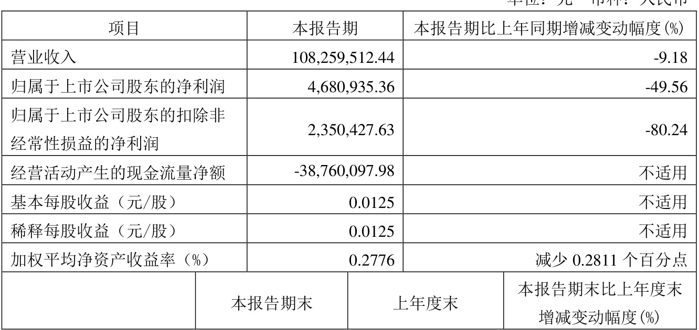  

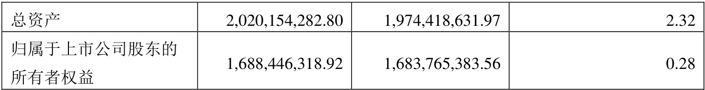  

# (二)非经常性损益项目和金额  

单位：元  币种：人民币 
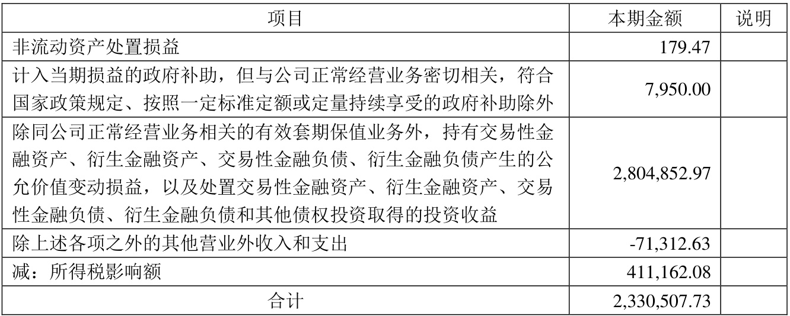  

将《公开发行证券的公司信息披露解释性公告第1 号——非经常性损益》中列举的非经常性损益项目界定为经常性损益项目的情况说明  

□适用 √不适用  

# (三)主要会计数据、财务指标发生变动的情况、原因  

$\surd$适用 □不适用  
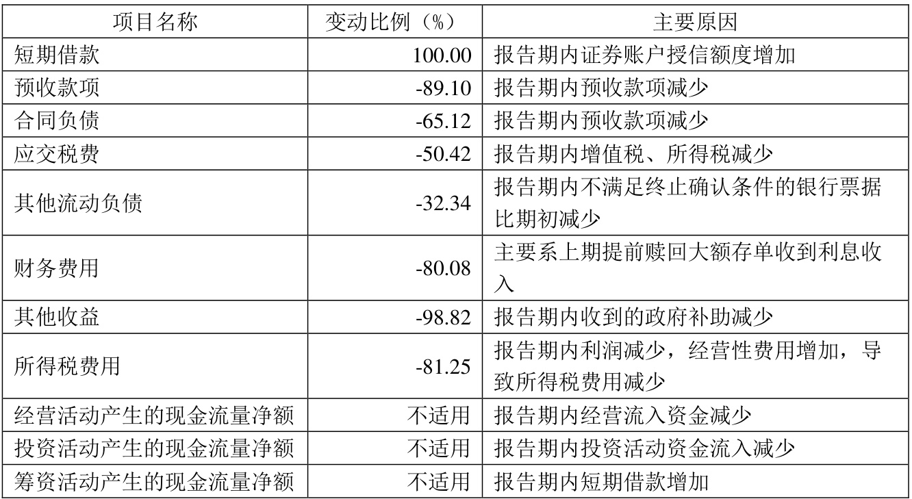  

# 二、 股东信息  

(一)普通股股东总数和表决权恢复的优先股股东数量及前十名股东持股情况表  

单位：股  
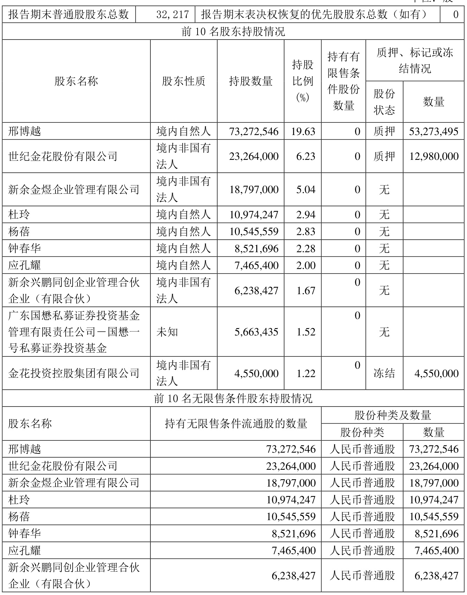  

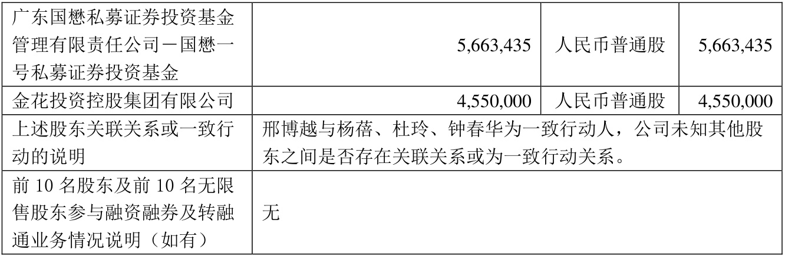  

# 三、 其他提醒事项  

需提醒投资者关注的关于公司报告期经营情况的其他重要信息  

√适用 □不适用  

公司于2023 年2 月11 日披露了《关于原实际控制人以公司名义违规担保的公告》，公司原控股股东金花投资控股集团有限公司与西安曙光汽车销售服务有限公司于2018 年10 月16 日签订了《借款合同》，公司原实际控制人吴一坚及公司为该合同项下借款提供连带责任保证，曙光汽车向西安市仲裁委员会提起仲裁申请，要求公司向其承担担保责任。经公司调查，时任公司管理层、董事会、股东大会对该事项均不知情，并未履行相应决策程序批准公司为金花投资的上述债务提供担保，公司没有签署《借款合同》或其他担保文件的记录，未发现留存或保管《借款合同》或相关担保文件，也未就该担保事项进行信息披露，《借款合同》签署系原实际控制人个人行为，并未履行上市公司相应审批及披露程序。（具体详见公司“临2023-009”号公告）  

# 四、 季度财务报表  

(一)审计意见类型  

□适用 √不适用  

(二)财务报表  

# 合并资产负债表  

2023 年3 月31 日  

编制单位:金花企业（集团）股份有限公司  

单位：元  币种:人民币  审计类型：未经审计  

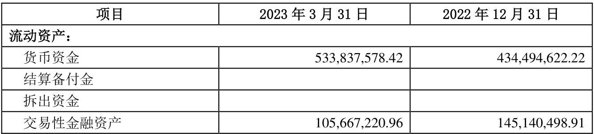  

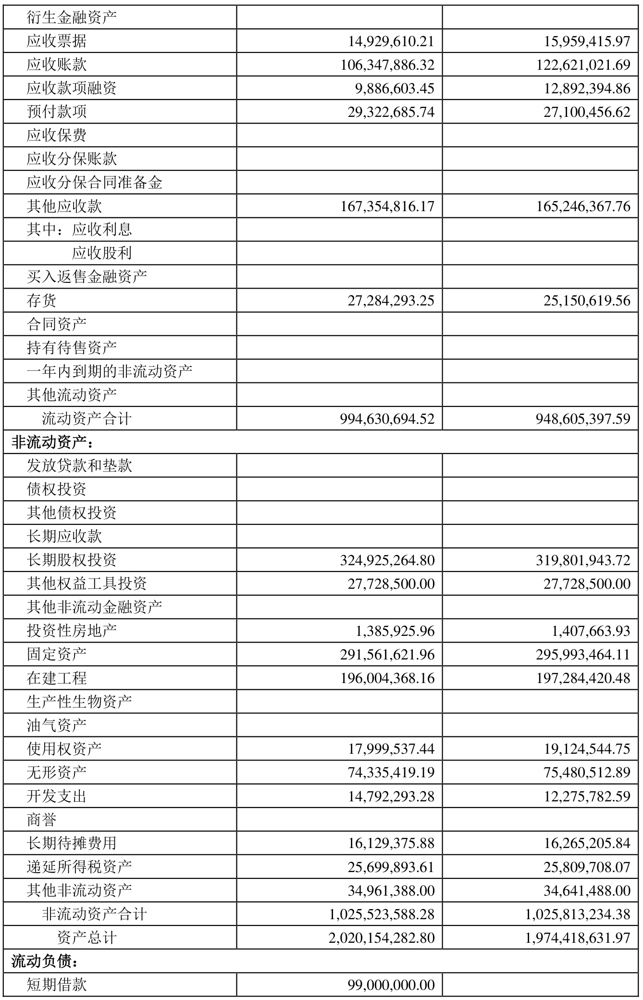  

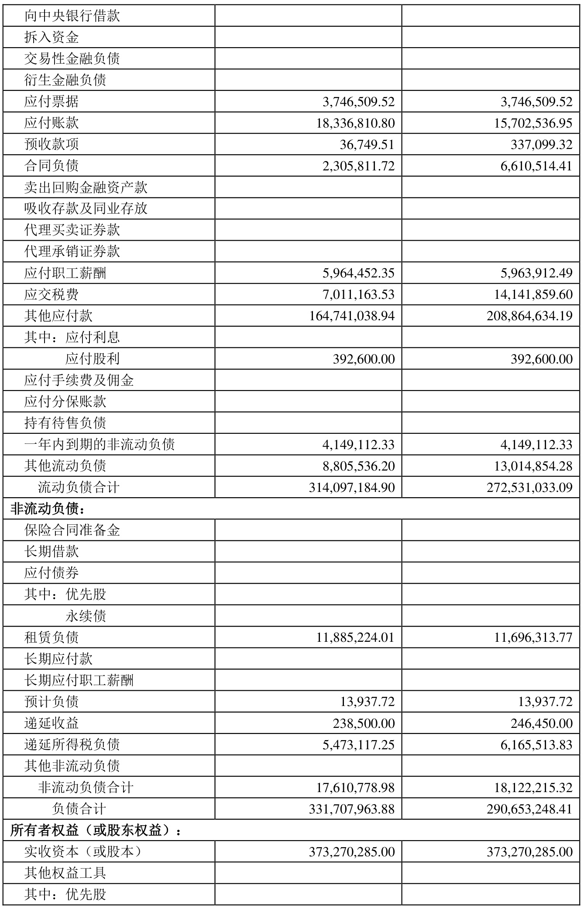  

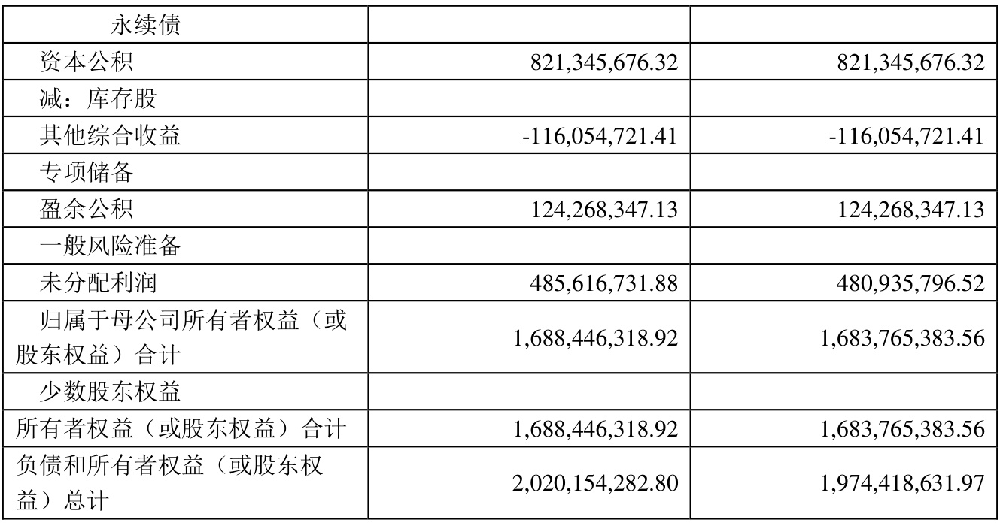  

公司负责人：邢雅江 主管会计工作负责人：韩卓军 会计机构负责人：巨亚娟  

# 合并利润表  

# 2023 年1—3 月  

编制单位：金花企业（集团）股份有限公司  

单位：元  币种:人民币  审计类型：未经审计 
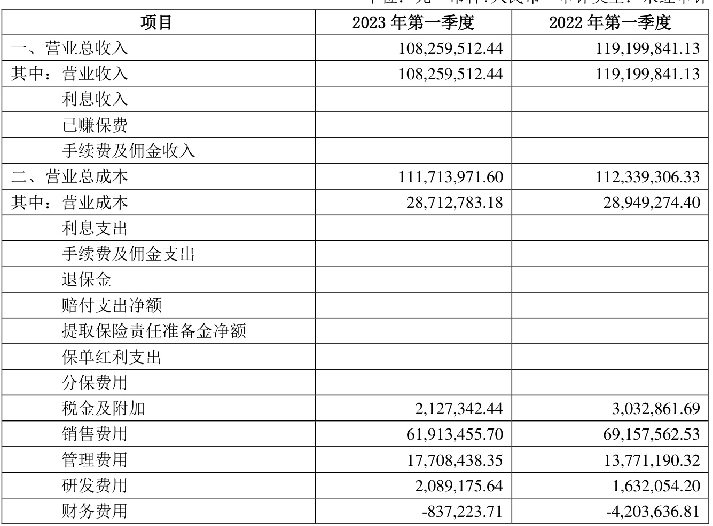  

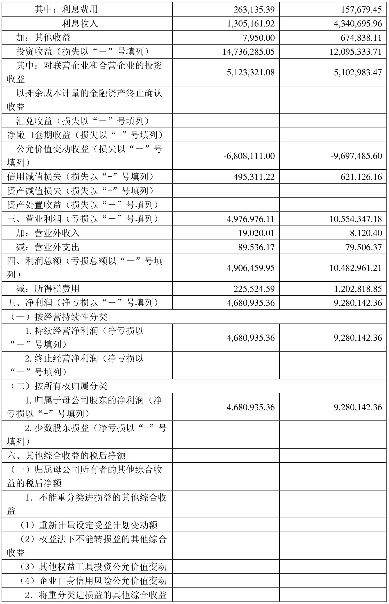  

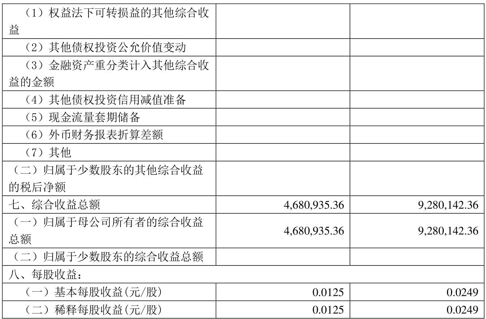  

本期发生同一控制下企业合并的，被合并方在合并前实现的净利润为：0 元，上期被合并方实现的净利润为：0 元。  

公司负责人：邢雅江 主管会计工作负责人：韩卓军 会计机构负责人：巨亚娟  

# 合并现金流量表  

2023 年1—3 月  

编制单位：金花企业（集团）股份有限公司  

单位：元  币种：人民币  审计类型：未经审计 
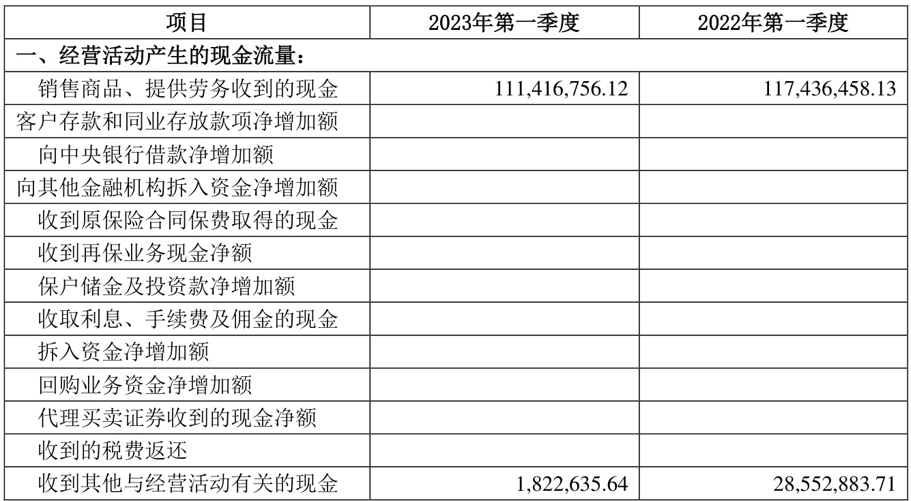  

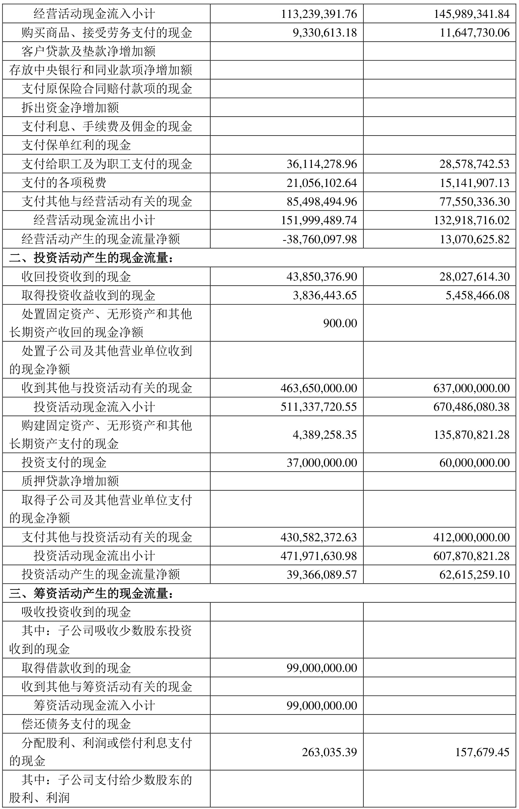  

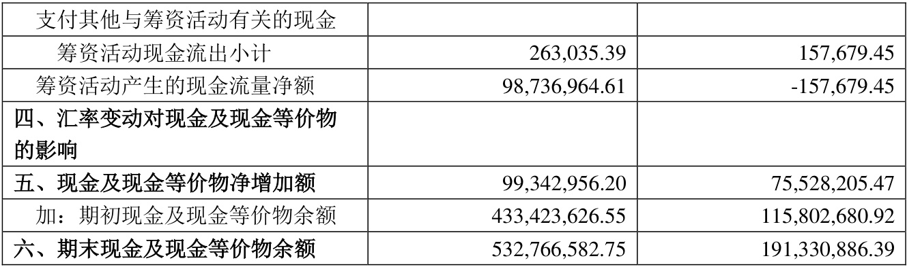  
公司负责人：邢雅江 主管会计工作负责人：韩卓军 会计机构负责人：巨亚娟  

(三)2023 年起首次执行新会计准则或准则解释等涉及调整首次执行当年年初的财务报表 

□适用 √不适用  

特此公告  

金花企业（集团）股份有限公司董事会 2023 年4 月26 日  