# 金花企业（集团）股份有限公司 2023 年第三季度报告  

本公司董事会及全体董事保证本公告内容不存在任何虚假记载、误导性陈述或者重大遗漏，并对其内容的真实性、准确性和完整性承担法律责任。  

# 重要内容提示：  

公司董事会、监事会及董事、监事、高级管理人员保证季度报告内容的真实、准确、完整，不存在虚假记载、误导性陈述或重大遗漏，并承担个别和连带的法律责任。  

公司负责人、主管会计工作负责人及会计机构负责人（会计主管人员）保证季度报告中财务信息的真实、准确、完整。  

第三季度财务报表是否经审计 

□是 √否  

# 一、 主要财务数据  

(一)主要会计数据和财务指标  

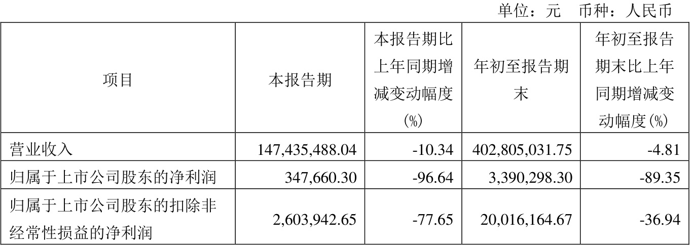  

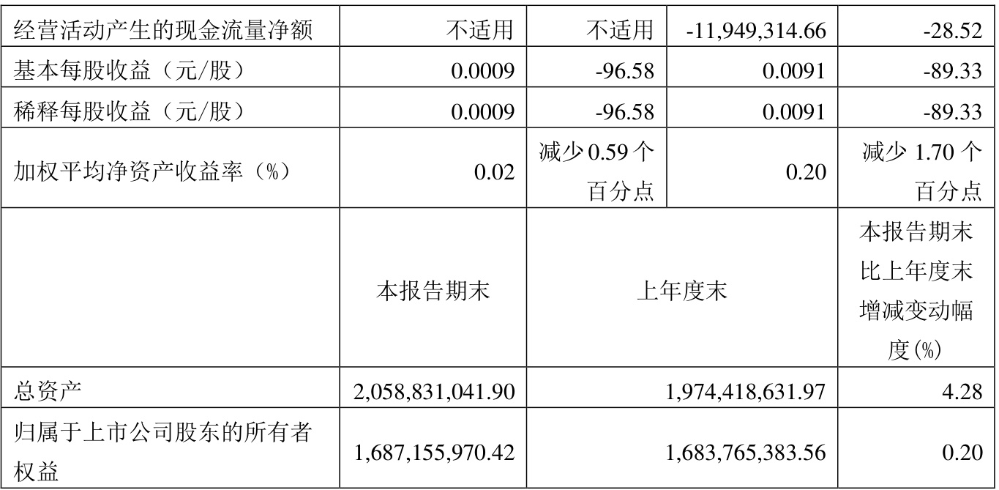  
注:“本报告期”指本季度初至本季度末3 个月期间，下同。  

# (二)非经常性损益项目和金额  

单位：元  币种：人民币 
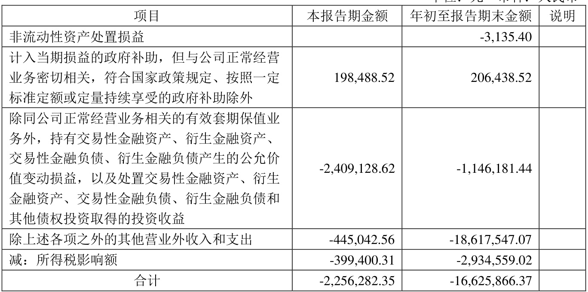  
将《公开发行证券的公司信息披露解释性公告第1 号——非经常性损益》中列举的非经常性损益项目界定为经常性损益项目的情况说明 □适用 √不适用  

# (三)主要会计数据、财务指标发生变动的情况、原因  

$\surd$适用 □不适用  

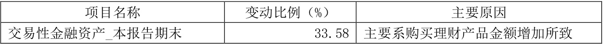  

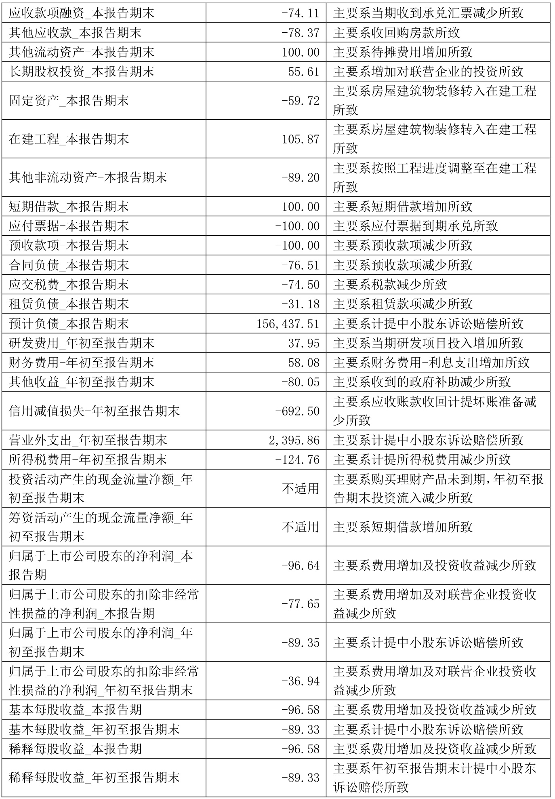  

# 二、 股东信息  

(一)普通股股东总数和表决权恢复的优先股股东数量及前十名股东持股情况表  

单位：股  

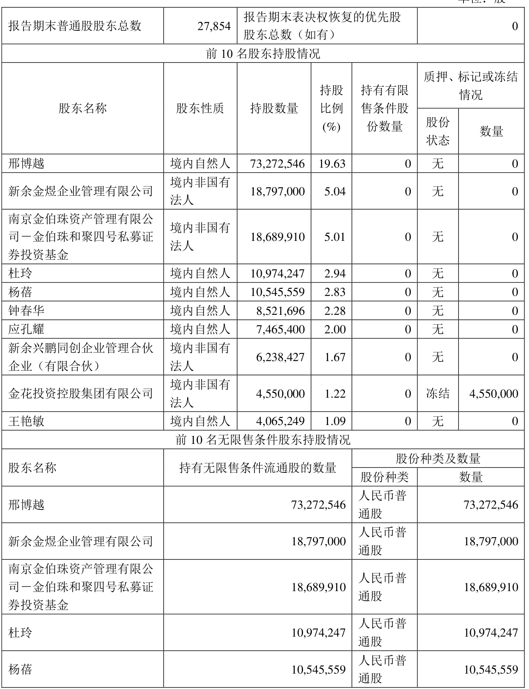  

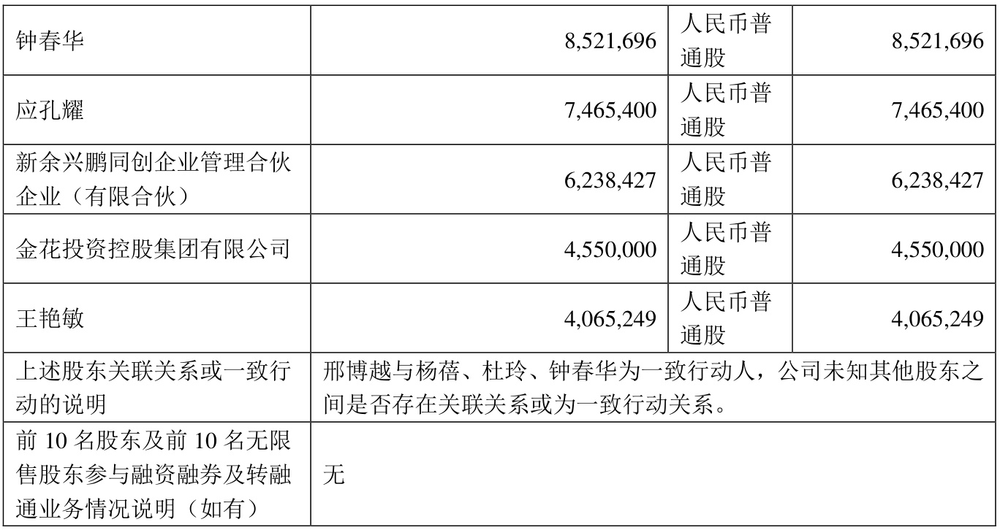  

# 三、 其他提醒事项  

需提醒投资者关注的关于公司报告期经营情况的其他重要信息  

$\surd$适用 □不适用  

2023 年10 月26 日，公司与王松灵院士团队签订《共建王松灵院士西部金花院士工作站合作协议书》，合作成立“西部金花院士工作站”。王松灵为中国科学院院士，中国医学科学院学部委员，教授、主任医师，南方科技大学医学院院长，首都医科大学医疗大数据国家研究院院长、口腔健康北京实验室主任，中华口腔医学会副会长，北京医学会副会长。王松灵院士团队致力耐瑞特药物的研发，该药物为采用微囊技术制备的以硝酸盐为主要成分的纳米颗粒，用于治疗放射性唾液腺损伤、骨质疏松等相关领域，该研发成果、研发方向与公司产品方向吻合。  

本次成立西部金花院士工作站，王松灵院士团队将与公司共同完成耐瑞特药物的研究及开发，通过双方共同努力，进一步推动研究成果的加速转化，有利于公司研发体系的建设，提升公司科技创新能力和技术水平，也将有效助力公司完善产品结构，进一步打造公司技术核心竞争优势。  

本次西部金花院士工作站的研发项目为新药品的研究开发，尚处于前期阶段，药品研发受政策、技术、环境、市场等多方面因素影响，研发能否成功存在不确定性。本次西部金花院士工作站的设立不会对公司短期的财务状况和经营业绩构成重大影响，敬请广大投资者，注意投资风险。  

# 四、 季度财务报表  

(一)审计意见类型 

 □适用 √不适用  

# (二)财务报表  

# 合并资产负债表  

2023 年9 月30 日  

编制单位:金花企业（集团）股份有限公司  

单位：元  币种:人民币  审计类型：未经审计 
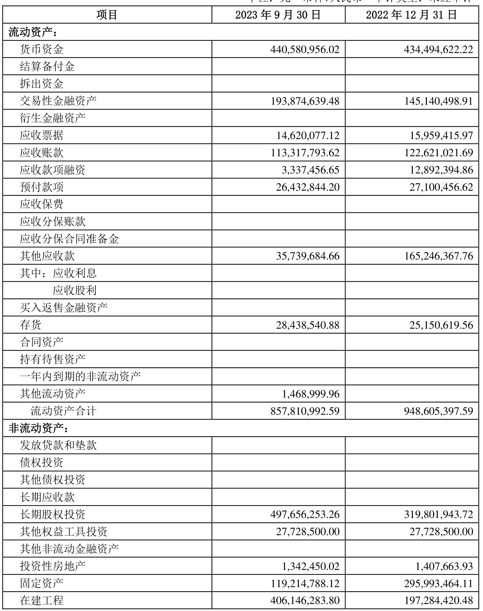  

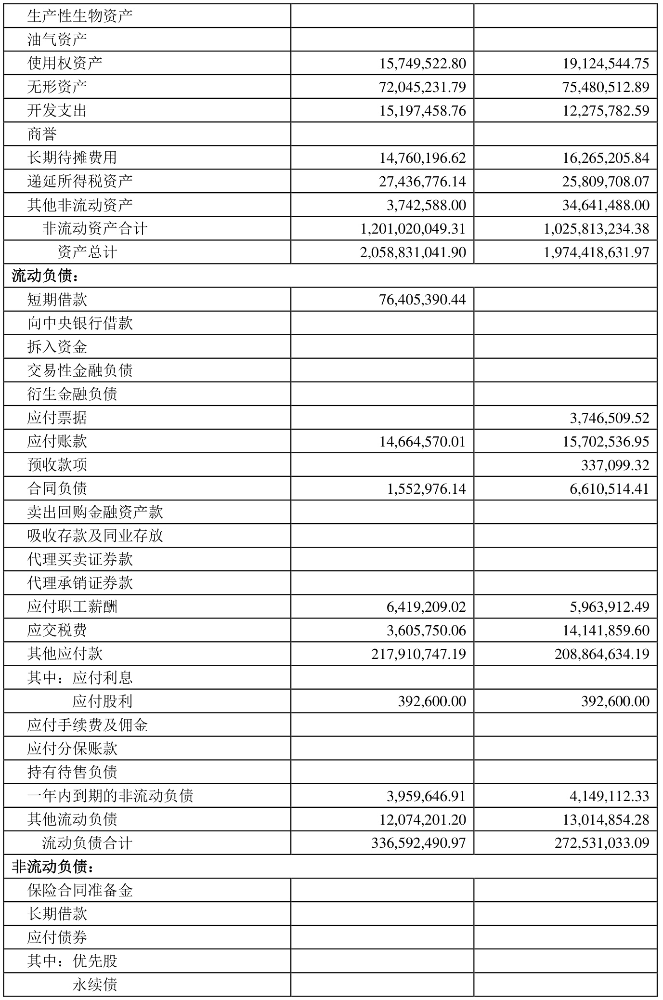  

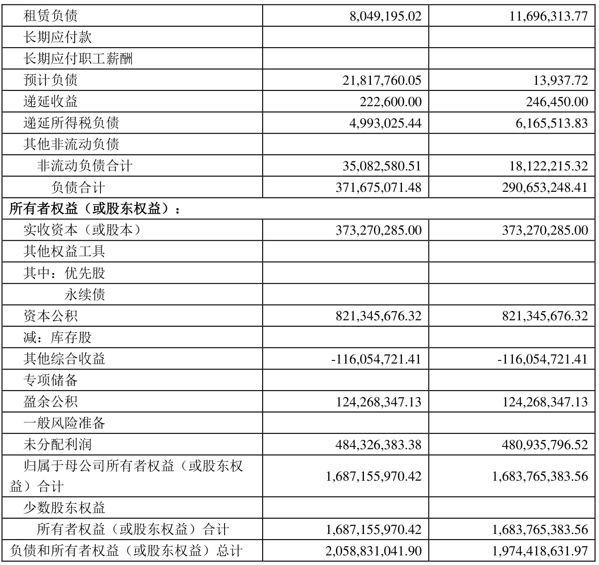  
公司负责人：邢雅江        主管会计工作负责人：韩卓军        会计机构负责人：巨亚娟  

# 合并利润表  

# 2023 年1—9 月  

编制单位：金花企业（集团）股份有限公司  

单位：元  币种:人民币  审计类型：未经审计 
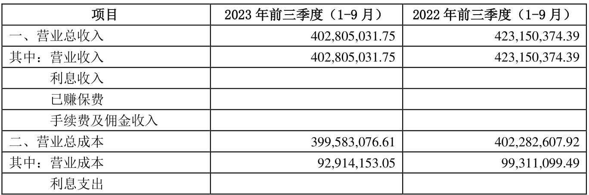  

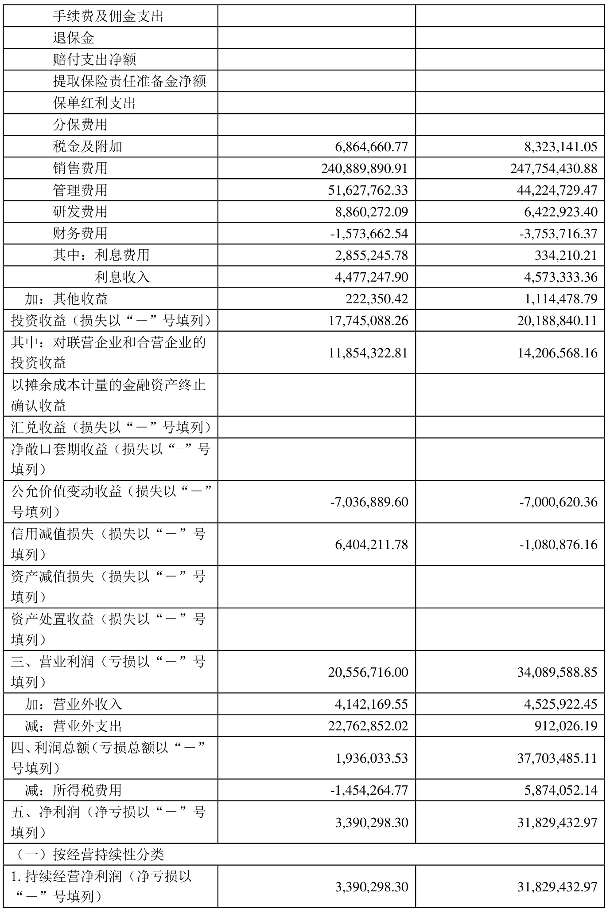  

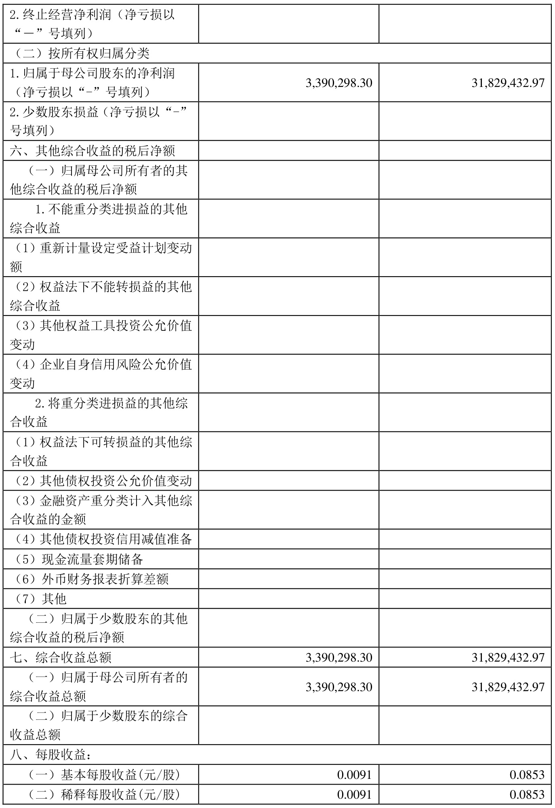  

本期发生同一控制下企业合并的，被合并方在合并前实现的净利润为：0 元, 上期被合并方实现的净利润为： 0 元。  

公司负责人：邢雅江        主管会计工作负责人：韩卓军        会计机构负责人：巨亚娟  

# 合并现金流量表  

2023 年1—9 月  

编制单位：金花企业（集团）股份有限公司  

单位：元  币种：人民币  审计类型：未经审计 
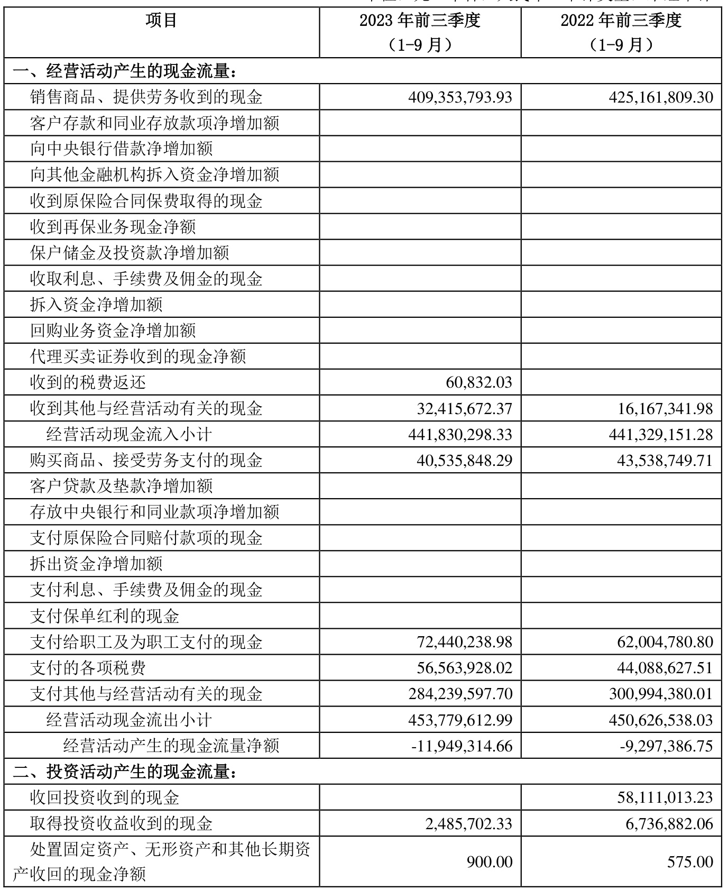  

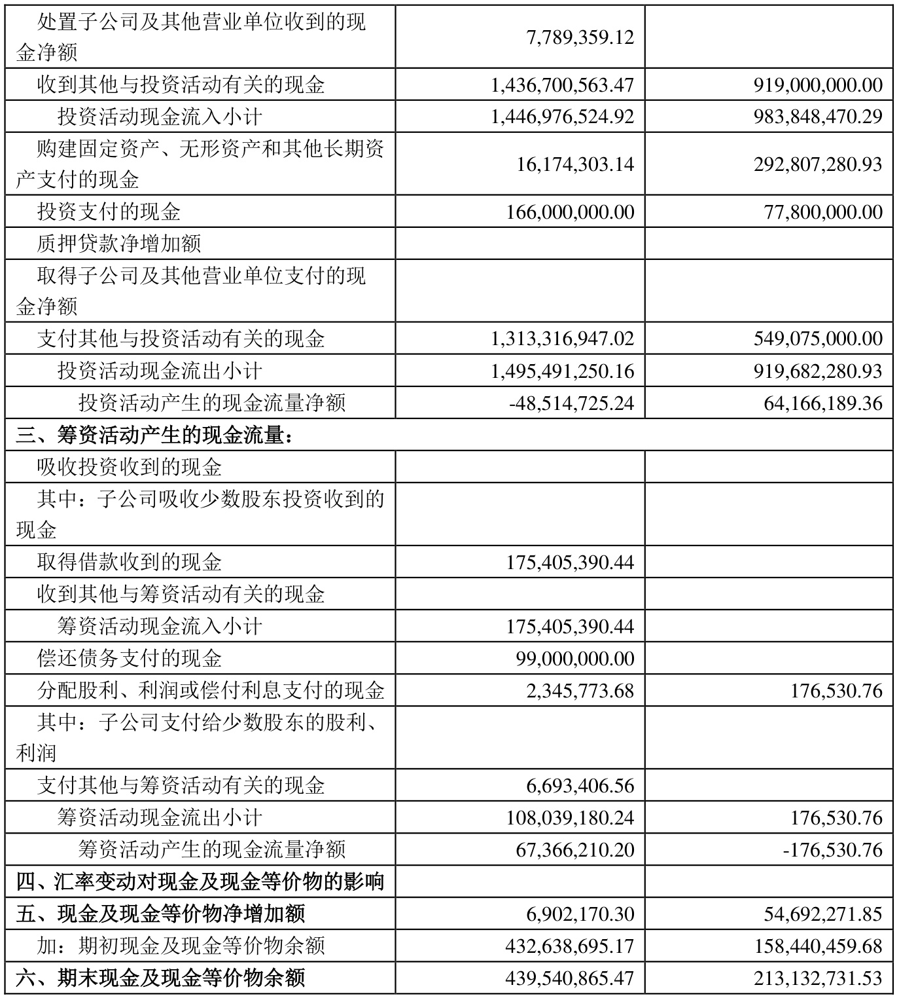  
公司负责人：邢雅江        主管会计工作负责人：韩卓军        会计机构负责人：巨亚娟  

2023 年起首次执行新会计准则或准则解释等涉及调整首次执行当年年初的财务报表 □适用 √不适用  

特此公告。  

金花企业（集团）股份有限公司董事会 2023 年10 月26 日  