# 金花企业（集团）股份有限公司 2024 年第一季度报告  

本公司董事会及全体董事保证本公告内容不存在任何虚假记载、误导性陈述或者重大遗漏，并对其内容的真实性、准确性和完整性承担法律责任。  

# 重要内容提示  

公司董事会、监事会及董事、监事、高级管理人员保证季度报告内容的真实、准确、完整，不存在虚假记载、误导性陈述或重大遗漏，并承担个别和连带的法律责任。  

公司负责人、主管会计工作负责人及会计机构负责人（会计主管人员）保证季度报告中财务信息的真实、准确、完整。  

第一季度财务报表是否经审计 □是 √否  

# 一、 主要财务数据  

(一)主要会计数据和财务指标  

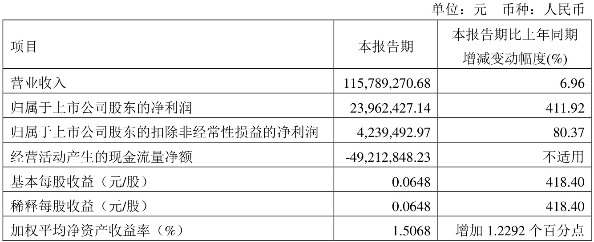  

$\surd$适用 □不适用  
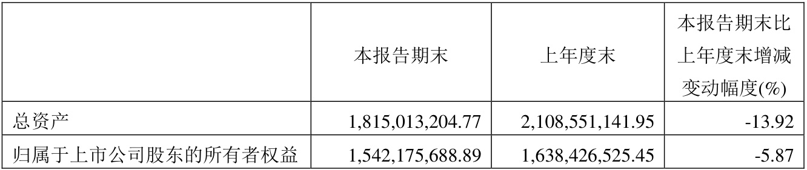  

单位:元  币种:人民币 
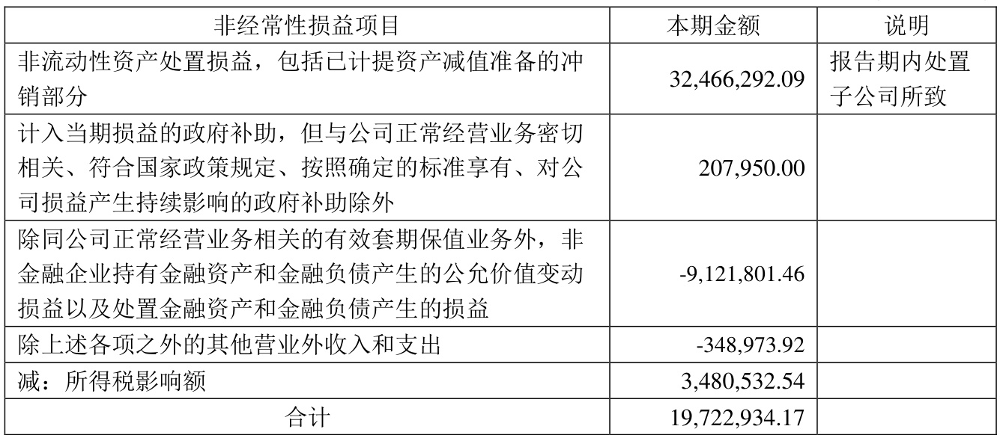  

对公司将《公开发行证券的公司信息披露解释性公告第1 号——非经常性损益》未列举的项目认定为的非经常性损益项目且金额重大的，以及将《公开发行证券的公司信息披露解释性公告第1号——非经常性损益》中列举的非经常性损益项目界定为经常性损益的项目，应说明原因。 □适用 √不适用  

# (三)主要会计数据、财务指标发生变动的情况、原因  

$\surd$适用 □不适用  
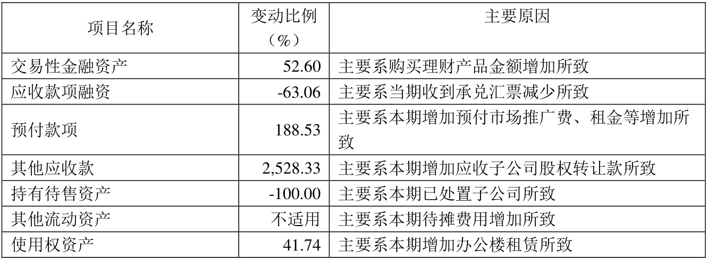  

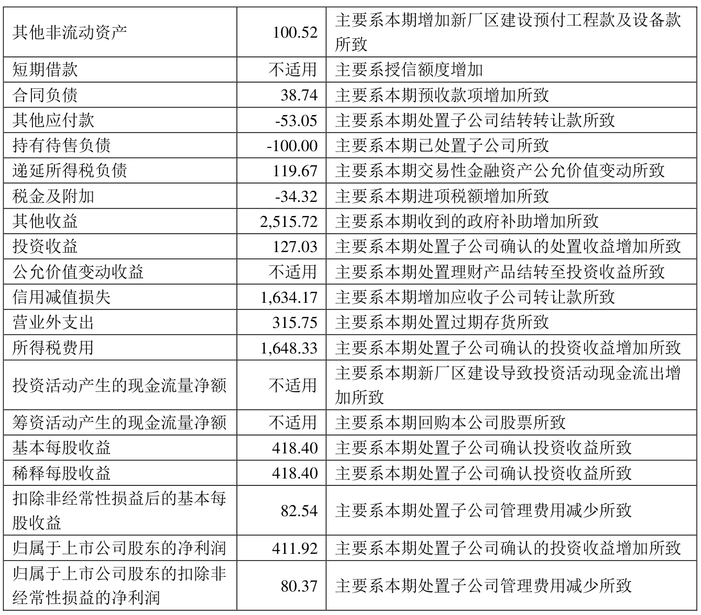  

# 二、 股东信息  

(一) 普通股股东总数和表决权恢复的优先股股东数量及前十名股东持股情况表  

单位：股  

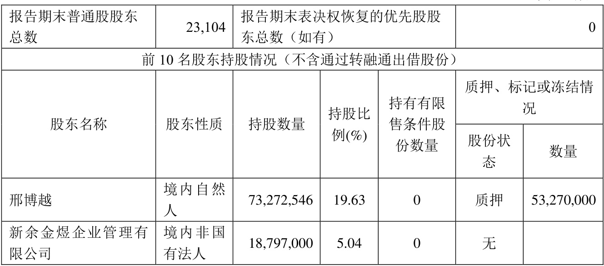  

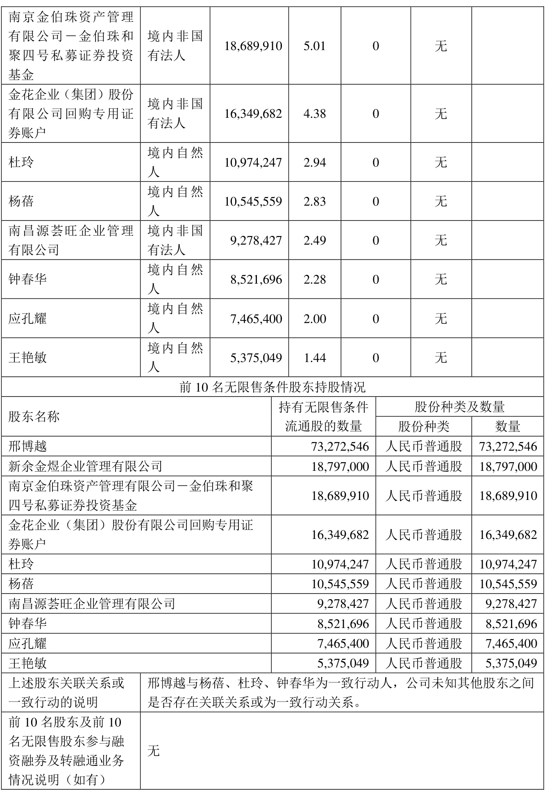  

持股$5\%$以上股东、前10 名股东及前10 名无限售流通股股东参与转融通业务出借股份情况 □适用 $\surd$不适用  

前10 名股东及前10 名无限售流通股股东因转融通出借/归还原因导致较上期发生变化 □适用 √不适用  

# 三、 其他提醒事项  

需提醒投资者关注的关于公司报告期经营情况的其他重要信息 

□适用 √不适用  

# 四、 季度财务报表  

(一)审计意见类型 

 □适用 $\surd$不适用  

# (二)财务报表  

# 合并资产负债表  

2024 年3 月31 日  

编制单位:金花企业（集团）股份有限公司  

单位：元  币种:人民币  审计类型：未经审计 
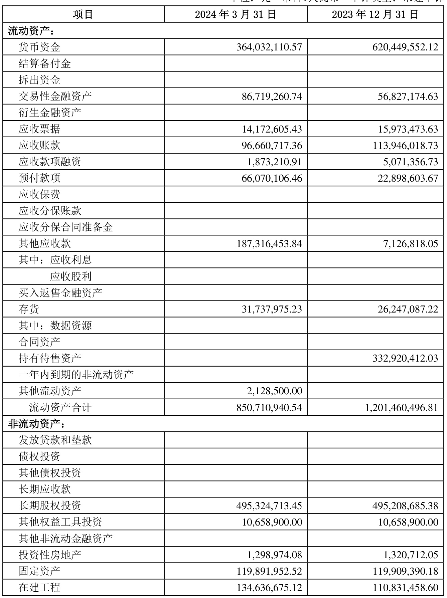  

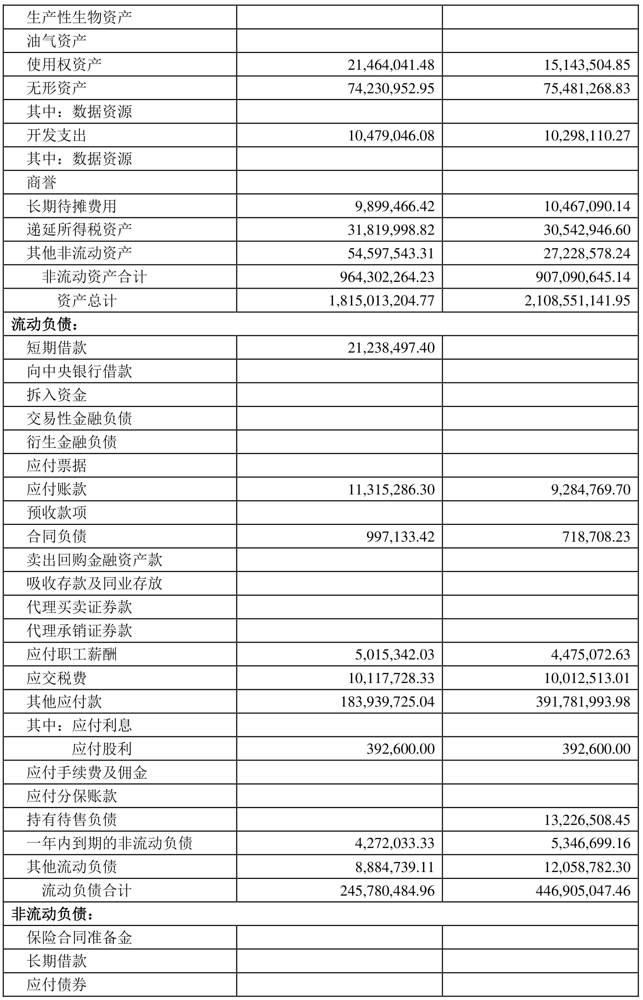  

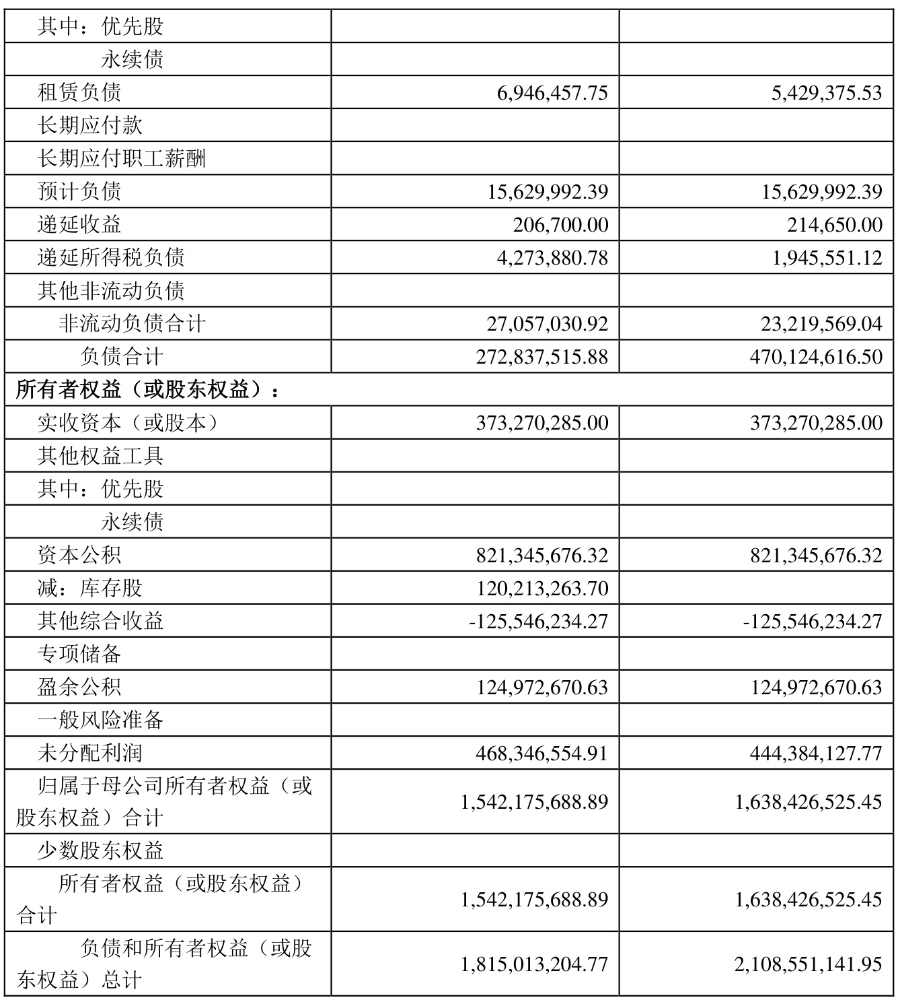  
公司负责人：邢雅江         主管会计工作负责人：韩卓军        会计机构负责人：张守峰  

# 合并利润表  

# 2024 年1—3 月  

编制单位：金花企业（集团）股份有限公司  

单位：元  币种:人民币  审计类型：未经审计  

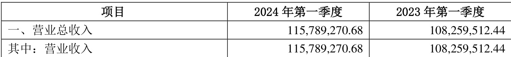  

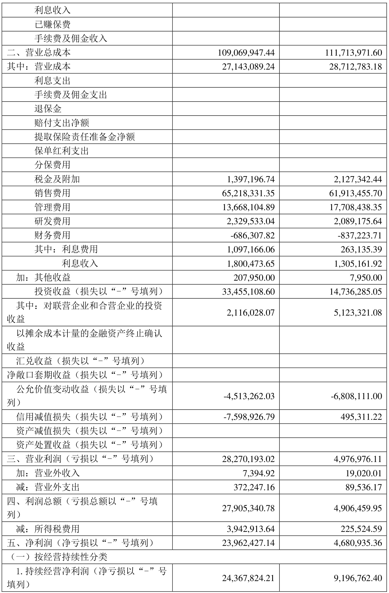  

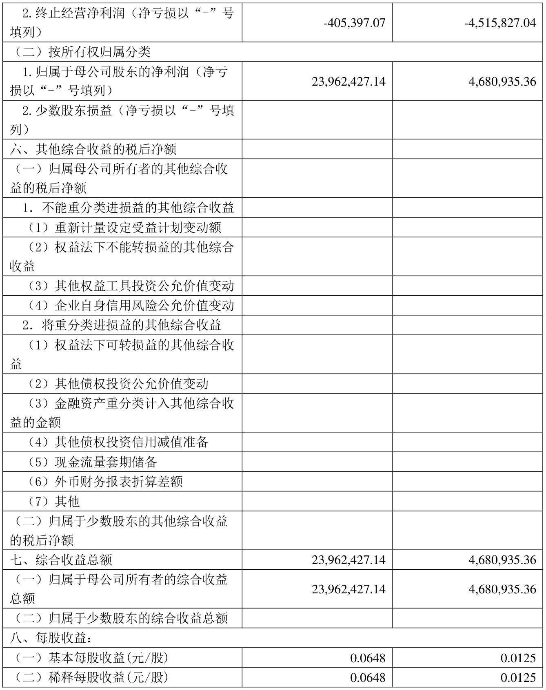  

本期发生同一控制下企业合并的，被合并方在合并前实现的净利润为：0 元，上期被合并方实现的净利润为：0 元。  

公司负责人：邢雅江         主管会计工作负责人：韩卓军        会计机构负责人：张守峰  

# 合并现金流量表  

2024 年1—3 月  

编制单位：金花企业（集团）股份有限公司  

单位：元  币种：人民币  审计类型：未经审计  

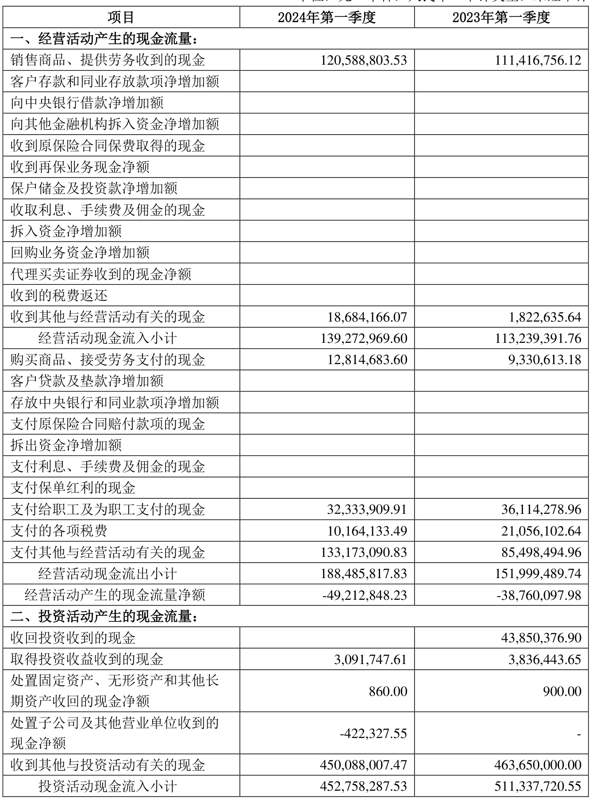  

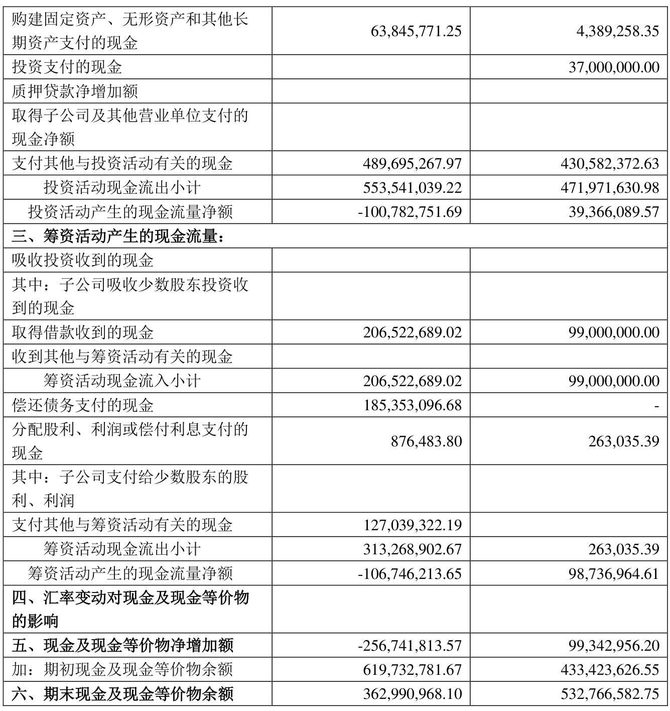  
公司负责人：邢雅江         主管会计工作负责人：韩卓军        会计机构负责人：张守峰  

(三)2024 年起首次执行新会计准则或准则解释等涉及调整首次执行当年年初的财务报表 

□适用 □不适用  

特此公告  

金花企业（集团）股份有限公司董事会 2024 年4 月25 日  