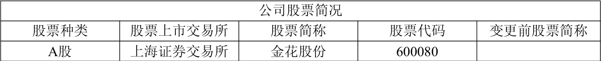
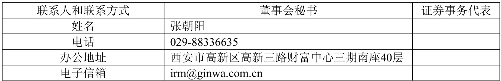
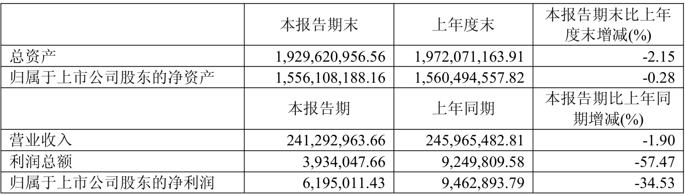
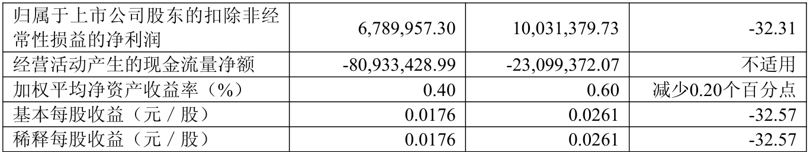
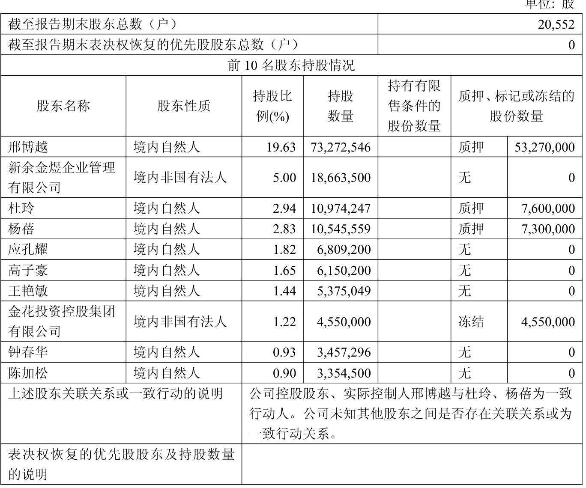

公司代码：600080公司简称：金花股份  

金花企业（集团）股份有限公司2025 年半年度报告摘要  

# 第一节重要提示  

1.1 本半年度报告摘要来自半年度报告全文，为全面了解本公司的经营成果、财务状况及未来发展规划，投资者应当到www.sse.com.cn 网站仔细阅读半年度报告全文。  

1.2 本公司董事会、监事会及董事、监事、高级管理人员保证半年度报告内容的真实性、准确性、完整性，不存在虚假记载、误导性陈述或重大遗漏，并承担个别和连带的法律责任。  

1.3 公司全体董事出席董事会会议。  

1.4 本半年度报告未经审计。  

1.5 董事会决议通过的本报告期利润分配预案或公积金转增股本预案  

报告期内不进行利润分配或公积金转增股本。  

# 第二节公司基本情况  

2.1 公司简介
  

单位：元币种：人民币
  

  

2.3 前10 名股东持股情况表
  

  

# 2.4 截至报告期末的优先股股东总数、前 10  名优先股股东情况表  

□适用$\surd$不适用

2.5 控股股东或实际控制人变更情况

□适用√不适用  

# 2.6 在半年度报告批准报出日存续的债券情况  

□适用$\surd$不适用  

# 第三节重要事项  

公司应当根据重要性原则，说明报告期内公司经营情况的重大变化，以及报告期内发生的对公司  

□适用√不适用  

金花企业（集团）股份有限公司董事长：邢雅江2025 年8 月20 日  