# 华润三九医药股份有限公司 2023 年第一季度报告  

本公司及董事会全体成员保证信息披露的内容真实、准确、完整，没有虚假记载、误导性陈述或重大遗漏。  

# 重要内容提示：  

1.董事会、监事会及董事、监事、高级管理人员保证季度报告的真实、准确、完整，不存在虚假记载、误导性陈述或重大遗漏，并承担个别和连带的法律责任。  

2.公司负责人、主管会计工作负责人及会计机构负责人(会计主管人员)声明：保证季度报告中财务信息的真实、准确、完整。  

3.第一季度报告是否经审计  

□是   否  

# 一、主要财务数据  

# （一） 主要会计数据和财务指标  

公司是否需追溯调整或重述以前年度会计数据  是 □否  追溯调整或重述原因 □会计政策变更 □会计差错更正 同一控制下企业合并 □其他原因  

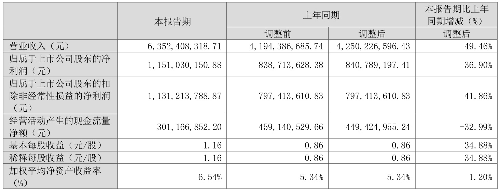  

适用 □不适用 
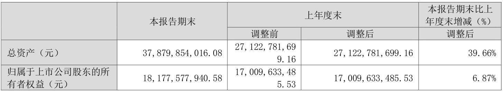  

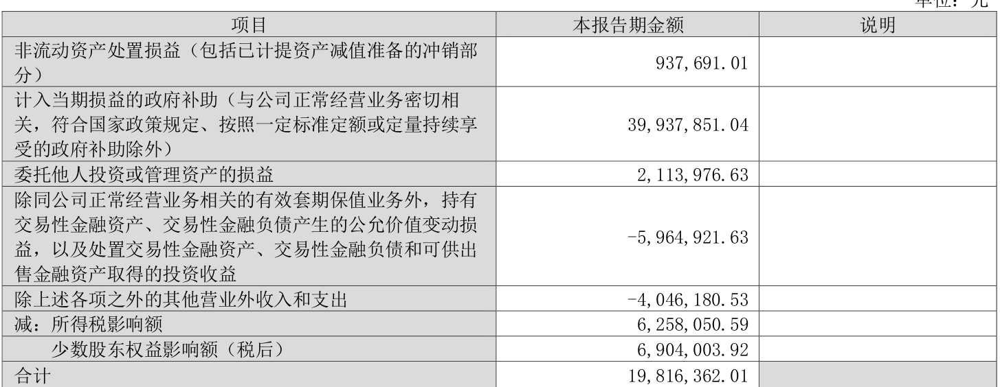  
其他符合非经常性损益定义的损益项目的具体情况 □适用 不适用  

公司不存在其他符合非经常性损益定义的损益项目的具体情况。  

将《公开发行证券的公司信息披露解释性公告第1 号——非经常性损益》中列举的非经常性损益项目界定为经常性损益项目的情况说明  

公司不存在将《公开发行证券的公司信息披露解释性公告第1 号——非经常性损益》中列举的非经常性损益项目界定为经常性损益的项目的情形。  

# （三） 主要会计数据和财务指标发生变动的情况及原因  

适用 □不适用  

2023 年1 月19 日，昆药集团股份有限公司（以下简称“昆药集团”）完成十届董事会、监事会改组工作，华润三九取得昆药集团控制权，主要因该事项导致公司主要会计数据和财务指标发生变动，详细情况如下：  

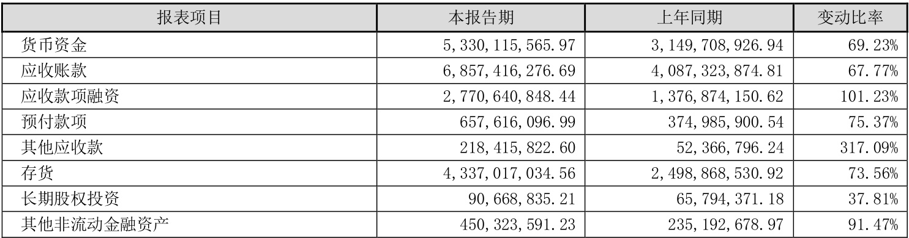  

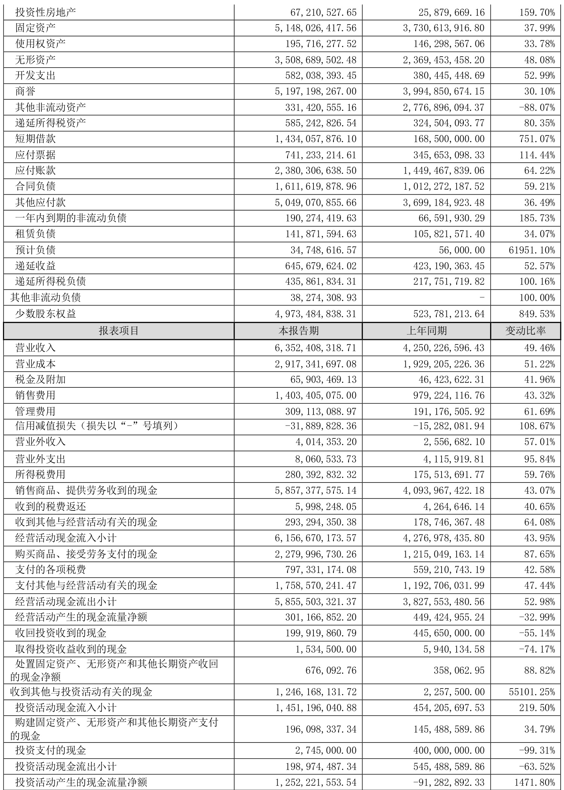  

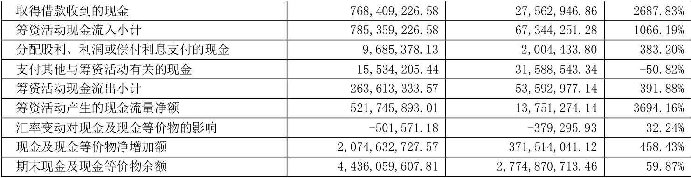  

# 二、股东信息  

# （一） 普通股股东总数和表决权恢复的优先股股东数量及前十名股东持股情况表  

单位：股  
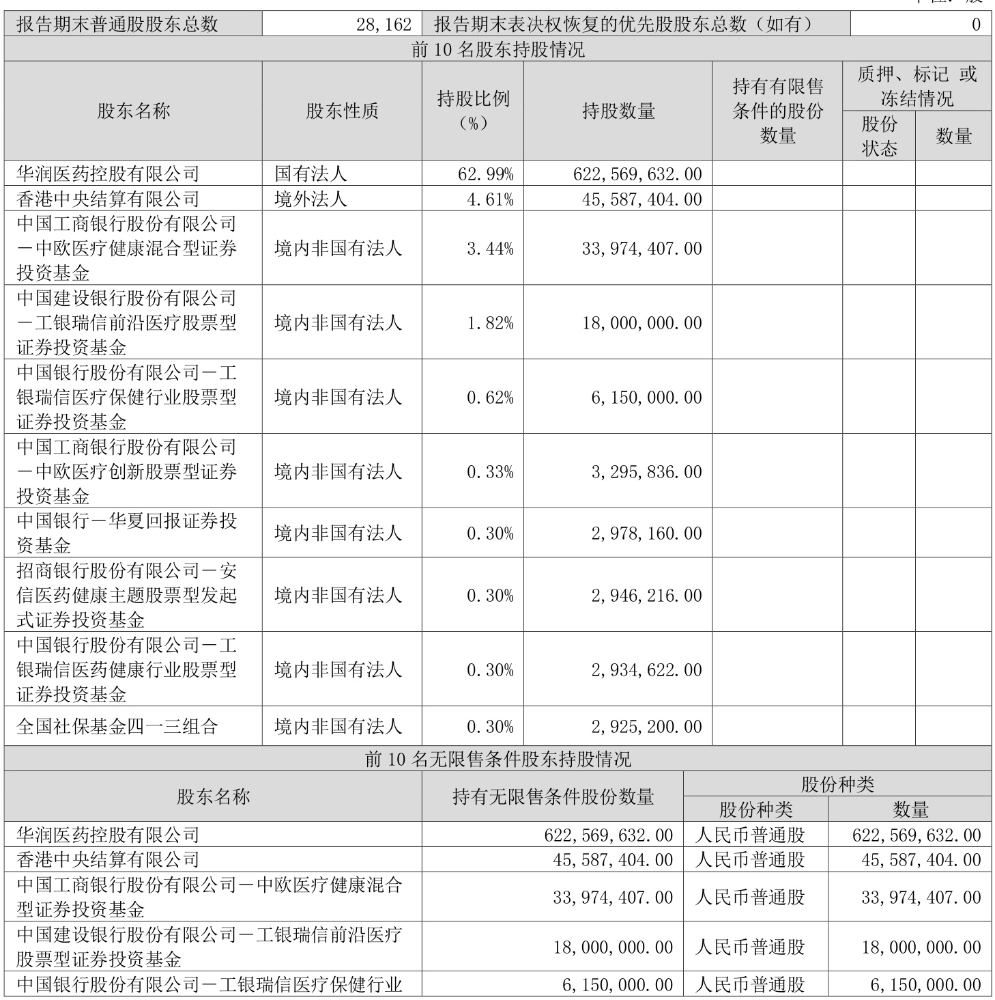  

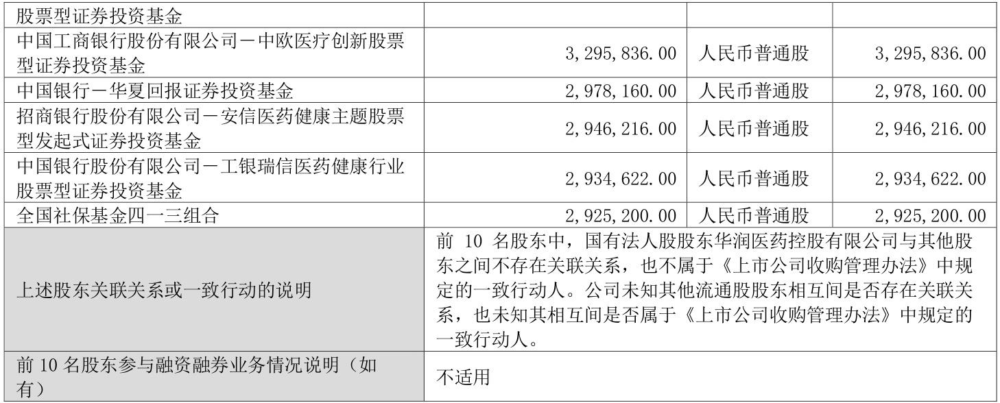  

# （二） 公司优先股股东总数及前10 名优先股股东持股情况表  

□适用 不适用  

# 三、其他重要事项  

适用 □不适用  

# 1、重大资产重组及其进展  

报告期内，公司完成对昆药集团股份有限公司（以下简称“昆药集团”）的控制权变更。2022 年5 月9日，公司公告收购昆药集团$28\%$股份的重大资产重组预案，以支付现金的方式向华立医药集团有限公司和华立集团股份有限公司购买其合计所持有的昆药集团$28\%$的股份。本次总交易价款为29.02 亿元，对应每股转让价格13.67 元。2022 年7 月8 日，公司披露了《华润三九医药股份有限公司关于收到〈经营者集中反垄断审查不实施进一步审查决定书〉的公告》。2022 年11 月28 日，董事会2022 年第十六次会议审议通过《关于公司重大资产购买方案的议案》等重大资产重组相关议案事项。2022 年12 月23 日，公司披露了《华润三九医药股份有限公司关于收购昆药集团股份有限公司获国务院国资委批复的公告》。2022 年12 月23 日，公司召开2022 年第五次临时股东大会审议通过重大资产重组相关事项。2022 年12 月31 日，公司披露了《华润三九医药股份有限公司关于重大资产购买之标的资产过户完成的公告》，本次交易对应的标的资产已过户完成。2023 年1 月20 日，公司披露了《华润三九医药股份有限公司关于昆药集团完成十届董事会、监事会改组工作暨取得其控制权的公告》，2023 年1 月19 日，昆药集团完成董事会、监事会改组工作，昆药集团控股股东由华立医药变更为华润三九，实际控制人由汪力成先生变更为中国华润有限公司。  

详细内容请见2022 年5 月9 日、2022 年6 月8 日、2022 年7 月8 日、2022 年8 月6 日、2022 年9 月5 日、2022 年10 月1 日、2022 年10 月29 日、2022 年11 月26 日、2022 年11 月29 日、2022 年12 月6 日、2022 年12 月23 日、2022 年12 月24 日、2022 年12 月31 日、2023 年1 月20 日公司在《证券时报》《中国证券报》《上海证券报》及巨潮资讯网（www.coninfo.com.cn）披露的相关公告。  

# 四、季度财务报表  

# （一） 财务报表  

# 1、合并资产负债表  

编制单位：华润三九医药股份有限公司  

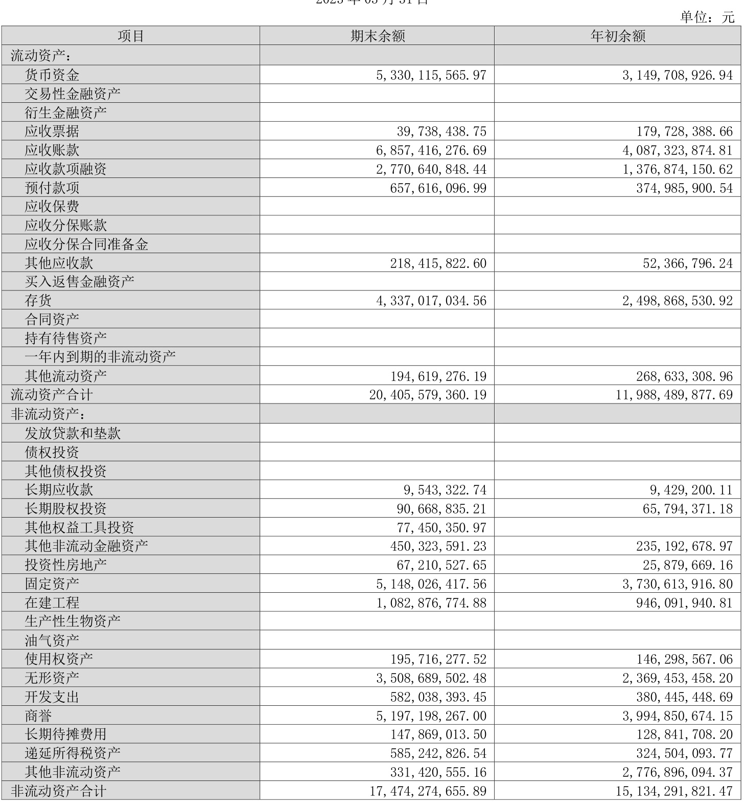  

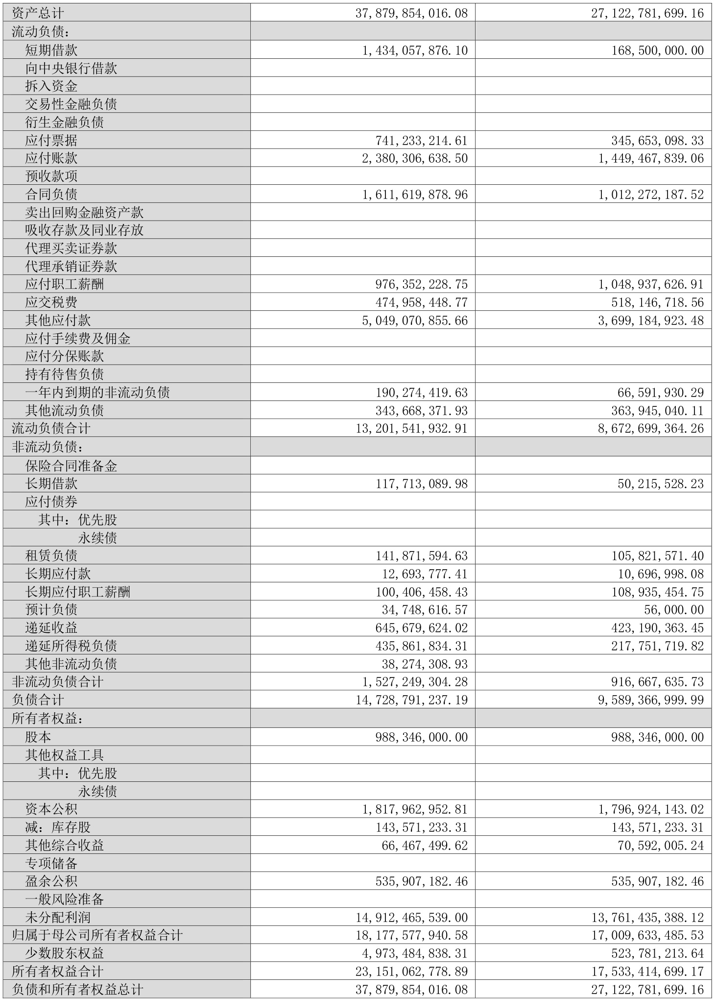  

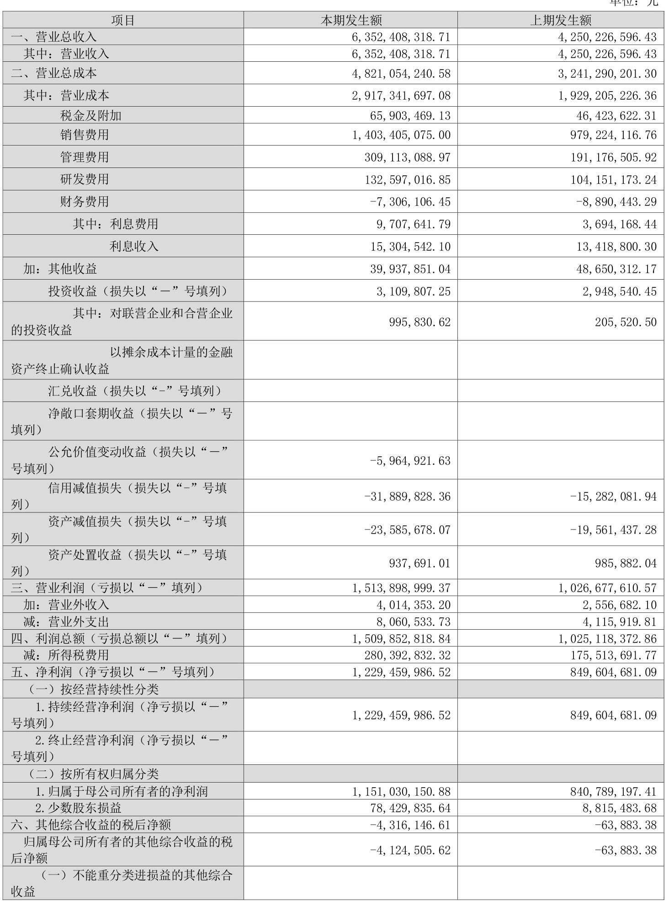  

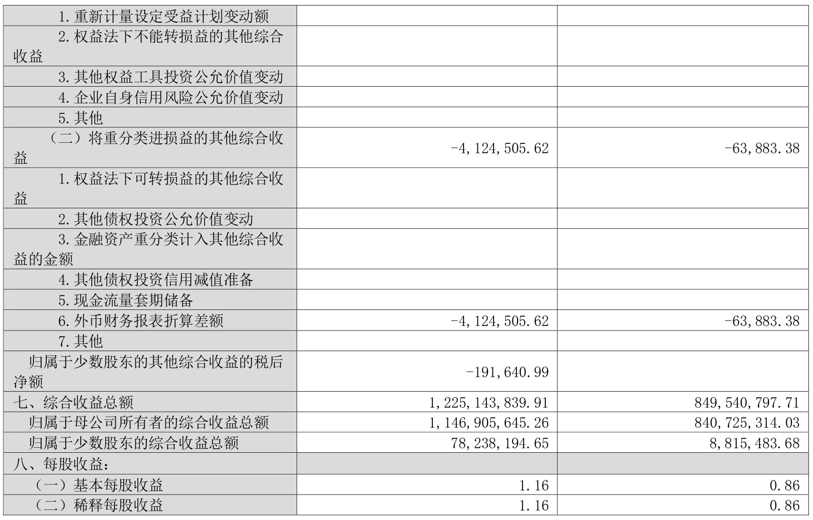  
法定代表人：赵炳祥                主管会计工作负责人：梁征                 会计机构负责人：钟江  

# 3、合并现金流量表  

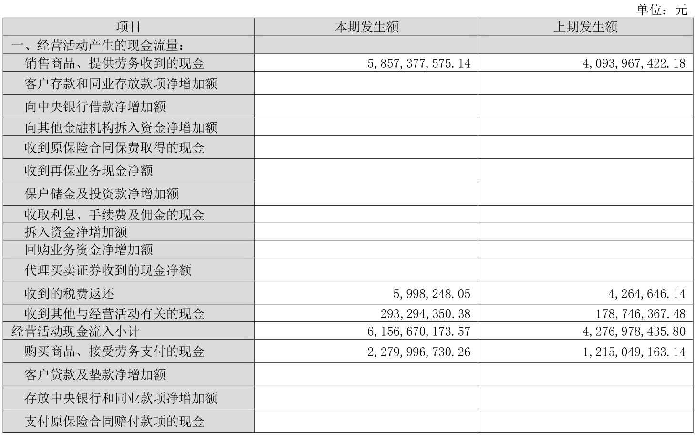  

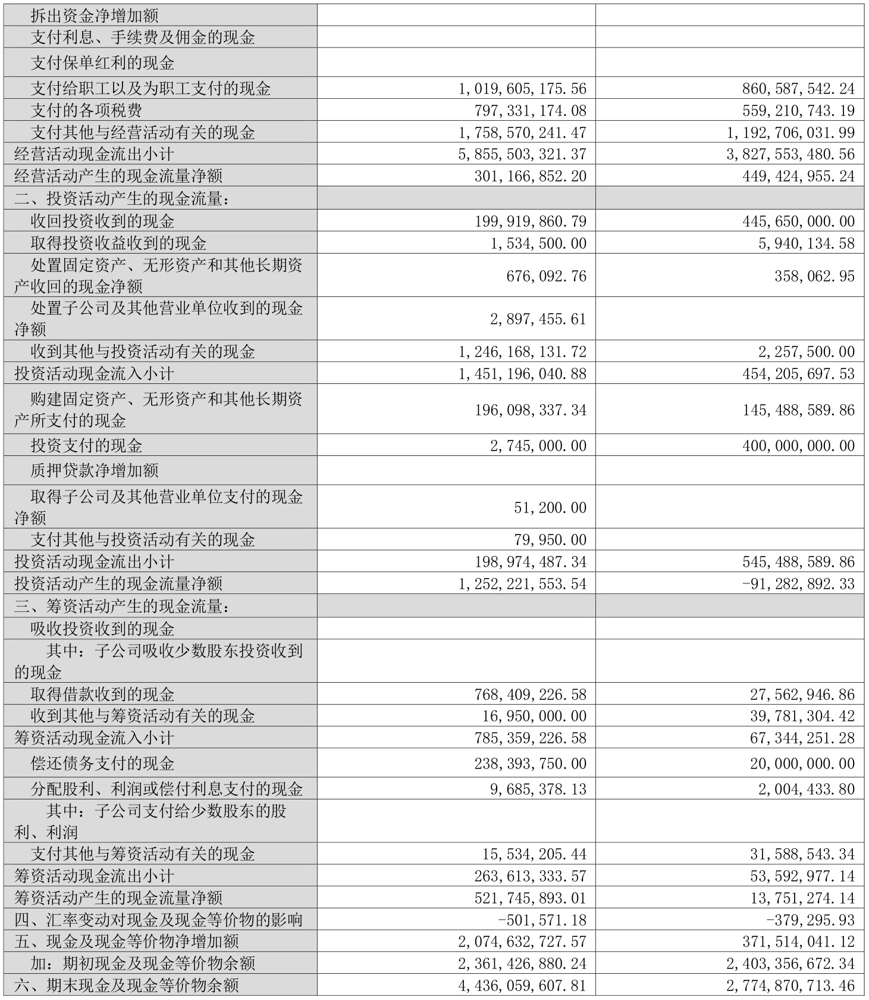  

# （二） 审计报告  

第一季度报告是否经过审计 □是   否  公司第一季度报告未经审计。  

华润三九医药股份有限公司董事会 2023 年04 月28 日  