# 华润三九医药股份有限公司  

# 2023 年第三季度报告  

本公司及董事会全体成员保证信息披露的内容真实、准确、完整，没有虚假记载、误导性陈述或重大遗漏。  

# 重要内容提示：  

1.董事会、监事会及董事、监事、高级管理人员保证季度报告的真实、准确、完整，不存在虚假记载、误导性陈述或重大遗漏，并承担个别和连带的法律责任。  

2.公司负责人、主管会计工作负责人及会计机构负责人(会计主管人员)声明：保证季度报告中财务信息的真实、准确、完整。  

3.第三季度报告是否经过审计  

□是   否  

# 一、主要财务数据  

# （一） 主要会计数据和财务指标  

公司是否需追溯调整或重述以前年度会计数据  

□是   否  
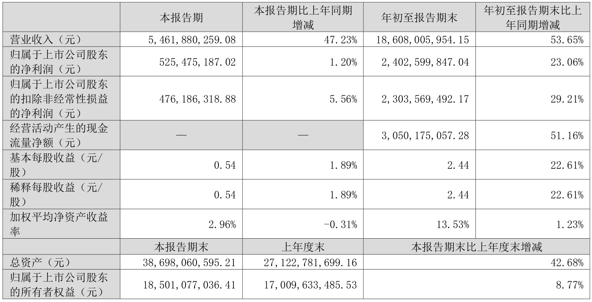  

# （二） 非经常性损益项目和金额  

适用 □不适用  

单位：元 
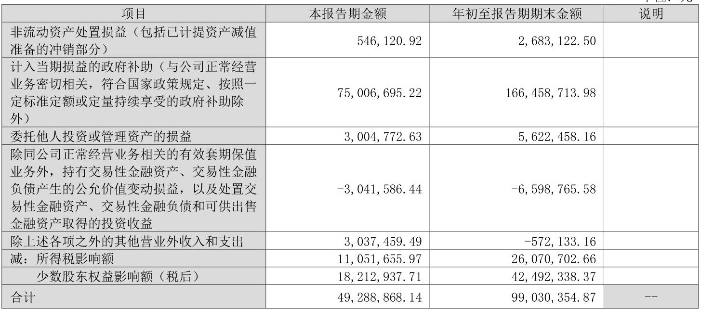  
其他符合非经常性损益定义的损益项目的具体情况：  

□适用 不适用  

公司不存在其他符合非经常性损益定义的损益项目的具体情况。 将《公开发行证券的公司信息披露解释性公告第1 号——非经常性损益》中列举的非经常性损益项目界定为经常性损益项目的情况说明  

□适用 不适用  

公司不存在将《公开发行证券的公司信息披露解释性公告第1 号——非经常性损益》中列举的非经常性损益项目界定为经常性损益的项目的情形。  

# （三） 主要会计数据和财务指标发生变动的情况及原因  

适用 □不适用 
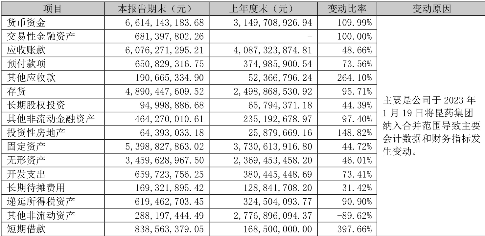  

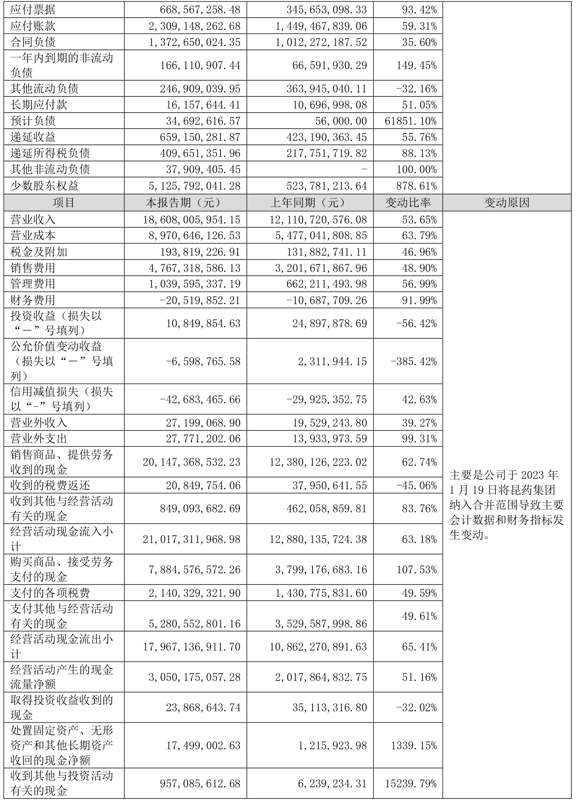  

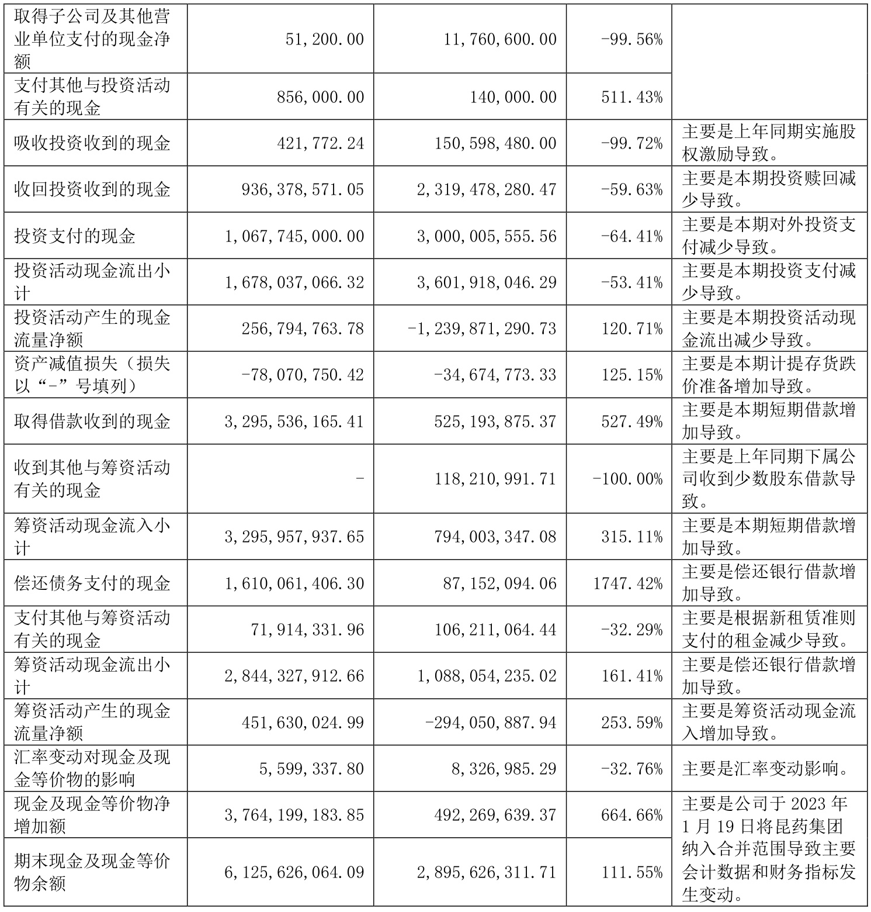  

# （四）公司概况  

在医药行业持续变革的背景下，公司顺应趋势，积极推动“品牌$^{+}$创新”双轮驱动的发展模式，乘势而上，前三季度业务实现较快增长，符合预期。  

# 1.锚定战略方向，品牌强势发力，业务结构优化  

2023 年1-9 月，公司实现营业收入186.08 亿元，同比增长$53.\,65\%$。CHC 健康消费品业务实现较快增长，其中，品牌OTC、专业品牌、大健康等业务增速较快。999 感冒药品牌力、产品力持续增强，消费者/患者对999 感冒灵认知度进一步提升，带动其他细分品类产品如抗病毒口服液、强力枇杷露等快速增长。处方药业务持续丰富管线，加强重点产品价值挖掘，在努力消化集采等因素影响的同时，夯实业务发展基础，增强业务发展韧性，整体保持了平稳态势；国药业务在饮片业务增长带动下，前三季度基本保持稳定，但三季度由于主动调整渠道管理，配方颗粒表现不佳，对当季表现有一定影响，对全年业务表现影响相对较小。  

# 2.研发创新能力稳步提升，铸造发展强劲引擎  

公司围绕战略方向，持续加强研发投入，重点研究项目进度较好。1 类小分子靶向抗肿瘤药QBH-196 正在开展I 期临床试验；H3K27M 突变型弥漫性中线胶质瘤新药ONC201 于2023 年7 月正式获批《药物临床试验批准通知书》；用于改善女性更年期症状的1 类创新中药DZQE，已完成II 期临床研究全部受试者入组工作；“示踪用盐酸米托蒽醌注射液”（复他舒®）针对胃癌根治术患者淋巴示踪的临床研究正在进行中。公司获得奥美拉唑碳酸氢钠胶囊、盐酸乌拉地尔注射液《药品注册证书》。同时，公司持续关注中药经典名方、中药配方颗粒标准及药材资源的研究，目前在研经典名方三十余首，并开展多个中药配方颗粒国家标准的研究和申报。昆药集团自主研发的适用于缺血性脑卒中的1 类药 KYAZ01-2011-020 临床II 期已启动了二十余家研究中心，试验正有序推进；适用于异檬酸脱氢酶-1（IDH1）基因突变1 类创新药KYAH01-2016-079 临床I 期继续入组中；自主研发产品双氢青蒿素磷酸哌喹片 40mg/320mg 通过WHO-PQ 认证现场检查，并最终获得WHO 的PQ 认证，列入世界卫生组织国际组织及公立机构抗疟药采购范围。  

# 3.推进昆药融合，加快协同发展  

公司正在按首年融合计划稳步推进昆药集团的整合工作。通过凝聚共识，确立了“打造银发经济健康第一股、成为慢病管理领导者、精品国药领先者”的新战略目标。随着昆药集团业务不断聚焦，商业渠道、业务模式、管理模式等融合深度推进，部分业务和产品已融入三九商道体系，实现终端覆盖率稳步提升。为推动三七产业链高质量发展，双方先后主办和/或承办了包括中药产业链沙龙、三七产业链研讨会、中国老龄产业中长期发展趋势与研判专家座谈会等在内的一系列重要活动，推动三七产业链平台搭建，加快实现打造三七产业链标杆的战略目标。  

# 二、股东信息  

# （一） 普通股股东总数和表决权恢复的优先股股东数量及前十名股东持股情况表  

单位：股  

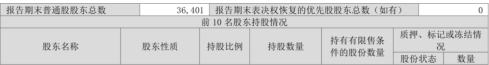  

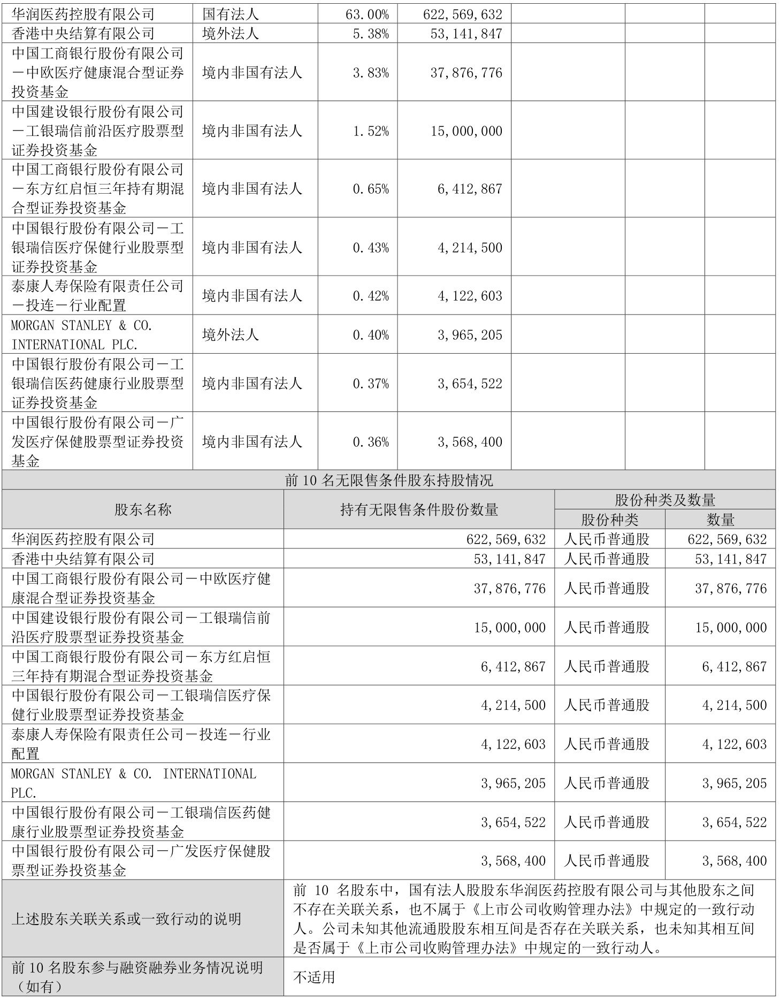  

# （二） 公司优先股股东总数及前10 名优先股股东持股情况表  

□适用 不适用  

# 三、其他重要事项  

适用 □不适用  

# 1．独立董事变更  

公司董事会于报告期内收到原独立董事屠鹏飞先生提交的辞职报告，由于工作需要，屠鹏飞先生提请辞去公司第八届董事会独立董事、董事会薪酬与考核委员会委员职务。屠鹏飞先生辞职后不再在本公司担任职务。经公司 2023 年第三次临时股东大会、董事会2023 年第十次会议审议通过，补选张强先生为公司第八届董事会独立董事、董事会薪酬与考核委员会委员，任期与第八届董事会一致。详细内容请见2023 年7 月22 日、2023 年9 月5 日、2023 年9 月21 日公司在《证券时报》《中国证券报》《上海证券报》及巨潮资讯网（www.coninfo.com.cn）披露的相关公告。  

# 四、季度财务报表  

# （一） 财务报表  

# 1、合并资产负债表  

编制单位：华润三九医药股份有限公司  

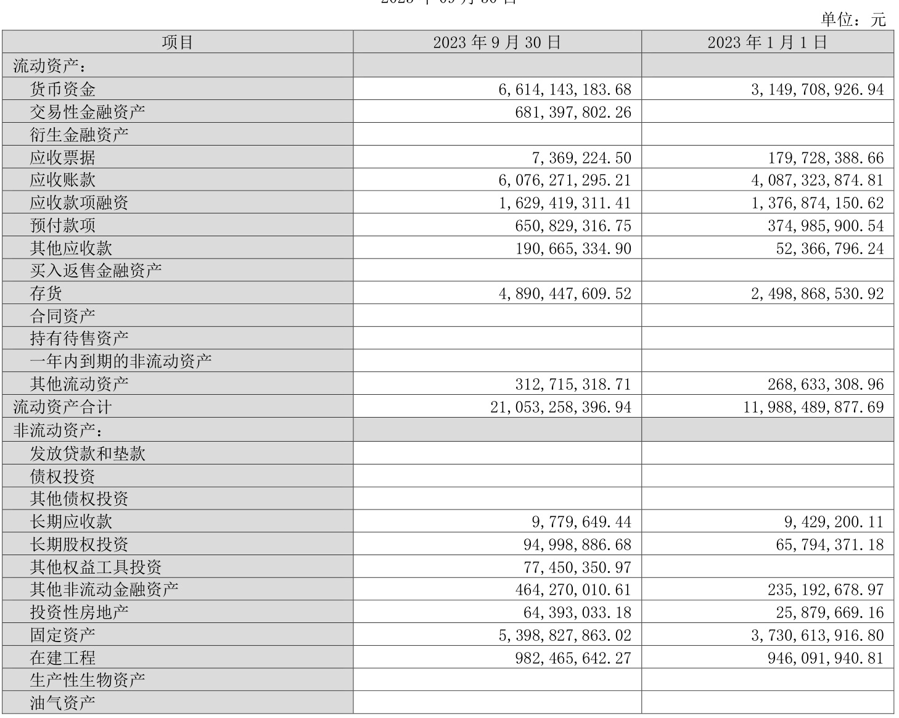  

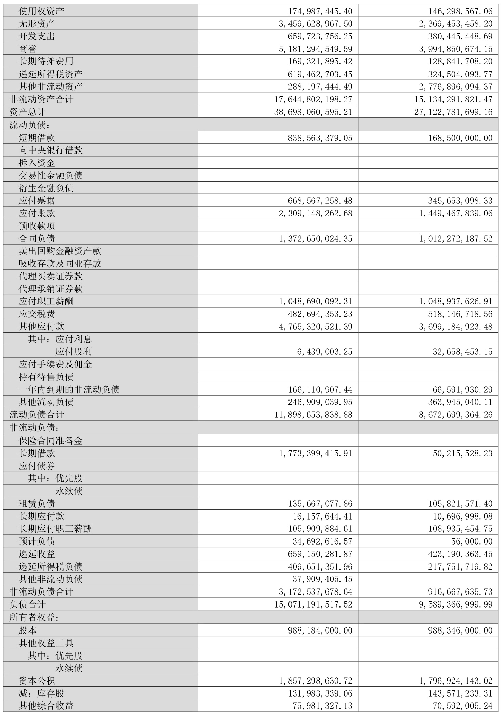  

2、合并年初到报告期末利润表 
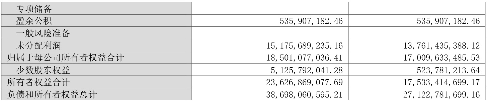  
法定代表人：赵炳祥                   主管会计工作负责人：梁征                会计机构负责人：钟江  

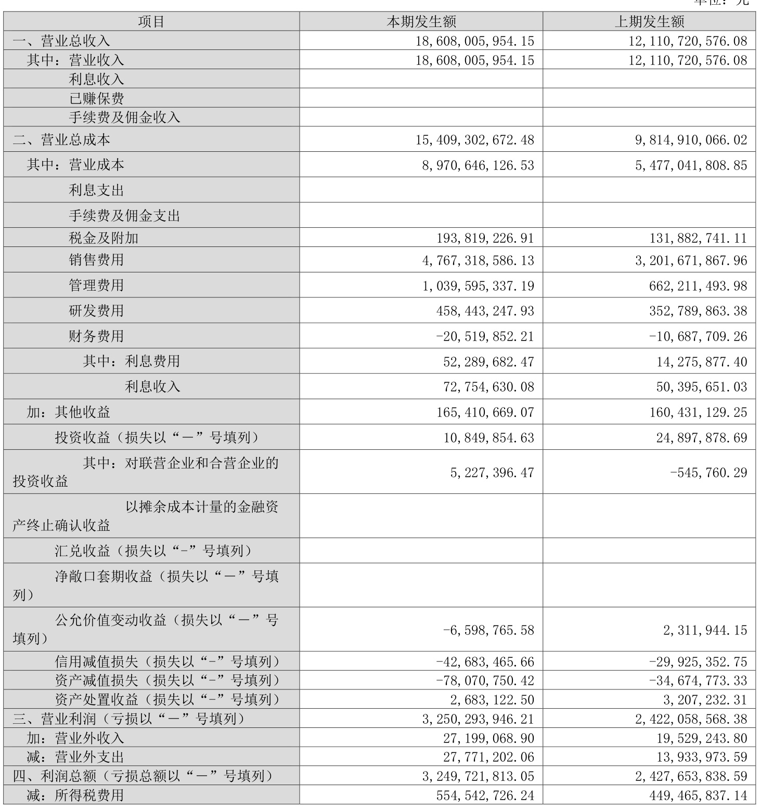  

3、合并年初到报告期末现金流量表 
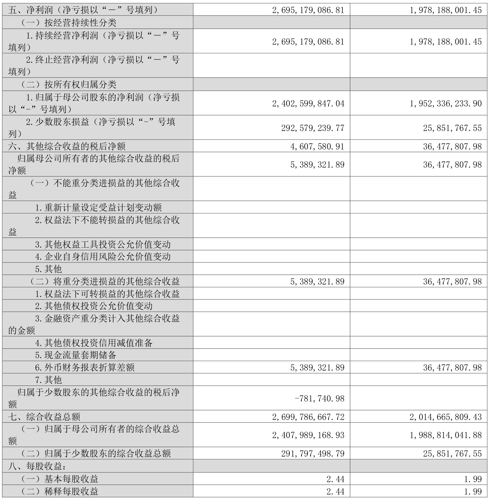  
法定代表人：赵炳祥                   主管会计工作负责人：梁征              会计机构负责人：钟江  

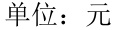  

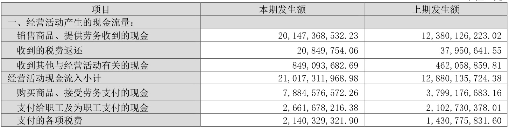  

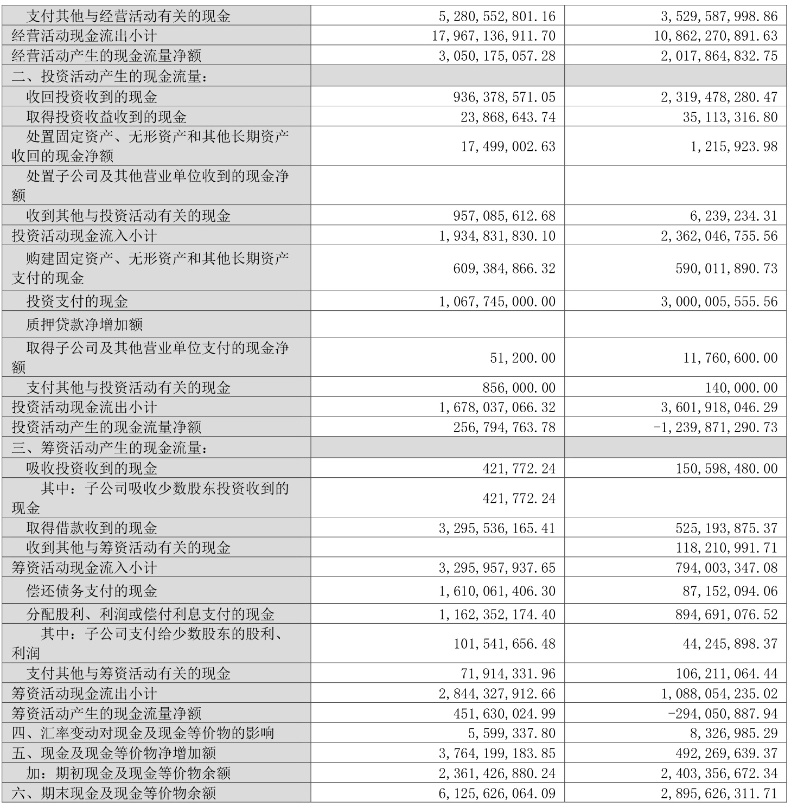  

# （二） 2023 年起首次执行新会计准则调整首次执行当年年初财务报表相关项目情况  

□适用 不适用  

# （三） 审计报告  

第三季度报告是否经过审计 □是   否  公司第三季度报告未经审计。  

华润三九医药股份有限公司董事会 2023 年10 月27 日  