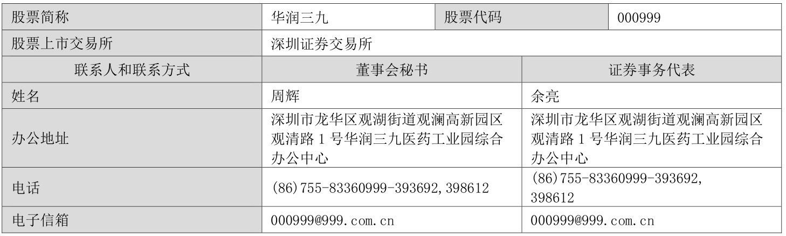
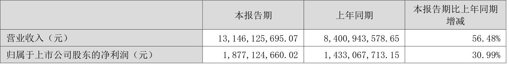
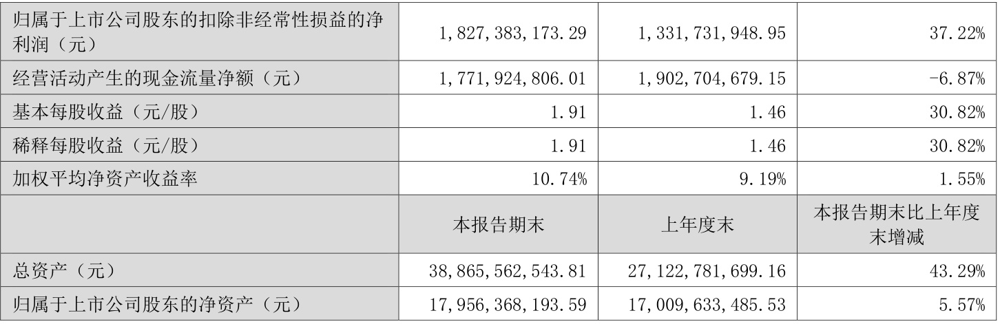
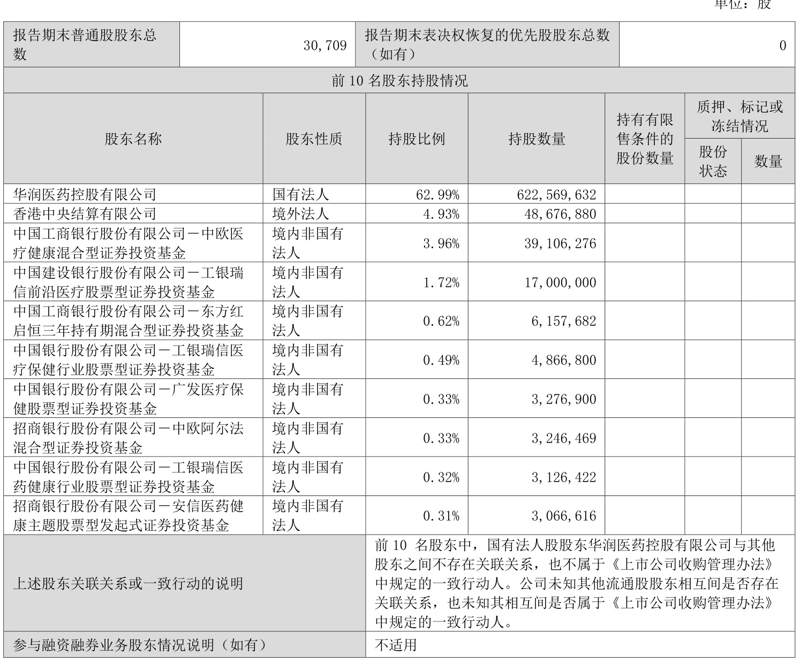

# 华润三九医药股份有限公司2023 年半年度报告摘要  

# 一、重要提示  

本半年度报告摘要来自半年度报告全文，为全面了解本公司的经营成果、财务状况及未来发展规划，投资者应当到证监会指定媒体仔细阅读半年度报告全文。  

所有董事均已出席了审议本报告的董事会会议。  

非标准审计意见提示 □适用 不适用 董事会审议的报告期普通股利润分配预案或公积金转增股本预案 □适用 不适用 公司计划不派发现金红利，不送红股，不以公积金转增股本。 董事会决议通过的本报告期优先股利润分配预案 □适用 不适用  

# 二、公司基本情况  

1、公司简介 
  

# 2、主要财务数据和财务指标  

公司是否需追溯调整或重述以前年度会计数据 □是   否  

  

3、公司股东数量及持股情况 
  

  

# 4、控股股东或实际控制人变更情况  

控股股东报告期内变更  □适用 不适用 公司报告期控股股东未发生变更。  

实际控制人报告期内变更 □适用 不适用 公司报告期实际控制人未发生变更。  

# 5、公司优先股股东总数及前10 名优先股股东持股情况表  

□适用 不适用 公司报告期无优先股股东持股情况。  

# 6、在半年度报告批准报出日存续的债券情况  

□适用 不适用  

# 三、重要事项  

# 1、重大资产重组及其进展  

2022 年5 月9 日，公司公告收购昆药集团股份有限公司（以下简称“昆药集团”）$28\%$股份的重大资产重组预案。公司以支付现金的方式向华立医药集团有限公司和华立集团股份有限公司购买其合计所持有的昆药集团$28\%$的股份。本次总交易价款为29.02 亿元，对应每股转让价格13.67 元。2022 年7 月8 日，公司披露了《华润三九医药股份有限公司关于收到〈经营者集中反垄断审查不实施进一步审查决定书〉的公告》。2022 年11 月28 日，董事会2022 年第十六次会议审议通过《关于公司重大资产购买方案的议案》等重大资产重组相关议案事项。2022 年12 月23 日，公司披露了《华润三九医药股份有限公司关于收购昆药集团股份有限公司获国务院国资委批复的公告》。2022 年12 月23 日，华润三九医药股份有限公司召开2022 年第五次临时股东大会审议通过重大资产重组相关事项。2022 年12 月31日，公司披露了《华润三九医药股份有限公司关于重大资产购买之标的资产过户完成的公告》，公司于2022 年12 月30 日收到中国证券登记结算有限责任公司出具的《过户登记确认书》，昆药集团$28\%$股份已过户至华润三九名下，本次交易对应的标的资产已过户完成。2023 年1 月20 日，公司披露了《华润三九医药股份有限公司关于昆药集团完成十届董事会、监事会改组工作暨取得其控制权的公告》，昆药集团十届董事会、监事会已完成董事会、监事会改组工作，昆药集团控股股东由华立医药变更为华润三九，实际控制人由汪力成先生变更为中国华润有限公司。  

详细内容请见2022 年5 月9 日、2022 年6 月8 日、2022 年7 月8 日、2022 年8 月6 日、2022 年9 月5 日、2022 年10 月1 日、2022 年10 月29 日、2022 年11 月26 日、2022 年11 月29 日、2022 年12 月6 日、2022 年12 月23 日、2022 年12 月24 日、2022 年12 月31 日、2023 年1 月20 日公司在《证券时报》《中国证券报》《上海证券报》及巨潮资讯网（www.coninfo.com.cn）披露的相关公告。  

# 2、监事、高级管理人员变更  

公司监事会于报告期内收到原监事翁菁雯女士提交的辞职报告，由于工作变动原因，翁菁雯女士提请辞去公司第八届监事会监事职务。翁菁雯女士辞职后不再在本公司担任职务。经公司2023 年第二次临时股东大会审议通过，补选邓蓉女士为公司第八届监事会监事。  

公司董事会于报告期内收到原副总裁吴文多先生提交的辞职报告，由于工作变动原因，吴文多先生提请辞去公司副总裁职务。吴文多先生辞职后不再在本公司担任职务。  

2023 年6 月28 日，经公司2023 年第六次董事会会议审议通过，聘任徐永前先生为公司副总裁，任期与公司第八届董事会任期一致。  

详细内容请见2023 年6 月15 日、2023 年6 月22 日、2023 年6 月30 日、2023 年7 月18 日公司在《证券时报》《中国证券报》《上海证券报》及巨潮资讯网（www.coninfo.com.cn）披露的相关公告。  