# 华润三九医药股份有限公司  

# 2025 年第一季度报告  

本公司及董事会全体成员保证信息披露的内容真实、准确、完整，没有虚假记载、误导性陈述或重大遗漏。  

# 重要内容提示：  

1.董事会、监事会及董事、监事、高级管理人员保证季度报告的真实、准确、完整，不存在虚假记载、误导性陈述或重大遗漏，并承担个别和连带的法律责任。 2.公司负责人、主管会计工作负责人及会计机构负责人(会计主管人员)声明：保证季度报告中财务信息的真实、准确、完整。  

3.第一季度报告是否经审计  

□是   否  

# 一、主要财务数据  

# （一） 主要会计数据和财务指标  

公司是否需追溯调整或重述以前年度会计数据  是 □否  追溯调整或重述原因 □会计政策变更 □会计差错更正 同一控制下企业合并 □其他原因  

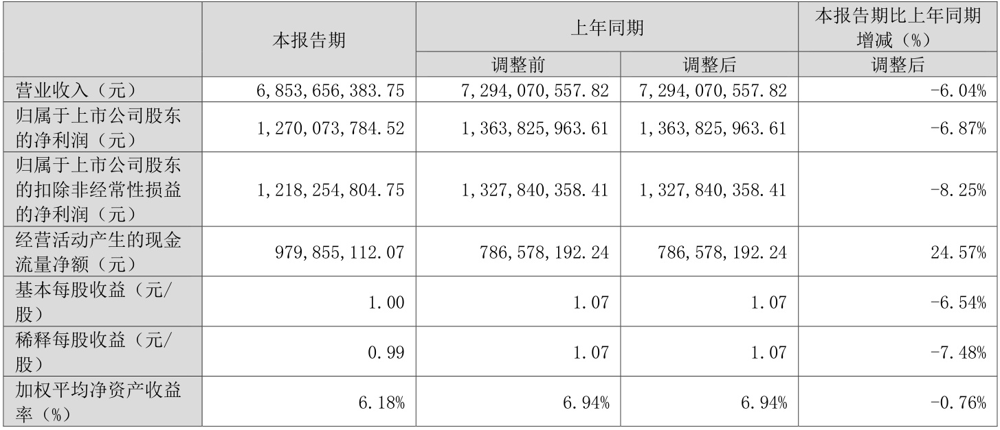  

适用 □不适用 
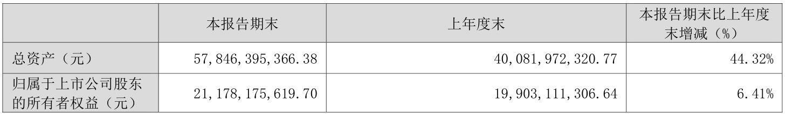  

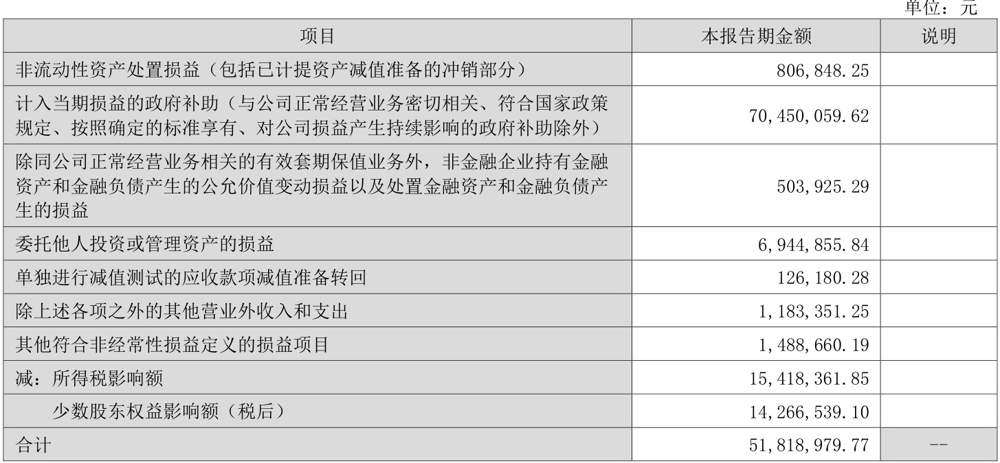  
其他符合非经常性损益定义的损益项目的具体情况  

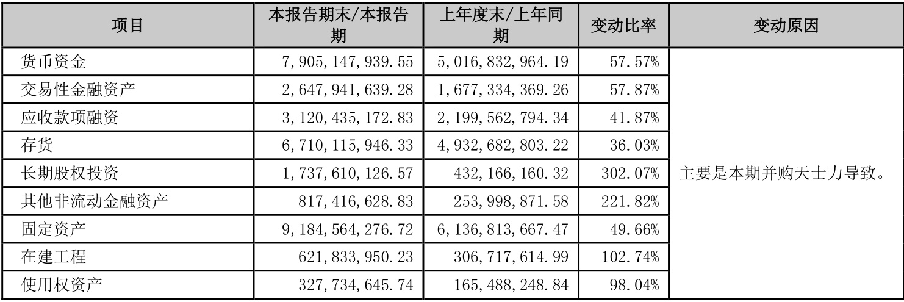  
□适用 不适用 公司不存在其他符合非经常性损益定义的损益项目的具体情况。 将《公开发行证券的公司信息披露解释性公告第1 号——非经常性损益》中列举的非经常性损益项目界定为经常性损益项目的情况说明 □适用 不适用 公司不存在将《公开发行证券的公司信息披露解释性公告第1 号——非经常性损益》中列举的非经常性损益项目界定为经常性损益的项目的情形。  

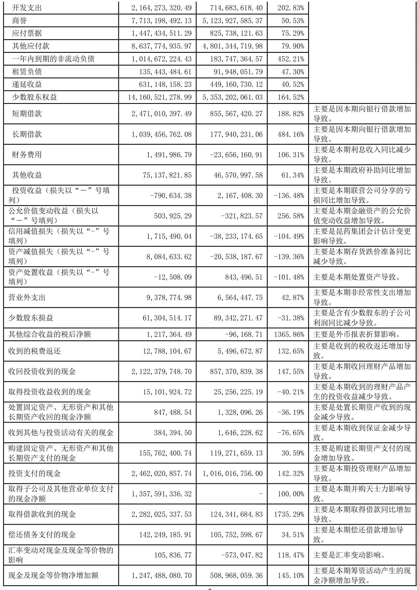  

# （四） 公司概况  

随着“三医联动”顶层制度设计的各项改革措施逐步落地，医药领域改革进入深水区，中成药集采持续推进，叠加全球政经动荡加剧等宏观因素影响，我国医药经济正处于调整期，医药产业新旧动能转换不断加快，对医药市场终端格局持续施加影响，终端市场中的药品零售市场整体增速放缓。米内网数据显示，2025 年1-2 月中国实体药店累计零售规模909 亿元，较2024 年同期下降$5,4\%$；药品、保健品等各品类2025 年前两月累计销售额较去年同期均呈现负增长态势。 面对复杂严峻的市场环境，华润三九积极应变、砥砺前行，以长远的目光和坚定的战略定力锚定发展航向，持续优化业务结构，整合行业优质资源，深化创新实力，夯实“稳”的根基，积蓄“进”的势能，稳步推进高质量经营发展。  

# 1.   驭变谋远、推陈出新，夯实业务发展基本盘  

报告期内，公司CHC 健康消费品业务努力应对流感等呼吸道疾病发病率同比降低等因素带来的压力，在逆境中谋求破局之道。公司首个中药3.2 类新药999 益气清肺颗粒于报告期内获批并正式发布，标志着华润三九呼吸品类实现全场景渗透的生态化布局，助力公司构建具有竞争壁垒的产品管线，巩固核心竞争优势。此外，处方药业务在行业重塑格局的过程中保持定力，强化医学引领，持续提升产品学术价值和产品竞争力，业务稳中有进、质效向好，彰显业务发展韧性。同时，国药业务通过主动变革、拥抱集采，实现稳健发展，为未来持续拓展市场奠定坚实基础。  

# 2. 聚力启新、协同赋能，铸造高质量发展三大动力引擎  

公司围绕战略领域，积极推动行业优质资源整合，快速完善业务布局，培育新的业务增长点，拓展长期可持续的发展空间。公司于报告期内完成天士力$28\%$股权的收购事项，天士力成为华润三九的控股子公司。公司将与天士力发挥产业链协同效应，在创新研发、智能制造、渠道营销等领域相互赋能，增强全产业链核心竞争力，助力公司加快补充创新中药管线，建立在中药领域的引领优势。  

报告期内，昆药集团紧抓银发机遇，持续深化与公司的融合重塑，培育转型动能；精品国药领域，围绕“昆中药1381”品牌发展战略，聚焦昆中药参苓健脾胃颗粒、舒肝颗粒等战略大单品，通过“全域媒体矩阵+精准场景营销”的双引擎驱动模式，强化“精品国药领先者”的品牌定位；慢病管理领域，持续聚焦三七全产业链，通过丰富“777”品牌内涵和产品布局，进一步提升零售渠道覆盖。  

华润三九、天士力、昆药集团各具资源禀赋与核心能力，未来三家企业将在深化协同中构建差异化竞争优势，助力公司锻造新的成长曲线和成长飞轮，加快驱动企业价值提升，推动公司在风云变幻的市场格局中实现可持续、高质量发展。  

# 3.   研发提速、守正创新，厚积创新发展底蕴  

华润三九深入挖掘中医药宝库精华，秉承“传承精华、守正创新”的研究思路，持续沉淀中药研发能力，将经典名方作为重点关注的研发创新方向之一，推动经典名方品种注册申报及生产落地，助力古代经典名方向新药转化，努力实  

现让经典变精品，让名方变名药。截至目前，公司共获4 个经典名方《药品注册证书》，5 个经典名方处于注册申报阶段，申报及获批数量行业领先。  

# 二、股东信息  

单位：股  
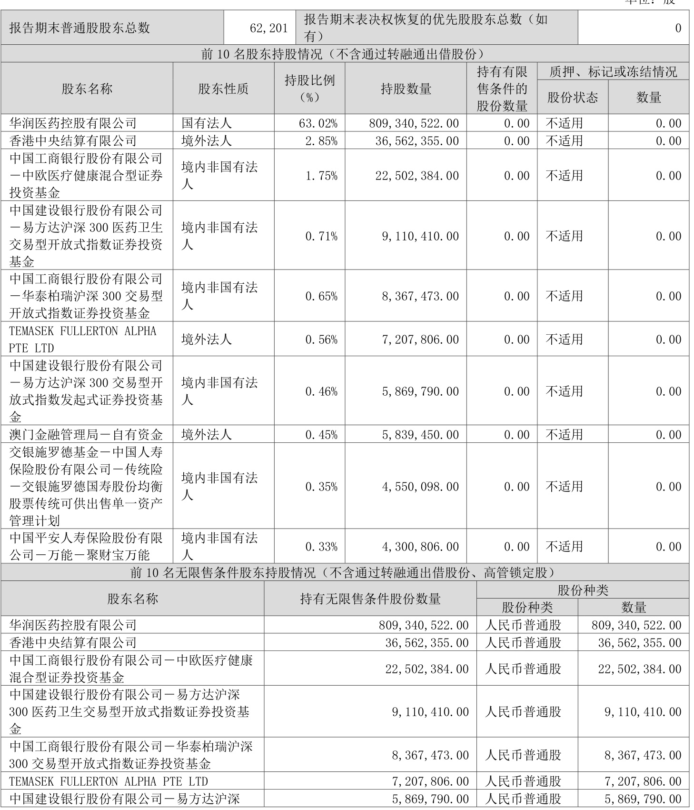  

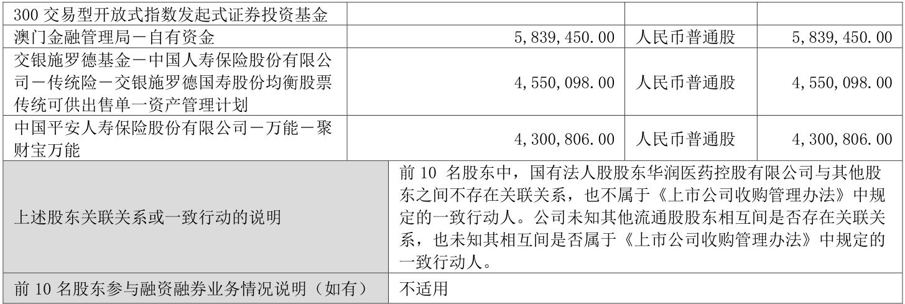  
持股$5\%$以上股东、前10 名股东及前10 名无限售流通股股东参与转融通业务出借股份情况 □适用 不适用 前10 名股东及前10 名无限售流通股股东因转融通出借/归还原因导致较上期发生变化 □适用 不适用  

# （二） 公司优先股股东总数及前10 名优先股股东持股情况表  

□适用 不适用  

# 三、其他重要事项  

适用 □不适用  

# 1．重大资产重组及其进展情况  

2024 年8 月5 日，公司披露拟收购天士力医药集团股份有限公司（以下简称“天士力”）$28\%$股份的重大资产重组预案等相关公告。公司拟以支付现金的方式向天士力生物医药产业集团有限公司（以下简称“天士力集团”）及其一致行动人天津和悦科技发展合伙企业（有限合伙）（以下简称“天津和悦”）、天津康顺科技发展合伙企业（有限合伙）（以下简称“天津康顺”）、天津顺祺科技发展合伙企业（有限合伙）（以下简称“天津顺祺”）、天津善臻科技发展合伙企业（有限合伙）（以下简称“天津善臻”）、天津通明科技发展合伙企业（有限合伙）（以下简称“天津通明”）、天津鸿勋科技发展合伙企业（有限合伙）（以下简称“天津鸿勋”）合计购买其所持有的天士力医药集团股份有限公司（以下简称“天士力”）418,306,002 股股份（占天士力已发行股份总数的$28\%$）（以下简称“本次交易”）。此外，天士力集团同意，天士力集团应出具书面承诺，承诺在登记日后放弃其所持有的天士力$5\%$股份所对应的表决权等方式，使其控制的表决权比例不超过$12,5008\%$。本次交易完成后，天士力的控股股东由天士力集团变更为华润三九，天士力的实际控制人变更为中国华润有限公司。2025 年3 月21 日，华润三九召开2025 年第二次临时股东大会审议通过重大资产重组相关事项，并于2025 年3 月27 日收到中国证券登记结算有限责任公司出具的《过户登记确认书》，天士力418,306,002 股股份已过户完成，天士力已成为华润三九的控股子公司。  

详细内容请见2024 年8 月5 日、2024 年8 月31 日、2024 年9 月30 日、2024 年10 月30 日、2024 年11 月29 日、2024 年12 月28 日、2025 年1 月25 日、2025 年2 月5 日、2025 年2 月7 日、2025 年3 月1 日、2025 年3 月22 日、2025 年3 月28 日公司在《证券时报》《中国证券报》《上海证券报》及巨潮资讯网（www.cninfo.com.cn）披露的相关公告。  

# 2. 聘任高级管理人员  

经董事会2025 年第三次会议审议通过，聘任邢健先生担任公司财务总监、董事会秘书，任期与公司第九届董事会任期一致。  

详细内容请见2025 年3 月1 日公司在《证券时报》《中国证券报》《上海证券报》及巨潮资讯网（www.cninfo.com.cn）披露的相关公告。  

# 四、季度财务报表  

# （一） 财务报表  

# 1、合并资产负债表  

编制单位：华润三九医药股份有限公司  

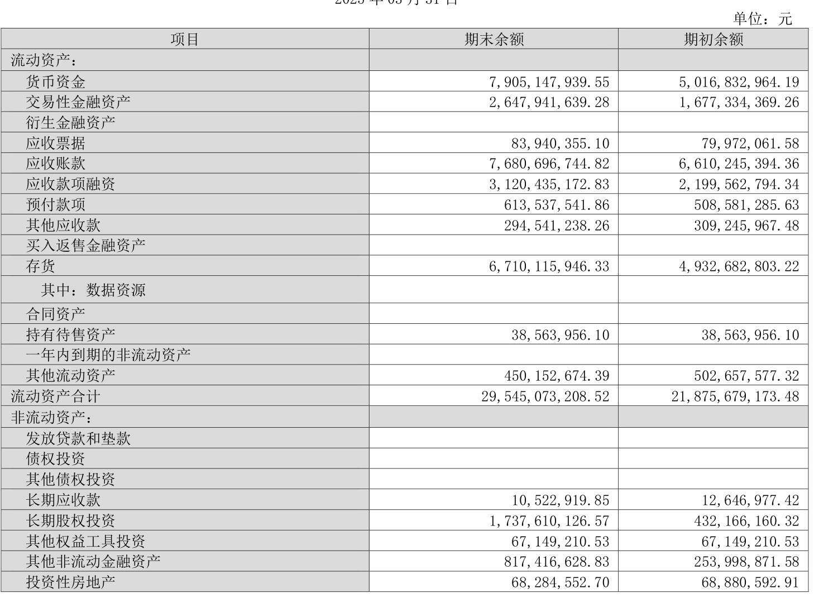  

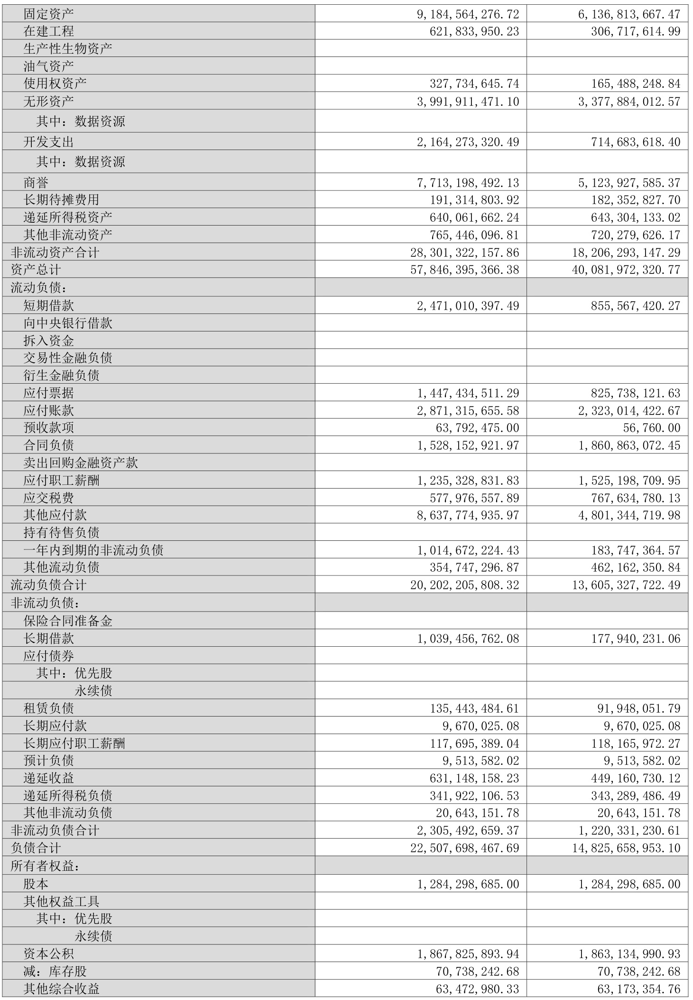  

2、合并利润表 
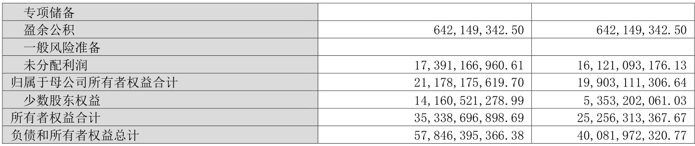  

单位：元 
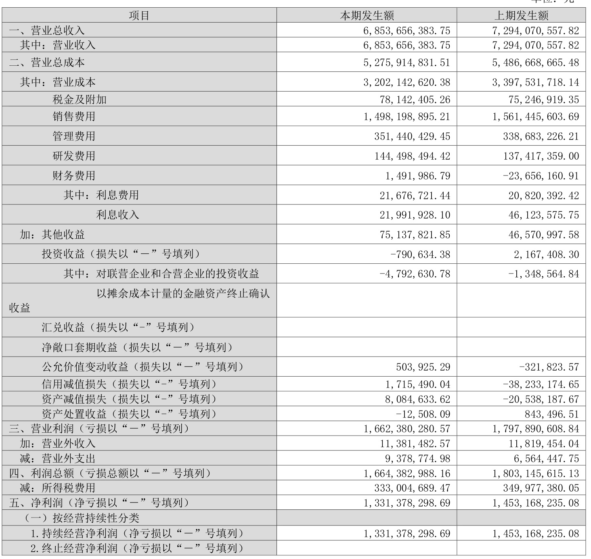  

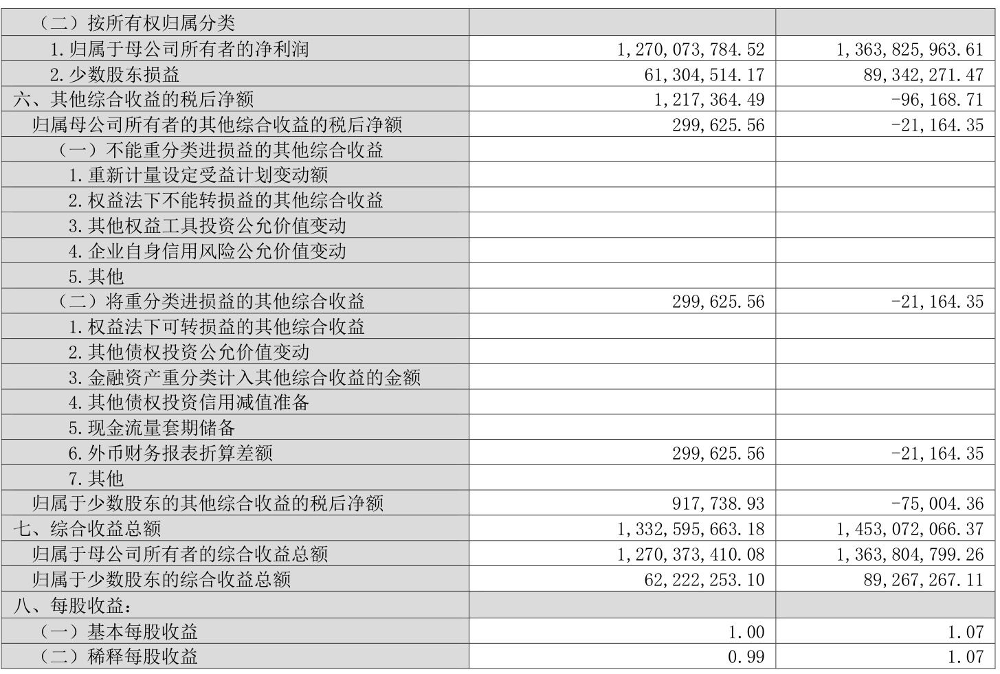  

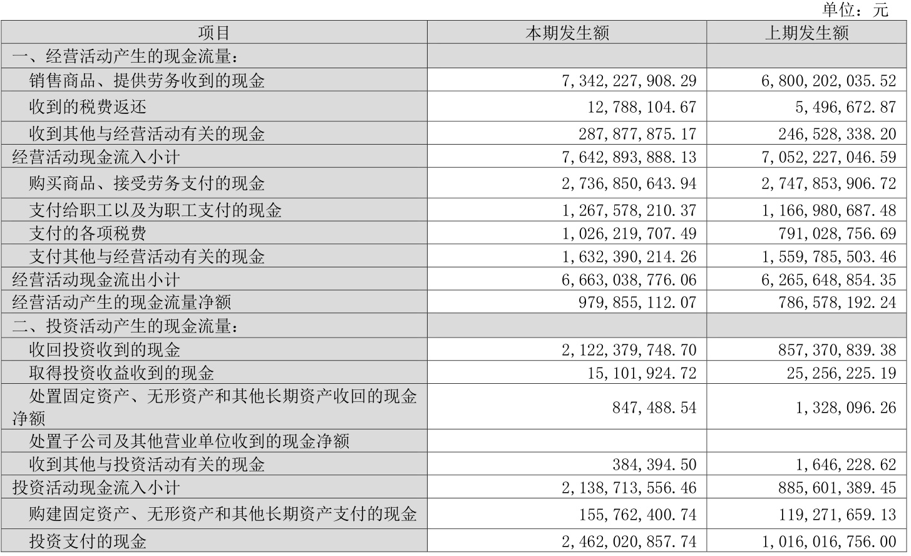  

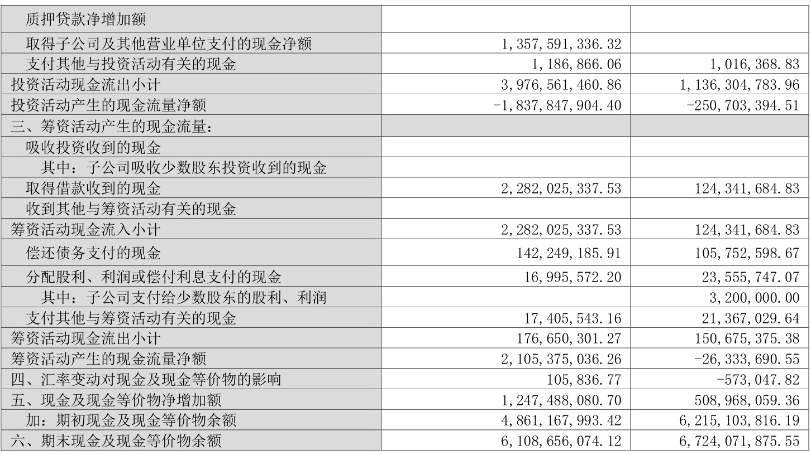  

# （二） 2025 年起首次执行新会计准则调整首次执行当年年初财务报表相关项目情况  

□适用 不适用  

# （三） 审计报告  

第一季度报告是否经过审计 □是   否  公司第一季度报告未经审计。  