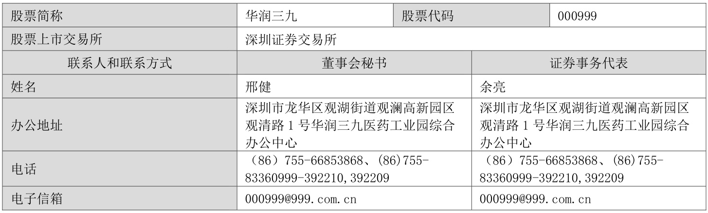
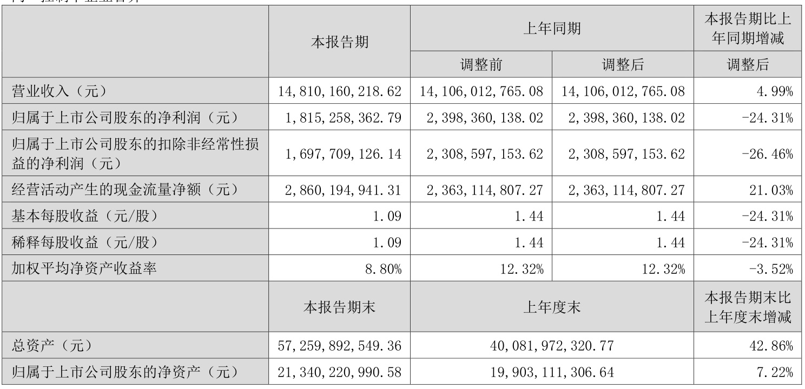
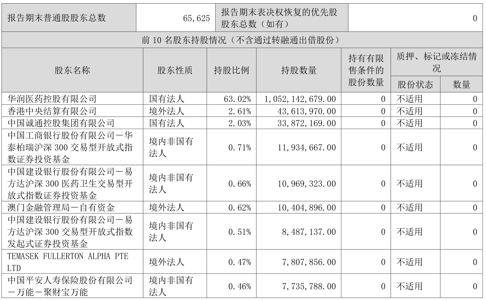
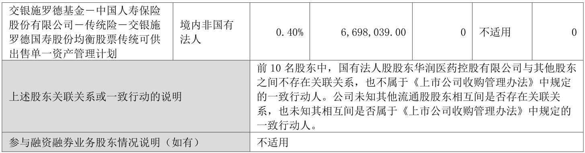

# 华润三九医药股份有限公司2025 年半年度报告摘要  

# 一、重要提示  

本半年度报告摘要来自半年度报告全文，为全面了解本公司的经营成果、财务状况及未来发展规划，投资者应当到证监会指定媒体仔细阅读半年度报告全文。  

所有董事均已出席了审议本报告的董事会会议。  

非标准审计意见提示  

□适用 不适用 董事会审议的报告期利润分配预案或公积金转增股本预案 适用 □不适用 是否以公积金转增股本  

□是   否  

公司经本次董事会审议通过的2025 年半年度利润分配预案为：以未来实施分配方案时股权登记日的总股本为基数，向全体股东每10 股派发现金红利4.5 元（含税），送红股0 股（含税），不以公积金转增股本。在实施权益分派的股权登记日前，如享有利润分配权的股份总额发生变动，则以实施分配方案时股权登记日的享有利润分配权的股份总额为基数，按照分配比例不变的原则对分配总额进行调整。  

董事会决议通过的本报告期优先股利润分配预案 □适用 不适用  

# 二、公司基本情况  

1、公司简介 
  

# 2、主要会计数据和财务指标  

公司是否需追溯调整或重述以前年度会计数据  是 □否  

追溯调整或重述原因  

同一控制下企业合并 
  

# 3、公司股东数量及持股情况  

单位：股  
  

  
持股$5\%$以上股东、前10 名股东及前10 名无限售流通股股东参与转融通业务出借股份情况 □适用 不适用 前10 名股东及前10 名无限售流通股股东因转融通出借/归还原因导致较上期发生变化 □适用 不适用  

# 4、控股股东或实际控制人变更情况  

控股股东报告期内变更  □适用 不适用 公司报告期控股股东未发生变更。 实际控制人报告期内变更 □适用 不适用 公司报告期实际控制人未发生变更。  

# 5、公司优先股股东总数及前10 名优先股股东持股情况表  

□适用 不适用 公司报告期无优先股股东持股情况。  

# 6、在半年度报告批准报出日存续的债券情况  

□适用 不适用  

# 三、重要事项  

# 1.重大资产重组及其进展情况  

2024 年8 月5 日，公司披露拟收购天士力医药集团股份有限公司（以下简称“天士力”）28%股份的重大资产重组预案等相关公告。公司拟以支付现金的方式向天士力生物医药产业集团有限公司（以下简称“天士力集团”）及其一致行动人天津和悦科技发展合伙企业（有限合伙）（以下简称“天津和悦”）、天津康顺科技发展合伙企业（有限合伙）（以下简称“天津康顺”）、天津顺祺科技发展合伙企业（有限合伙）（以下简称“天津顺祺”）、天津善臻科技发展合伙企业（有限合伙）（以下简称“天津善臻”）、天津通明科技发展合伙企业（有限合伙）（以下简称“天津通明”）、天津鸿勋科技发展合伙企业（有限合伙）（以下简称“天津鸿勋”）合计购买其所持有的天士力418,306,002 股股份（占天士力已发行股份总数的$28\%$）（以下简称“本次交易”）。此外，天士力集团已出具书面承诺，承诺在登记日后放弃其所持有的天士力$5\%$股份所对应的表决权等方式，使其控制的表决权比例不超过$12.\,5008\%$。本次交易完成后，天士力的控股股东将由天士力集团变更为华润三九，天士力的实际控制人将变更为中国华润有限公司。2025 年2 月5 日，公司披露了《关于收到〈经营者集中反垄断审查不实施进一步审查决定书〉的公告》。2025 年2 月7 日，公司披露了《关于收购天士力医药集团股份有限公司获国务院国资委批复的公告》。2025 年2 月27 日，董事会2025 年第二次会议审议通过《关于公司重大资产购买方案的议案》等重大资产重组相关议案事项。2025 年3 月21 日，公司召开2025 年第二次临时股东大会审议通过重大资产重组相关事项。2025 年3 月28 日，公司披露《关于重大资产购买之标的资产过户完成暨取得其控制权的公告》，公司于2025 年 3 月 27 日收到中国证券登记结算有限责任公司出具的《过户登记确认书》，天士力418,306,002 股股份已过户至华润三九名下，本次交易对应的标的资产已过户完成，天士力已成为华润三九的控股子公司。  

详细内容请见2024 年8 月5 日、2024 年8 月31 日、2024 年9 月30 日、2024 年10 月30 日、2024 年11 月29 日、2024 年12 月28 日、2025 年1 月25 日、2025 年2 月5 日、2025 年2 月7 日、2025 年3 月1 日、2025 年3 月22 日、2025 年3 月28 日公司在《证券时报》《中国证券报》《上海证券报》及巨潮资讯网（www.cninfo.com.cn）披露的相关公告。  

# 2．高级管理人员变更  

公司董事会于报告期内收到副总裁黄先锋先生提交的辞职报告，黄先锋先生由于工作调整原因，提请辞去公司副总裁职务，辞职后黄先锋先生继续在公司担任党委专职副书记职务。  

2025 年2 月28 日，经公司2025 年第三次董事会会议审议通过，聘任邢健先生为公司财务总监、董事会秘书，任期与公司第九届董事会任期一致。  

2025 年4 月17 日，经公司2025 年第六次董事会会议审议通过，聘任喻翔先生为公司副总裁，任期与公司第九届董事会任期一致。  

详细内容请见2025 年3 月1 日、2025 年4 月18 日、2025 年6 月25 日公司在《证券时报》《中国证券报》《上海证券报》及巨潮资讯网（www.cninfo.com.cn）披露的相关公告。  